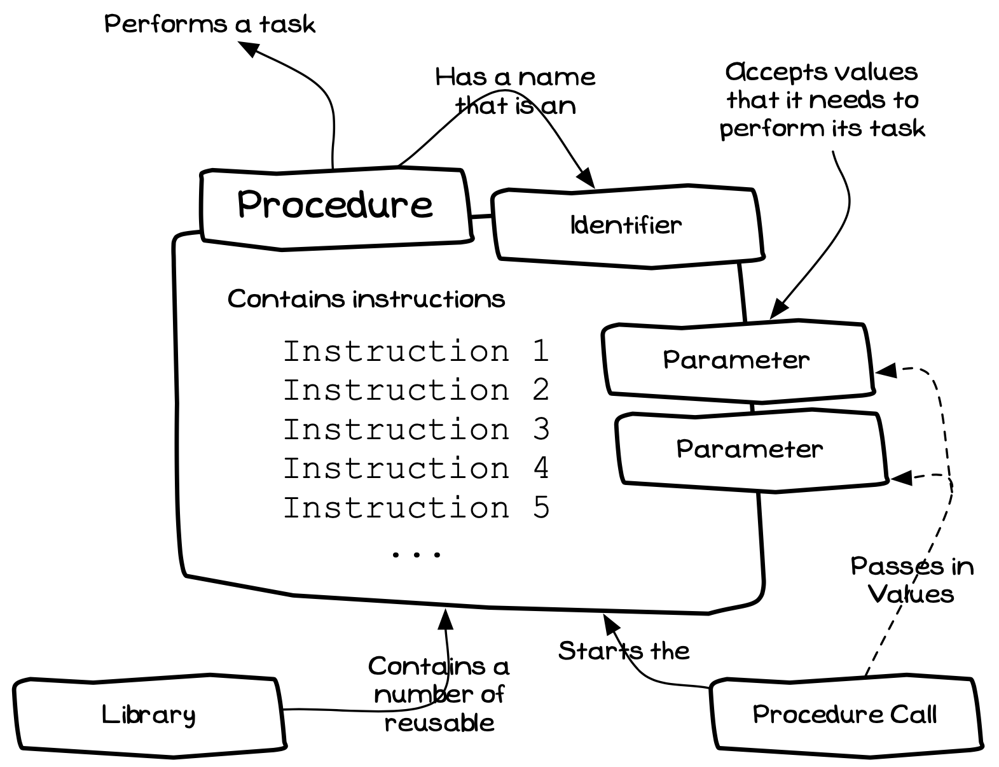
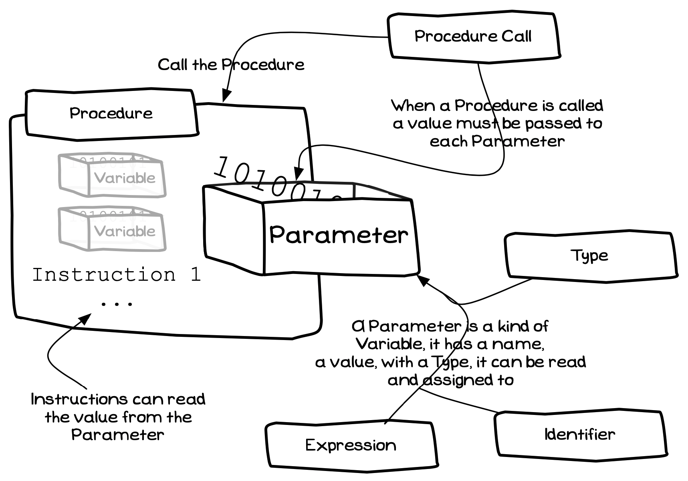

# Concepts

## Program Creation Concepts

### Program

In most software projects the top level *artefact* you are aiming to create is a **program**. Within your software a program is a list of instructions the computer will perform when that program is run on the computer.

When you create a program in your code you should be thinking about the tasks you want the program to achieve, and the steps you must get the computer to perform when the program is run. These then become the instructions within the program, with each instruction being a [Statement](#statement) of what you want performed.

Figure 5.1:  A program contains instructions that command the computer to perform 
 

:::note

- A program is an **artefact**, something you can create in your code.
- [Figure 5.1](#FigureProgram) shows the concepts related to the program’s code.
- A program is a programming artefact used to define the steps to perform when the
program is run.
- You use a compiler to convert the program’s source code into an executable file.
- By declaring a program in your code you are telling the compiler to create a file the user can run (execute).
- The program has an **entry point** that indicates where the program’s instructions
start.
- The name of the program determines the name of the executable file.
- Your program can use code from a [Library](#library) or number of libraries.
- In programming terminology, an instruction is called a [Statement](#statement).

:::

### Statement

When you are created a program you define the actions the computer will
perform when the program is run. Each of these *actions* is coded as a
**statement** within the program. This style of programming is known as
**imperative** programming. Imperative means to give authoritative
commands, and that is what we do in our programs. Our programs are lists
of *authoritative commands*, statements, that *tell* the computer the
actions it is to perform.

Figure 5.2:  A statement is a command for the computer to perform an action
 

:::note

- A statement is a **term** used to describe the instructions in your code.
- [Figure 5.2](#FigureStatement) shows the concepts related to statements.
- A statement is a **command**, an instruction to perform an action.
- A [Program](#program) has a list of statements that are followed when it is executed.
- There are only a few kinds of statements. Each statement has a defined set of actions the computer performs to carry out the command.
- A [Procedure Call](#procedure-call) is a kind of statement that tells the computer to run the code in a [Procedure](#procedure).

:::

### Procedure Call

A procedure call is a kind of [Statement](#statement) that instructs the computer to run the code in a [Procedure](#procedure) . This statement uses the procedure's name to identify the procedure that must be run. If the procedure called requires some data, this data is *passed* to the procedure as part of the procedure call.

Figure 5.3: A procedure calls runs a procedure, passing in values for the procedure to use
 

:::note

- A procedure call is an **action**, you can call procedures in your code.
- [Figure 5.3](#FigureProcedureCall) shows the concepts related to the procedure call.
- A procedure call is an instruction to execute a procedure.
- You can code a procedure anywhere you can code a statement.
- The [Identifier](#identifier) indicates the [Procedure](#procedure) to run.
- Data values passed to the procedure are coded using [Expressions](#expression).
- When the procedure’s task is complete the program continues with the next [Statement](#statement).

:::

### Procedure

The computer is unintelligent, so performing anything meaningful
requires a large number of instructions. Coding all of these directly in
the program would be slow and time consuming. To avoid this programming
languages offer the capability to group the instructions to perform a
task into a **procedure**.

A procedure is a list of instructions that gets the computer to perform
a specific task. When a procedure is called it gets control of the
computer and instructs it to perform the steps needed. Often these steps
require data, so the procedure may need to be passed data when it is
called. When the procedure finishes its task, control returns back to
the code that called the procedure.

Figure 5.4: A procedure contains instructions to perform a task, and may need to be passed data in order to do this
 
<!--div class="caption">Figure 5.4:  A procedure contains instructions to perform a task, and may need to be passed data in order to do this
<br/-->

:::note

- A procedure is an **artefact**, something that can be created in code.
- [Figure 5.4](#FigureProcedure) shows the concepts related to procedures.
- A procedure is a programming artefact that can be called to perform a certain task.
- The name of a procedure is an [Identifier]identifier).
- Each [Library](#library) will contain a number of procedures to perform common tasks.
- The standard library will include procedures to write values to the Terminal.
- The SwinGame libraries contain procedures that can draw images on the screen,
play sounds, and perform other tasks needed to create small games.
Procedures are also known as **subroutines**, **sub-programs**, **methods** or **sub-procedures**.

:::

### Expression

Some statements need data, this data can be calculated or provided as a
literal value in the code. The term **expression** is used in
programming to describe the places in a statement where data must be
supplied. At run time each expression becomes a value that is used by
the statement.

Figure 5.5:  An expression provides a **value** to be used in a Statement.
 

:::note

- An expression is a **term** given to code that calculates a value.
- The concepts related to expressions are shown in [Figure 5.5](#FigureExpression).
- An expression provides a **value** that is used in a Statement.
- The expression’s value may be calculated or entered directly into the code.
- Calculations can use mathematical operators: + for addition, - for subtraction, * for multiplication, / for division, and parenthesis ( ) for grouping.
- Expressions are evaluated using the BODMAS[a](#FootnoteBODMAS) order of operations.
- Values entered directly within an expression are **Literal** values.

aBODMAS indicates that expressions are evaluated B brackets first, O orders (which includes powers and square roots), DM for division and multiplication (which are of equal precedence, and are evaluated left-to-right), then AS addition and subtraction (of equal precedence, evaluated left-to-right).

:::

### Literal

A Literal is a whole, or part of, an [Expression](#expression) where the value is entered directly into the code.

Figure 5.6: Concepts related to Literals.
 

:::note

- [Figure 5.6](#FigureLiteral) shows the concepts relate to Literals.
- A Literal is a value entered directly into the program’s source code.
- The value of a Literal can be a number or text.
- A Literal can be part or all of an [Expression](#expression).
- These values are *hard coded* into the program.

:::

### Type

All values within a program will have a **type**. The type indicates how
the data stored in the computers memory is interpreted by the program.
There are three basic data types available in a programming language, as
shown in [Figure 5.7](#FigureType).

-   **Textual** data such as '*Fred*', '*Hello World*', '*23*', and
    '*This is text!*'.
-   **Whole numbers** such as *1*, *0*, *-5*, and *37*.
-   **Real numbers** such as *0.5*, *-126.0*, *3.141516*, and *23.981*.

Figure 5.7: A types define how values are interpreted and the operations that can be performed on the data.
 

:::note

- A type is an **artefact**, there will be a number of existing types that you can use, and later you will see how to create your own types.
- The concepts related to expressions are shown in [Figure 5.7](#FigureType).
- A type is a programming artefact that indicates a kind of data.
- The type determines the basic actions that can be performed on the value.
- The type determines the amount of memory needed to store a value of that kind
- Whole numbers are usually called **Integers**.
- Real numbers are usually represented as **Floating Point** values. These values have a limited precision, supporting only a certain number of digits of precision.
- Textual values can contain numbers as text characters. For example, the text '*23*' is the character *'2'* followed by the character '*3*' - it is not the number *23*.
- You can perform mathematic operations on numeric data, but not on textual data.

:::

### Identifier

An identifier is the technical term for the name/word that *identifies*
something for the compiler. These can be the **name** of a programming
artefact (such as a Program, Library, or Procedure) or words that have
special meaning for the compiler. You will use identifiers to name the
artefact you create, and to select the artefact you want to use.

Figure 5.8: An Identifier is the name of a programming artefact such as a Program, Library, or Procedure.
 

:::note

- [Figure 5.8](#FigureIdentifier) shows the concepts related to an Identifier.
- The **name** used to identify a programming artefact (such as a [Program](#program), [Library](#library) or [Procedure](#procedure)) is an identifier.
- You use identifiers to indicate which libraries you want to access in your program.
- Each [Procedure Call](#procedure-call) uses the procedure’s identifier to determine which procedure is run.

:::

### Library

A library is a collection of reusable code artefacts. Each programming
language has its own library, and your programs can make use of the code
available in this library.

Figure 5.9: A library contains code that can be used by your Program
 

:::note

A library is an **artefact**, it contains reusable artefacts.
• [Figure 5.9](#FigureLibrary) shows the concepts related to a library.
• A library is a collection of reusable code artefacts that you can use to perform certain tasks.
• The library will contain [Procedures](#procedure) that perform a number of tasks.
• Each language has a standard library with code to perform many commonly performed tasks.
• Other libraries extend the capability of the languages further.
• SwinGame is a external library containing code to help you build games

:::

### Comments

A program's source code contains instructions for the actions the
computer must perform. However, this code is written and maintained by
people. It is often useful to be able to place comments in the code to
help someone reading that code understand how the code works or what it
is trying to achieve. This text is not something that should be
translated into machine code.

Programming languages support the ability for programmers to embed
*comments* into the source code that are ignored by the compiler.

:::note

- It is good practice to place a comment at the top of your code explaining what the program does.
- Comments should be included to help other people read your code. You will also find these comments useful when you return to your code after a long break.
- Make your comments meaningful, try to capture your intentions and ideas
- Comments have no impact on the output produced by the compiler.

:::

### Procedure Declarations

Procedures contain code that define the steps the computer performs when
the procedure is called. In your Program you can define your own
Procedures, allowing you to divide a program's tasks into separate
Procedures.

Figure 5.10: Procedure Declaration
 

:::note

- A Procedure is an **artefact** that you can create and use in your code.
- Each Procedure contains code to perform a certain task. When you want the task
performed you call the Procedure.
- Procedures should have a **side effect**a, meaning that it changes something when it
is executed.
- The Procedure’s declaration defines its **name**, and the **steps** it performs.
- Each instructions in the [Procedure](#procedure) is a [Statement](#statement).
- The Procedure’s [Identifier](#identifier):
  - Is the name used to call the Procedure.
  - Should be a **verb** that **reflects the task** the Procedure performs.
- When the Procedure is called its instructions are executed.
- Each Procedure’s instructions are isolated from the other code in your Program.
When you are working on a Procedure you do not need to know about the internal workings of the other procedures.

aOutput to the Terminal is an example of a Side Effect. After calling these procedures the text you wanted to appear was written to the Terminal. These Procedures changed the Terminal.

:::

### Summary

This section has introduced a number of programming artefacts, some
programming terminology, and one kind of instruction. An overview of
these concepts is shown in [Figure 5.11](#FigureSummary). The next section will look at how you can use these concepts to design some small programs.

Figure 5.11: Key Concepts introduced in this Chapter
 

:::note

- Artefacts are things you can create and use.
- Terms are things you need to understand.
- Actions are things you can command the computer to perform

:::

## Concepts Related to Storing and Using Data

### Variable

A Variable is a **container** into which you can store a value, which can then be retrieved later. The Variable allows you to store values you want to work with in your program, you store values in the variable so that you can read them back later. The variable's themselves are either a [Global Variable](#global-variable), [Local Variable](#local-variable), or [Parameter](#parameter).

<Caption><FigureText>Figure 5.12: </FigureText>Variables store a value that can be read and changed</Caption> 

:::note

- A Variable is an **artefact**, you can create variables to store values in your programs.
- You can think of a Variable like a "box with an item in it". The Variable is the box, its value is the item within it.
- Each Variable has a ...
  - **Name** that can be used to refer to it.
  - **Value** that it is storing.
  - **Type** that determines the size of the Variable and how its value is interpreted.
- You use an [Assignment Statement](#assignment-statement) to store a value into the Variable.
- You can **read** the value from Variable in Expressions.
- The Variable is **different** to its value:
  - The Variable is a container into which a value can be stored.
  - You can read the value from the Variable.
  - The Variable **is not** the value, it is a container into which the value is stored

:::

## Constant

A Constant is just like a [Variable](#variable), but its value cannot be changed. Constants are declared within the Program, and given a value when they are created. Once they are created the value within the Constant cannot be
changed. This is useful for data where you do not want the value changing during the program's execution.

Figure 5.13:  Constants have a value that cannot be changed
 

:::note

A Constant is an **artefact**. You can create Constants in your Program to store values that must not change.

- A Constant is similar to a [Variable](#variable), they have a...
  - **Name** that is used to access them.
  - **Value** that can be read in an Expression.
  - **Type** that determines how their data is interpreted.
- You **read** values of Constants in Expressions.
- Constants are useful for data you do not want to change during the program.
- The name of the Constant is an [Identifier](#identifier).
- The Constant’s name should reflect the value it is storing.

:::

### Local Variable

Variables can be declared at a number of different places in your code. Variables that are declared within Procedures are called **Local Variables**. Most of the variables in your code will be Local Variables.

Figure 5.14:  Variables declared within a Procedure are Local Variables
 

:::note

- Local Variable is the **term** given to a Variable that is declared within a Procedure.
- Variables that are declared within Procedures are called **Local Variables**.
- Local Variables are located within the Procedure they are declared in.
- They can only be accessed by instructions in the Procedure.
- It is **good practice** to use Local Variables to store values. These variables can only be accessed from the instructions **within** the Procedure, this makes it easier to understand how the variable is being used and where it is being changed.
- Space is allocated for the Local Variables when the Procedure is called.
- When the call ends, the Local Variables for that call are destroyed

:::

### Global Variable

Variables and Constants can be declared within a Program. Variables declared in this way are called Global Variables. It seems tempting to use Global Variables to share values between procedures, but this is a bad idea. Global Variables should be avoided, and for many programs are unnecessary. The issue with Global Variables is that their values can be changed from anywhere within the program's code. This can make it difficult to locate the source of errors when globals are used.

While Global Variables should be avoided, Constants should be declared globally. As these values can not change, the issues with Global Variables do not affect Constants.

Figure 5.15:  Variables declared within a Program are Global Variables
 

:::note

- Global Variable is the **term** given to a Variable that is declared within the program.
- Variables that are declared within a Program are called **Global Variables**.
- Global Variables can be accessed by the program’s instructions, and by the instructions in any of the Procedures.
- You should **avoid** using Global Variables. These variables can be accessed anywhere within the Program, making it difficult to locate errors.
- Using Global Variables introduces hidden dependencies between Procedures, breaking the isolated nature of the Procedures.
- Constants **should** be declared globally, and used to give meaning to values entered into your code.

:::

### Parameter

The instructions within a Procedure define the actions that occur when that procedure is called. In most cases these instructions need to be given values to work with. These values can be passed to the Procedure using Parameters. The Parameter is a Variable that has its value set in the procedure call.

Figure 5.16:  Parameters allow data to be passed to Procedures
  

:::note

- Parameter is the **term** given to the Variables declared to accept values passed to Procedures.
- The **procedure call** assigns values to each of the Procedure’s Parameters.
- Parameters allow you to pass values into a Procedure. 
- Within the Procedure the Parameters can be used in the same way as any other
Variable.
- It is **good practice** to use Parameters to pass values into a Procedure

:::

### Pass by Value and Pass by Reference

There are actually two ways that values can be passed to Parameters. This relates back to the fact that Variables have two aspects: the Value within the Variable, and the Variable itself. These two means of passing parameters allow you to either pass a value, or pass a Variable.

Figure 5.17:  Parameters can accept data by reference or by value
  

:::note

- Pass by Reference and Pass by Value are **terms** that explain how data is passed to a Parameter.
- Most parameters are passed by value.
- Pass by value copies the value to the parameter. This means pass by value can work with any Expression.
- Pass by reference allows you to pass the Variable itself to the parameter.
- The main use for pass by reference is to allow the Procedure or Function to store a value in the Variable passed to the parameter.
- It is called pass by reference due to the way it is implemented, with the parameter receiving a reference to the Variable. Section **???** will cover this in more detail, conceptually the Variable itself is passed to the Parameter

:::

### Statement (with Assignment)

Statements are the actions that we can get the computer to perform. At this stage we have covered the statements that run procedures, the [Procedure Call](#procedure-call), and the statement to assign values to variables, the [Assignment Statement](#assignment-statement).

Figure 5.18:  A Statement may be an Assignment statement
  

:::note

- Statement is the **term** given to the instructions in our code.
- Statements can be either:
  - [Procedure Call](#procedure-call) used to run the code in a Procedure, as covered in Chapter
  - [Assignment Statement](#assignment-statement) used to calculate a value and store it in a Variable.
- All instructions in your code are Statements, these include the instructions in your Program as well as the instructions in your Procedures and Functions.

:::

### Assignment Statement

The Assignment Statement calculates a value, and stores it in a Variable. You use an assignment statement to store values in variables.

Figure 5.19:  A Assignment Statements assign values to Variable
  

:::note

- An Assignment Statement is an **action** you can get the computer to perform.
- The _right hand side_ of the Assignment is an **Expression** that calculates the value to be stored.
- The _left hand side_ of the Assignment is a **Variable** into which the value is stored.
- When the Assignment Statement is executed the Expression is evaluated first, and then the resulting value is stored in the variable.
- Its important to remember that the Variable is a location at which to store a value.
- When the Variable appears on the left hand side of an assignment it is being use to store the resulting value. If the variable appears on the right hand side its value is being used as part of the expression.

:::

### Function

Functions are used to calculate values. In many ways a Function is just like a Procedure, it has a name, can be called, can accept parameters, can have local variables, and performs a number of instructions when it is called. Unlike a Procedure, however, Functions are used to calculate values. When the function you called ends it returns back to you with a value.

Figure 5.20: A Function is just like a Procedure, except it calculates and returns a value
  

:::note

- A Function is an **Artefact**. Something that you can create and use in your program’s code.
- A Function is just like a Procedure in that it ...
- Has a name that is used to call it.
- Performs instructions when it is executed.
- Can accept Parameters to allow the caller to pass in values. – Is allowed to create its own local variables.
- Unlike a Procedure, a Function...
- Should **not** have any side effects. – Calculates and returns a value.
- Is called as part of an Expression.
  - You use Functions to calculate values.
  - You use a [Function Call](#function-call) to call a function as part of an Expression.

:::

### Function Call

A Function Call is used to execute a , and to read the value that is returned. This is similar to a , but unlike a procedure call it must be done as part of an Expression.

Figure 5.21: A Function Call is part of an Expression where the value is calculated
  

:::note

- A Function Call is an **action**, but one that is performed as part of an Expression.
- Function calls can appear in any expression. For example, you can use a Function Call to calculate the value in an [Assignment Statement](#assignment-statement). You can use a Function Call to calculate the argument values for a procedure call.
 

:::

### Expressions

You can **read** the values from Variables and Constants within Expressions. The value of the expression is calculated by **reading** the values from the Variables and Constants when the expression is calculated[^22].

Figure 5.22: Expressions can read values from Function Calls, Variables, and Constants
  

:::note

- Expression is the term given to the code that calculates values within your Statements.
- You can read values from Function Calls, Variables, and Constants.
- You use the Variable or Constant’s name to access its value within an Expression.
- The Function Call runs the code in the Function, and then reads the result returned.
- There are actually **two expressions** in [Figure 5.22](#FigureExpressions):
  - The first Expression is the value passed to the _sin_ function (𝑑𝑒𝑔 × 𝑃 𝐼 × 180). This value is calculated by reading the values from the 𝑑𝑒𝑔 variable and the 𝑃𝐼 constant. These values are then used in the Expression to determine that value that is passed to the Parameter in _sin_.
  - The second Expression is the result returned from the call to the _sin_ function. This will calculate the sine of the value calculated in the first expression.
- The Expression reads the value of the Variable **at the time** it is executed
- Expressions are used to calculate values that are...
  - Passed to Parameters within [Procedure Calls](#procedure-call).
  - Assigned to Variables within [Assignment Statements](#assignment-statement). 

:::

### Program (with functions)

You can declare your own Functions within the program's code.

Figure 5.23: You can declare your own Functions in your program's code

:::note

- A Program is an **Artefact**, you create Programs that the user can execute. Internally these programs contain other artefacts such as Procedures, Functions, and Variables.
- You can declare your own [Functions](#function) within your program’s code.
- With C and Pascal the Function must be declared before it is used.

:::

### Summary

This section has introduced a number of programming artefacts, some programming terminology, and one kind of instruction. An overview of these concepts is shown in [Figure 5.24](#FigureDataConceptsSummary). The next section will look at how you can use these concepts to design some small programs.

Figure 5.24: Key Concepts introduced in this Chapter

:::note

- **Artefacts** are things you can create and use.
- **Terms** are things you need to understand.
- **Actions** are things you can command the computer to perform.

:::