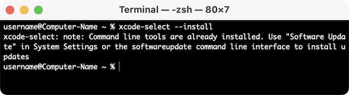

import { YouTube } from 'astro-embed';

In this guide, we will walk through the steps to install the necessary Applications and Tools that you will need to code in C# and C++ with SplashKit.  
We will be using the **Terminal** app, with the **zsh** shell. You can also use the **bash** shell if you prefer.

:::note[Already have SplashKit installed?]
If you have previously installed SplashKit:

- Update SplashKit using your Terminal, with the command: `skm update`
- Then you can skip to [Install SplashKit Globally](#install-splashkit-globally)

:::

Now, let's get started!

To get SplashKit and other coding tools installed on macOS, follow the steps outlined below:

## 1. Install XCode Command Line Tools

**Xcode Command Line Tools** is a package of tools provided by Apple for developers to enable command-line development and building of software on macOS, using your **Terminal** app. *It includes tools you will need for installing SplashKit and coding in the next chapters.*

:::note[XCode Command Line Tools Installation Video:]
<div class="not-content">
  <YouTube id="3CHGbyVY2F8" params="fs=1&modestbranding=1&rel=0&autoplay=1"/>
</div>
:::

To install these tools, run the command below in your *Terminal* app:

```bash
xcode-select --install
```


<div class="caption">Image not subject to The Programmer's Field Guide <a href="https://creativecommons.org/licenses/by-nc-nd/4.0/">CC BY-NC-ND 4.0 License</a></div>

:::tip[How do I find the Terminal on my Mac?]

1. Press ***Command*** (⌘) + ***Space bar*** to open the Spotlight Search.  
2. Start typing "Terminal".  
3. Click the **Terminal** app.

:::

**Note:** After running the command above, if you get something like this:


<div class="caption">Image not subject to The Programmer's Field Guide <a href="https://creativecommons.org/licenses/by-nc-nd/4.0/">CC BY-NC-ND 4.0 License</a></div>

That means you've already installed Xcode, and are ready to move to the next step!

## 2. Install Language Specific Tools

Some coding languages require specific tools/frameworks to be installed to be able to build and run your code files.  
As you will be coding in C# and C++ in this book, let's look at the tools needed for these languages:

### C# Tools

For coding in C#, you will need to install the `.NET` SDK which will allow you to use the *dotnet* terminal command to create, build, and run your C# project code.

:::note[.NET Installation Video:]
<div class="not-content">
  <YouTube id="i2g9br8Y9Jc" params="fs=1&modestbranding=1&rel=0&autoplay=1"/>
</div>
:::

Download the latest version of the .NET SDK for macOS from the official .NET website: [dotnet.microsoft.com/download](https://dotnet.microsoft.com/download)

Run the downloaded installer and follow on-screen instructions.

### C/C++ Tools

For coding in C++, you will need to have a C++ compiler installed to build your C++ code into a file you can use to run your program. Commonly used C++ compilers are `g++` and `clang++`.

:::note
If you installed Xcode Command Line Tools successfully in Step 1, then you will already have the necessary compilers installed and ready for coding in C++!
:::

## 3. Install SplashKit

[SplashKit](https://splashkit.io) is a beginner's all-purpose software toolkit that will allow you to create fun and exciting programs more easily, especially for Graphical User Interface (GUI) programs.

:::note[SplashKit Installation Video:]
<div class="not-content">
  <YouTube id="KlT_PCoc0pw" params="fs=1&modestbranding=1&rel=0&autoplay=1"/>
</div>
:::

Copy and paste the following command into your Terminal window to download and run the SplashKit installer:

```bash
bash <(curl -s https://raw.githubusercontent.com/splashkit/skm/master/install-scripts/skm-install.sh)
```


<div class="caption">Image not subject to The Programmer's Field Guide <a href="https://creativecommons.org/licenses/by-nc-nd/4.0/">CC BY-NC-ND 4.0 License</a></div>

:::tip[Troubleshooting tips:]

1. If the command above **does nothing**, go to [this troubleshooting page](https://splashkit.io/troubleshoot/macos/mac-issue-1/) on the SplashKit website for an alternative installation process.
2. If you see a message about "**permission denied**" or "**Operation not permitted**", go to the [Permission issue when running SplashKit installation command](https://splashkit.io/troubleshoot/macos/mac-issue-3/) page on the SplashKit website for steps to follow to resolve this issue.

:::

### Build the SplashKit Library

This step is optional for most users. If you are using an OSX version earlier than OSX 13, you will need to run the following command to build the SplashKit library locally:

```bash
skm macos install
```

### Install SplashKit Globally

Finally, you will need to install the SplashKit Global Libraries. This will install the SplashKit libraries and library include files into the system's default global locations so that the compiler can find these files when building (compiling) programs created with SplashKit.

To install SplashKit globally, copy and paste the following command into your Terminal window:

```bash
skm global install
```


<div class="caption">Image not subject to The Programmer's Field Guide <a href="https://creativecommons.org/licenses/by-nc-nd/4.0/">CC BY-NC-ND 4.0 License</a></div>

:::note[What does this command do specifically?]
The command above will add the **SplashKit libraries** into the `/usr/local/lib/` folder, and the required **SplashKit library include files** into the `/usr/local/include` folder.
:::

## 4. Install Visual Studio Code

Visual Studio Code, also commonly known as *VS Code* or just *Code*, is a powerful and versatile code editor that enables efficient coding, debugging, and collaboration for your SplashKit projects!

:::note[VS Code Installation Video:]
<div class="not-content">
  <YouTube id="ABJJMuzzbgA" params="fs=1&modestbranding=1&rel=0&autoplay=1"/>
</div>
:::

:::tip[VS Code has it all!]
Once you have your code project set up, Visual Studio Code will be the main program you will use to write, build, run and debug your code.
:::

First you will need to download the zip file from: [code.visualstudio.com/Download](https://code.visualstudio.com/Download)

To install: double-click the downloaded zip file, then click and drag the **Visual Studio Code** Application file into the ***Applications*** folder.


<div class="caption">Image not subject to The Programmer's Field Guide <a href="https://creativecommons.org/licenses/by-nc-nd/4.0/">CC BY-NC-ND 4.0 License</a></div>

### Add 'code' command to PATH

You can install the `code` command to allow you to open any file or folder in a new Visual Studio Code window, right from your Terminal!

Follow the steps in the [**Launching from the command line**](https://code.visualstudio.com/docs/setup/mac#_launching-from-the-command-line) section of the *Visual Studio Code on macOS* article to install this command.

:::tip[Troubleshooting tip:]
If you are having issues with the `code` command not working after following the steps above, go to the ['zsh: command not found: code'](https://splashkit.io/troubleshoot/macos/mac-issue-5/) page on the SplashKit website for to use an alternative installation process.
:::

### Recommended Extensions

The final step to complete the setup of VS Code is to install a few *Extensions* in VS Code:

[**Set up my VS Code Extensions**](/book/appendix/0-installation/2-7-setup-vscode)

Go to the page linked above, follow the steps to install both the C# and C/C++ recommended extensions, and then come back here and continue to the next step. *You can use the "Back button" in your browser to return to this page.*

## 5. Optional Steps

### Check Environment Variables

Through this installation process, some steps *should* have edited your computer's environment variables, or your "Shell Profile" file.

To ensure the required *paths* will be added to your **PATH** environment variable each time you open a new Terminal shell, you will need to check that your **"Shell Profile" file** contains the following line:

```bash
export PATH="$HOME/.splashkit:$PATH"
```

:::tip[Shell Profiles]
The two most common shell profiles are **zsh** (Default shell since macOS Catalina) and **bash**:

- If you are using `zsh` (Z Shell) then the *"Shell Profile"* files are: `.zshrc` or `.zprofile`.
- If you are using `bash` (Bash Shell) then the *"Shell Profile"* files are: `.bashrc` or `.bash_profile`.

:::

If you are missing the line above, you can edit your "Shell Profile" file in a few ways:

### Using '*nano*' in the Terminal

To open the file in the "nano" shell, copy and paste the following command in your Terminal:

```bash
nano .zshrc
```

To edit the file directly inside the **nano** terminal window, you can just move the cursor down to the last line and paste the missing command.

Once you're finished, press ***Control*** (^) + ***X*** to exit **nano** and follow the prompts to save the changes.

### Using 'code' to open .zshrc file in Visual Studio Code

You can open your `.zshrc` file in Visual Studio Code using the `code` command, to edit and add any missing lines.

To do this, copy and paste the following command in your Terminal:

```bash
code ~/.zshrc
```


<div class="caption">Image not subject to The Programmer's Field Guide <a href="https://creativecommons.org/licenses/by-nc-nd/4.0/">CC BY-NC-ND 4.0 License</a></div>
