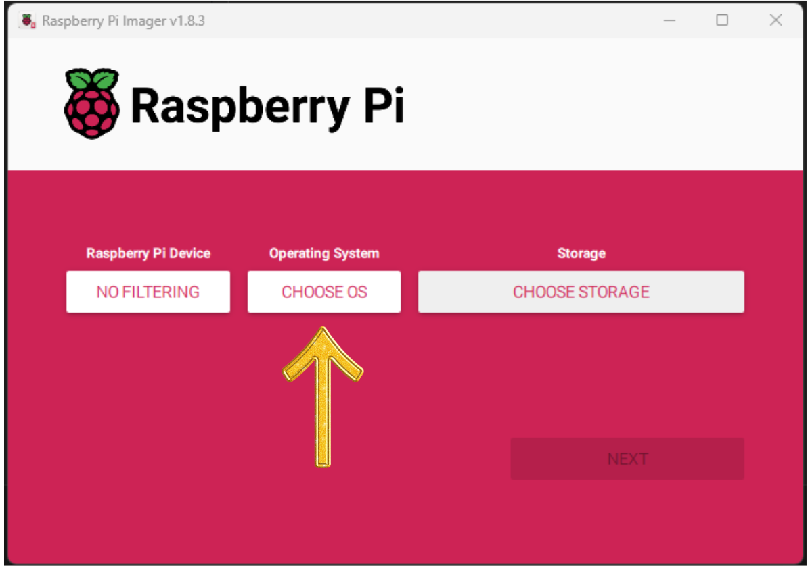
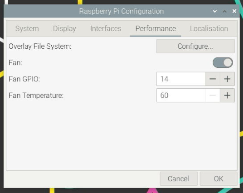

This guide will go through how to set up the software on your Raspberry Pi, including how to:

- Download and burn Raspberry Pi OS to an SD card.
- Install Raspberry Pi Operating System (OS).
- Install programs and tools used in the next chapters (continued on next page).

## 1. Download Raspberry Pi OS

:::tip[Want a pre-built image?]

The following steps get you to set up the software yourself. We recommend that you do this. However, if you need to, we also provide an image with everything already set up. Download the [FieldGuidePiImage.v1.0.img.gz](https://drive.google.com/file/d/1ieeTv6dVV7zv5vittwb82crd_wih2DPj/view?usp=share_link). Unzip it, and use this as the image you copy to the SD card in the steps below. There is a **student** user with password **student** on this Image. Please make sure to change the password.

:::

Follow the steps below to download the recommended Raspberry Pi OS:

1. Download and install the Raspberry Pi Imager from [raspberrypi.org](https://www.raspberrypi.org/software/)
    - Select the version for your operating system.
    - Run the installer and follow the instructions.
2. Insert the micro SD card into your computer.
    - You may need a Micro SD card adapter and/or a USB SD card reader.
    - We recommend using a micro SD card with a size of at least 16 GB (32 GB preferred).
3. Open the Raspberry Pi Imager.
4. Click CHOOSE OS.

    
    <div class="caption">Image not subject to The Programmer's Field Guide <a href="https://creativecommons.org/licenses/by-nc-nd/4.0/">CC BY-NC-ND 4.0 License</a></div>

5. Select Raspberry Pi OS (64b-bit)

    
    <div class="caption">Image not subject to The Programmer's Field Guide <a href="https://creativecommons.org/licenses/by-nc-nd/4.0/">CC BY-NC-ND 4.0 License</a></div>

    :::tip
    If you are using the prebuilt image, choose **Use custom** at this point and select the **FieldGuidePiImage.v1.0.img** file you downloaded. When this finishes copying onto the SD card you are all done. Just plug it into your Pi and get going.
    :::

6. Click storage and select the micro SD card and click next.

    :::danger[Which Device should I select?]
    Make sure you select the correct storage device. Selecting the wrong device will result in the data on that device being erased.

    In the image below we are using a 32 GB micro SD card connected via a USB SD card reader:

    
    <div class="caption">Image not subject to The Programmer's Field Guide <a href="https://creativecommons.org/licenses/by-nc-nd/4.0/">CC BY-NC-ND 4.0 License</a></div>

    :::

7. Click `No` to the question "Would you like to apply OS customisation setting?
    - Optionally you can click edit settings to preconfigure options like the hostname, password, and Wi-Fi settings. Click yes if you want to do this.
8. Click `Yes` to the question Are you sure you want to continue?
    - **WARNING**: This will erase all data on the selected storage device.
9. Wait until the Raspberry Pi Imager has downloaded, written and verified the image on micro SD card. (This may take a while)
10. Click continue and remove the micro SD card from your computer.

    
    <div class="caption">Image not subject to The Programmer's Field Guide <a href="https://creativecommons.org/licenses/by-nc-nd/4.0/">CC BY-NC-ND 4.0 License</a></div>

## 2. Install Raspberry Pi OS

Follow the steps below to install the Raspberry Pi OS on the micro SD card:

1. Insert the micro SD card into the Raspberry Pi and power on. (See [Build my Raspberry Pi](/book/appendix/0-installation/2-2-pi-computer) for setup instructions)
2. On the Welcome screen click next.
3. Set your country, language and time zone and click next.

    :::note[Important!]
    For the correct keyboard layout that is used for most Australian-produced keyboards (and the Raspberry Pi Keyboard that we are using), make sure to ***tick*** the option: "**Use US keyboard**", as shown in the image below.
    :::

    
    <div class="caption">Image not subject to The Programmer's Field Guide <a href="https://creativecommons.org/licenses/by-nc-nd/4.0/">CC BY-NC-ND 4.0 License</a></div>

4. Set your username and password, click next.

    
    <div class="caption">Image not subject to The Programmer's Field Guide <a href="https://creativecommons.org/licenses/by-nc-nd/4.0/">CC BY-NC-ND 4.0 License</a></div>

5. \*\*Optional\*\*  
   Select Wi-Fi network and enter password, click next.

    
    <div class="caption">Image not subject to The Programmer's Field Guide <a href="https://creativecommons.org/licenses/by-nc-nd/4.0/">CC BY-NC-ND 4.0 License</a></div>

6. Select your preferred browser: Chromium or Firefox, Click next.

    
    <div class="caption">Image not subject to The Programmer's Field Guide <a href="https://creativecommons.org/licenses/by-nc-nd/4.0/">CC BY-NC-ND 4.0 License</a></div>

7. \*\*Optional\*\*  
   Update Software, Click next.

    :::tip[Reduce initial setup time]
    This process will take some time to complete.

    Click "Skip" to perform this task later.
    :::

    
    <div class="caption">Image not subject to The Programmer's Field Guide <a href="https://creativecommons.org/licenses/by-nc-nd/4.0/">CC BY-NC-ND 4.0 License</a></div>

8. Click restart.

9. After the reboot you will be presented with the Raspberry Pi Desktop:

    
    <div class="caption">Image not subject to The Programmer's Field Guide <a href="https://creativecommons.org/licenses/by-nc-nd/4.0/">CC BY-NC-ND 4.0 License</a></div>

10. Raspberry Pi OS Install Complete!

## 3. Setup Raspberry Pi OS

*Let's get your Raspberry Pi ready to start coding*.

This section will go through all the steps to install the required Applications and Tools that you will need to code in C# and C++ with SplashKit.
To make things easier we have an automated script for fresh installs that will install all the required tools and applications for you or you can follow the manual steps below.

:::note[How do I open the Terminal on my Pi?]
Click the Terminal icon in the task bar or press `Ctrl + Alt + T`.


<div class="caption">Image not subject to The Programmer's Field Guide <a href="https://creativecommons.org/licenses/by-nc-nd/4.0/">CC BY-NC-ND 4.0 License</a></div>
:::

### Automated Setup

This script will install the following applications and tools:

- Visual Studio Code
  - C/C++ Extension
  - C# Extension
- .NET SDK
- SplashKit
  - SplashKit Global
- wget
- git
- curl
- clang

Open the Terminal and run the following command:

```bash
curl -s "https://programmers.guide/resources/Raspberry_Pi_InstallScript.sh" | bash /dev/stdin
```

:::note
This script will take a while to run (approx. 12-15 mins).
:::

Once the automated script has finished running, close and reopen the Terminal.

Run the command `skm` to check SplashKit is installed correctly.

:::tip[Using options with the script]
The linux_pi_install script supports a number of options that can be used to customise the installation.  
They can be added to the end of the command.

The example below will display the help menu which lists the available options (scroll the command across to see the end):

```bash
curl -s "https://programmers.guide/resources/Raspberry_Pi_InstallScript.sh"| bash /dev/stdin --help
```

:::

### Manual Setup Steps

If you choose not to use the automated set up above, or are experiencing issues with this, you can follow these steps below:

### 1. Install the SplashKit SDK

[SplashKit](https://splashkit.io) is a beginner's all-purpose software toolkit that will allow you to create fun and exciting programs more easily, especially for Graphical User Interface (GUI) programs.

Copy and paste the following command into your Terminal window to download and run the SplashKit installer:

```bash
bash <(curl -s https://raw.githubusercontent.com/splashkit/skm/master/install-scripts/skm-install.sh)
```

:::tip[Troubleshooting tip:]
If you have issues installing the SplashKit SDK, go to [this troubleshooting page](https://splashkit.io/troubleshoot/linux/linux-issue-1/) on the SplashKit website for an alternative installation process.
:::

Close and reopen the Terminal, then run the command below to build SplashKit on the Pi:

```bash
skm linux install
```

When prompted, type `y` and press enter to confirm the installation.


<div class="caption">Image not subject to The Programmer's Field Guide <a href="https://creativecommons.org/licenses/by-nc-nd/4.0/">CC BY-NC-ND 4.0 License</a></div>

:::note
This may take a while (approx. 10 mins).
:::

### 2. Install SplashKit Globally

Finally, you will need to install the SplashKit Global Libraries. This will install the SplashKit libraries and library include files into the system default global locations so that when building (compiling) programs created with SplashKit, the compiler can find these files automatically.

To install SplashKit globally on your machine:

Copy and paste the following command into your Terminal window:

```bash
skm global install
```

:::note[What does this command do specifically?]
The command above will add the **SplashKit libraries** into the `/usr/local/lib/` folder, and the required **SplashKit library include files** into the `/usr/local/include` folder.
:::

### 3. Install Visual Studio Code

Visual Studio Code, also commonly known as *VS Code* or just *Code*, is a powerful and versatile code editor that enables efficient coding, debugging, and collaboration for your SplashKit projects!

:::note[VS Code has it all!]
Once you have your code project set up, Visual Studio Code will be the main program you will use to write, build, run and debug your code.
:::

Run the following command in the Terminal to install Visual Studio Code:

```bash
sudo apt install code
```


<div class="caption">Image not subject to The Programmer's Field Guide <a href="https://creativecommons.org/licenses/by-nc-nd/4.0/">CC BY-NC-ND 4.0 License</a></div>

:::tip[Open Code from Terminal]
You can open Visual Studio Code from the Terminal by typing `code` and pressing enter.
`code .` Will open the current folder in Visual Studio Code.
:::

### Recommended Extensions

The final step to complete the setup of VS Code is to install a few *Extensions* in VS Code:

[**Set up my VS Code Extensions**](/book/appendix/0-installation/2-7-setup-vscode)

Go to the page linked above, follow the steps to install both the C# and C/C++ recommended extensions, and then come back here and continue to the next step. *You can use the "Back button" in your browser to return to this page.*

### 4. Install Language Specific Tools

Some coding languages require specific tools/frameworks to be installed to be able to build and run your code files.  
As you will be coding in C# and C++ in this book, let's look at the tools needed for these languages:

### C# Tools

For coding in C#, you will need to install the `.NET` framework, also commonly called *dotnet*.  
You will use this to create, build, and run your C# project code.

Download the latest version of the .NET SDK using the following command:

```bash
curl -sSL https://dot.net/v1/dotnet-install.sh | bash /dev/stdin
```

You will also need to add the *.dotnet* folder to your PATH environment variable with the following commands:

```bash
echo 'export DOTNET_ROOT=$HOME/.dotnet' >> ~/.bashrc
echo 'export PATH=$PATH:$HOME/.dotnet' >> ~/.bashrc
source ~/.bashrc
```

Test dotnet is installed correctly by running `dotnet --version` in the Terminal.

For more details on the process, refer to this article [Deploy .NET apps on ARM single-board computers](https://docs.microsoft.com/en-us/dotnet/iot/deployment)

### C++ Tools

For coding in C++, you will need to have a C++ compiler installed to build your C++ code into a file you can use to run your program.  
Commonly used compilers are `g++` and `clang++`.

`g++` is installed by default on the Raspberry Pi.

To install `clang++` run the following command:

```bash
sudo apt install clang -y
```

### 5. Optional Steps

:::tip[What is nano?]
Nano is a command line text editor that is installed by default on the Raspberry Pi. It has a number of features but as a quick start these are the most important commands

- To edit a file in nano use `nano [filename]`
- navigate the cursor using the arrow keys
- `Ctrl + O` to save the file
- `Ctrl + X` to exit the editor

  :::

### Setup zhs shell

When using the terminal you are actually interacting with a shell, where the default for the Raspberry Pi is **bash**, but there are other shells available.

Here we will install ***zsh*** and ***oh-my-zsh*** to customise the terminal. These will give you a more user-friendly terminal experience with themes and plugin support.

**To install zsh**, run the following command in your Terminal:

```bash
sudo apt install zsh -y
```

**To install oh-my-zsh**, run the following command in your Terminal:


<div class="caption">Image not subject to The Programmer's Field Guide <a href="https://creativecommons.org/licenses/by-nc-nd/4.0/">CC BY-NC-ND 4.0 License</a></div>

```bash
sh -c "$(curl -fsSL https://raw.githubusercontent.com/ohmyzsh/ohmyzsh/master/tools/install.sh)"
```

Answer `y` to the question `Do you want to change your default shell to zsh?`

Add SplashKit and dotnet to the PATHs to zsh:

```bash
echo "export PATH=$PATH:$HOME/.dotnet" >> ~/.zshrc
echo "export DOTNET_ROOT=$HOME/.dotnet" >> ~/.zshrc
echo "export PATH=$PATH:$HOME/.splashkit" >> ~/.zshrc
source ~/.zshrc
```

:::note[You may need to restart the Pi for the terminal to update]
:::

### Plugins

There are a number of plugins available for **oh-my-zsh** that add additional functionality to the terminal.  
[This article](https://github.com/ohmyzsh/ohmyzsh/wiki/Plugins) has a list of pre-installed plugins, although there are others available as well.

To install a plugin you need to add it to the plugins list in the `~/.zshrc` file.

Using `autojump` as an example:


<div class="caption">Image not subject to The Programmer's Field Guide <a href="https://creativecommons.org/licenses/by-nc-nd/4.0/">CC BY-NC-ND 4.0 License</a></div>

First you will install it with:

```bash
sudo apt install autojump -y
```

Then add it to the plugins list in `~/.zshrc`

```bash
nano ~/.zshrc
```

Navigate to the plugins line and add `autojump` to the list. `git` will be listed already.  
Use a space to separate the plugins as shown below:

```bash
plugins=(git autojump)
```

Save and close the file.
Then run the following command to update the terminal:

```bash
source ~/.zshrc
```

### Add Shortcut for the Programmers Field Guide

To add the Programmers Field Guide to the menu, run the following commands in the terminal.
On the Raspberry Pi it will appear under "Programming" in the menu.

```bash
    echo "Adding Programers Feild guide to Menu"
    sudo curl -s "https://raw.githubusercontent.com/splashkit/the-programmers-field-guide/main/public/favicon.svg" -o /usr/share/pixmaps/feildguide.svg

    touch ~/programmers-field-guide.desktop
    echo "[Desktop Entry]" >> ~/programmers-field-guide.desktop
    echo "Type=Application" >> ~/programmers-field-guide.desktop
    echo "Name=Programmers Field Guide" >> ~/programmers-field-guide.desktop
    echo "TryExec=/usr/bin/x-www-browser" >> ~/programmers-field-guide.desktop
    echo "Exec=/usr/bin/x-www-browser https://programmers.guide/" >> ~/programmers-field-guide.desktop
    echo "Icon=/usr/share/pixmaps/feildguide.svg" >> ~/programmers-field-guide.desktop
    echo "Categories=Development;" >> ~/programmers-field-guide.desktop
    sudo mv ~/programmers-field-guide.desktop /usr/share/applications/programmers-field-guide.desktop
```

### Desktop Background

To customise the desktop background, right-click anywhere on the desktop and select Change Background (**Properties on the Raspberry Pi**).  
Then, select the image or theme you want to use as your background.


<div class="caption">Image not subject to The Programmer's Field Guide <a href="https://creativecommons.org/licenses/by-nc-nd/4.0/">CC BY-NC-ND 4.0 License</a></div>

You can toggle dark mode by clicking on the icon in the top right of the screen and selecting the mode you want to use.


<div class="caption">Image not subject to The Programmer's Field Guide <a href="https://creativecommons.org/licenses/by-nc-nd/4.0/">CC BY-NC-ND 4.0 License</a></div>

### Raspberry Pi Set Fan Control

If you are using a fan on your Raspberry Pi with GPIO control, you can configure it to turn on when the CPU reaches a specific temperature.
Click the menu, select `Preferences`, then `Raspberry Pi Configuration`, and select the `Performance` tab.


<div class="caption">Image not subject to The Programmer's Field Guide <a href="https://creativecommons.org/licenses/by-nc-nd/4.0/">CC BY-NC-ND 4.0 License</a></div>

Toggle the fan on, select the GPIO pin you are using, and set the temperature the fan will turn on when reached.
If you follow our Pi setup guide, you will use GPIO 14, and we recommend setting the fan to turn on at 60 degrees.


<div class="caption">Image not subject to The Programmer's Field Guide <a href="https://creativecommons.org/licenses/by-nc-nd/4.0/">CC BY-NC-ND 4.0 License</a></div>
