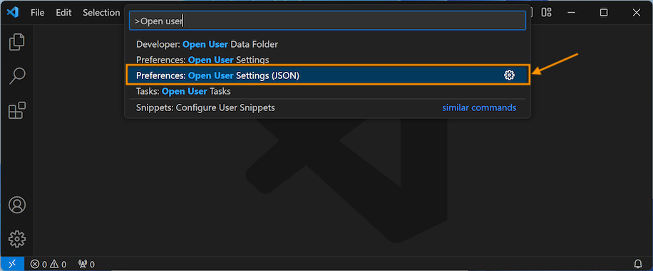

import { YouTube } from 'astro-embed';

In this guide, we will walk through the steps to install the necessary Applications and Tools using **MSYS2** (**M**inimal **SYS**tem) on Windows. This will enable you to code in C# and C++ with SplashKit.

:::note[Already have SplashKit installed?]
If you have previously installed SplashKit:

- Update SplashKit using your MSYS2/MINGW64 terminal with the command: `skm update`
- Then you can skip to [Install SplashKit Globally](#install-splashkit-globally).

:::

Now, let's get started!

To get SplashKit and other coding tools installed on Windows, using MSYS2, follow the steps outlined below:

## 1. Install MSYS2

Download the installer from the official MSYS2 website: [www.msys2.org](https://www.msys2.org/)

:::note[MSYS2 Installation Video:]
<div class="not-content">
  <YouTube id="Hayjgo1Kqg0" params="fs=1&modestbranding=1&rel=0&autoplay=1"/>
</div>
:::

To install MSYS2, double-click the downloaded executable file, and follow the on-screen instructions.

*It is strongly recommended that you use the default install path, but you can customise the other installation options as needed.*

:::note[Which Terminal?]
MSYS2 comes with a variety of terminal environments. The **MINGW64** terminal environment is recommended for 64-bit computers (MINGW32 for 32-bit) as it has been found to support the C# and C++ terminal commands you will use.

Therefore, you should use the **MINGW64** (MSYS2 MINGW64) terminal, which you can find by searching "mingw64" in the Windows Start menu and selecting the **MSYS2 MINGW64** App.
:::

:::tip[Pin it!]
To make it easier to open each time, you can pin your terminal to the Taskbar.

- Open MINGW64 terminal.
- Right-click on the MSYS2 App icon in the taskbar (shown in the orange box in the image below).
- Select "Pin to taskbar" (shown in the pink box):


<div class="caption">Image not subject to The Programmer's Field Guide <a href="https://creativecommons.org/licenses/by-nc-nd/4.0/">CC BY-NC-ND 4.0 License</a></div>
:::

## Automated Setup

This script will install the following applications and tools:

- Visual Studio Code
  - C/C++ Extensions
  - C# Extensions
- .NET SDK
- SplashKit
  - SplashKit Global
- git
- clang
- gcc
- gdb

Open the MSYS2/**MINGW64** Terminal using **"Run as Administrator"** and run the following command:

```bash
curl -s "https://programmers.guide/resources/MSYS2_InstallScript.sh" | bash /dev/stdin
```

:::note
This script may take a while to run (approx. 5-10 mins).
:::

Once the automated script has finished running, close and reopen the Terminal.

Run the command `skm` to check SplashKit is installed correctly.

:::tip[Add MINGW64 Terminal to Visual Studio Code]
Now go to the [Setup VS Code Terminal](#setup-vs-code-terminal) section to add your MSYS2/MINGW64 Terminal into VS Code.  
Then, once you're finished, you can go to the [Using MSYS2](#using-msys2) section for more information about accessing files in your C drive with the MSYS2/MINGW64 terminal.
:::

## Manual Steps

### 2. Install Command Line Tools

To install SplashKit, you will firstly need to install some command line tools using the `pacman` package manager.

:::note[Command Line Tools Installation Video:]
<div class="not-content">
  <YouTube id="XxaHFoGdlj0" params="fs=1&modestbranding=1&rel=0&autoplay=1"/>
</div>

*The command used in the video above has been altered slightly, but the process is the same.*
:::

Copy and paste the following command into your **MINGW64** terminal window to install the `git`, `clang`, `gcc` and `gdb` pacman packages:

```bash
pacman -S git mingw-w64-x86_64-clang mingw-w64-x86_64-gcc mingw-w64-x86_64-gdb --noconfirm --disable-download-timeout
```

:::caution[Paste commands into MINGW64 Terminal]
Unfortunately, you won't be able to use `Ctrl` + `V` to paste.

Instead, right-click anywhere in the terminal window and then select **Paste**.
:::

### 3. Install SplashKit

SplashKit is a beginner's all-purpose software toolkit that will allow you to create fun and exciting programs more easily, especially for Graphical User Interface (GUI) programs.

:::note[SplashKit Installation Video:]
<div class="not-content">
  <YouTube id="ndP8vrf9oOU" params="fs=1&modestbranding=1&rel=0&autoplay=1"/>
</div>
:::

Copy and paste the following command into your MINGW64 terminal to download and run the SplashKit installer:

```bash
bash <(curl -s https://raw.githubusercontent.com/splashkit/skm/master/install-scripts/skm-install.sh)
```

:::tip[Troubleshooting tip:]
If you have issues installing the SplashKit SDK, go to the [No response when running SplashKit installation command](/book/appendix/0-installation/3-0-troubleshooting-install/#no-response-when-running-splashkit-installation-command) section in the Installation Troubleshooting page for an alternative installation process.
:::

:::note[Curious to know more?]
The **SplashKit SDK** is installed using the `skm-install.sh` shell script which is stored in the [**skm**](https://github.com/splashkit/skm) GitHub repository (in the **install-scripts** folder).

It will also add the required paths to your PATH environment variable.
:::

### Install SplashKit Globally

Finally, you will need to install the SplashKit Global Libraries. This will install the SplashKit libraries and library include files into the system's default global locations so that the compiler can find these files when building (compiling) programs created with SplashKit.

To install SplashKit globally, open the MINGW64 terminal and run the following command in the terminal window:

```bash
skm global install
```

You may need to open the MINGW64 Terminal with "Run as administrator" if you have issues.

:::note[What does this command do specifically?]
The command above will add the **SplashKit libraries** into the `/mingw64/lib` folder, and the required **SplashKit library include files** into the `/mingw64/include` folder.
:::

### 4. Install Visual Studio Code

Visual Studio Code, also commonly known as *VS Code* or just *Code*, is a powerful and versatile code editor that enables efficient coding, debugging, and collaboration for your SplashKit projects!

:::note[VS Code Installation Video:]
<div class="not-content">
  <YouTube id="UqGIPYWprRE" params="fs=1&modestbranding=1&rel=0&autoplay=1"/>
</div>
:::

:::note[VS Code has it all!]
Once you have your code project set up, Visual Studio Code will be the main program you will use to write, build, run and debug your code.
:::

Download and run the installer from: [code.visualstudio.com/Download](https://code.visualstudio.com/Download).

:::tip[Open Code from Terminal]
You can open Visual Studio Code from the MINGW64 terminal by typing `code` and pressing enter. `code .` will open the current folder in Visual Studio Code.

*You will need to close and reopen any currently open terminal windows after installing VS Code for the above commands to work.*
:::

### Setup VS Code Terminal

Visual Studio Code has a built-in Terminal that you can use instead of needing to switch back and forth between VS Code and your MINGW64 terminal window. You will need to update some settings to get this working with your MINGW64 terminal.

Open Visual Studio Code, then press `Ctrl` + `Shift` + `P` to open the [Command Palette](https://code.visualstudio.com/docs/getstarted/userinterface#_command-palette).

Start typing "Open user..." and then select **Open User Settings (JSON)** (shown in the orange box in the image below):


<div class="caption">Image not subject to The Programmer's Field Guide <a href="https://creativecommons.org/licenses/by-nc-nd/4.0/">CC BY-NC-ND 4.0 License</a></div>

This will open the **settings.json** file that you can now edit.

Create a new line just before the last closing curly brace `}` at the end of the file, and then copy and paste the text below into that line:

```json
    "terminal.integrated.profiles.windows": {
        "PowerShell": {
            "source": "PowerShell",
            "icon": "terminal-powershell"
        },
        "Command Prompt": {
            "path": [
                "${env:windir}\\Sysnative\\cmd.exe",
                "${env:windir}\\System32\\cmd.exe"
            ],
            "args": [],
            "icon": "terminal-cmd"
        },
        "MSYS2": {
            "path": "C:\\msys64\\usr\\bin\\bash.exe",
            "args": [
                "--login",
                "-i"
            ],
            "env": {
                "MSYSTEM": "MINGW64",
                "CHERE_INVOKING": "1"
            }
        }
    },
    "terminal.integrated.defaultProfile.windows": "MSYS2",
    "terminal.integrated.env.windows": {
        "MSYSTEM": "MINGW64",
        "CHERE_INVOKING": "1"
    },
```

:::note[Troubleshooting Notes:]

- If you already have some settings included in this file, you will need to add a comma `,` after the closing curly brace `}` on the line above your new line.
- If you already see code that looks similar to the code above, you may need to copy only small parts to match the code above.
- The last line of the code above will set your default profile, so that it will automatically use the MSYS2 (MINGW64) terminal. You can also read this [article](https://code.visualstudio.com/docs/terminal/profiles) to see other ways to set the default terminal.

:::

Save the file for these changes to take effect.

Now you can open a new Terminal in VS Code with: ***Terminal* > *New Terminal*** (as shown below):


<div class="caption">Image not subject to The Programmer's Field Guide <a href="https://creativecommons.org/licenses/by-nc-nd/4.0/">CC BY-NC-ND 4.0 License</a></div>

### Recommended Extensions

The final step to complete the setup of VS Code is to install a few *Extensions* in VS Code:

[**Set up my VS Code Extensions**](/book/appendix/0-installation/2-7-setup-vscode)

Go to the page linked above, follow the steps to install both the C# and C/C++ recommended extensions, and then come back here and continue to the next step. *You can use the "Back button" in your browser to return to this page.*

### 5. Install Language Specific Tools

Some coding languages require specific tools/frameworks to be installed to be able to build and run your code files.  
As you will be coding in C# and C++ in this book, let's look at the tools needed for these languages:

### C# Tools

For coding in C#, you will need to install the `.NET` SDK which will allow you to use the *dotnet* terminal command to create, build, and run your C# project code.

:::note[.NET Installation Video:]
<div class="not-content">
  <YouTube id="lmJjNbPwAlw" params="fs=1&modestbranding=1&rel=0&autoplay=1"/>
</div>
:::

Download the latest version of the .NET SDK for Windows from the official .NET website: [dotnet.microsoft.com/download](https://dotnet.microsoft.com/download)

Run the downloaded installer and follow on-screen instructions.

### C/C++ Tools

For coding in C++, you will need to have a C++ compiler installed to build your C++ code into a file you can use to run your program. Commonly used C++ compilers are `g++` and `clang++`, which can be installed with **GCC** (**G**NU **C**ompiler **C**ollection). You will also need to install **GDB** (**G**NU **D**e**b**ugger), which you can use when debugging C++ programs.

:::note
If you installed the Command Line Tools successfully in Step 2, then you will already have the necessary compilers installed and ready for coding in C++!
:::

Your Windows machine is now set up with MSYS2, Visual Studio Code, and SplashKit, ready for C# and C++ development. Happy coding!

## Using MSYS2

MSYS installs a minimal Linux environment on top of Windows. This will give you easy access to all of your Windows files and folder. The one challenge is that MSYS2 has its own home folder that does not map to your Windows home folder. If you want to access your Windows home folder you will need to use the `cd` command to move into that folder. Each of your system drives (C: for example) is mapped to a folder with the drive name in the root of the file system. So `C:` is `/c/` in MSYS. To access my Windows Documents folder, I can use the path `/c/Users/andrew/Documents`. You will need to change `andrew` to be your username, so the path will be in the format `/c/Users/<username>/Documents`. The following commands open my Documents folder.

```bash
# Move to my C drive
cd /c/

# Move to my Documents folder
cd /c/Users/andrew/Documents
```

Using these commands you should be able to save your projects either in your Windows Documents folder for easy access.

If you want to find where your MSYS2 home folder is on your Windows machine, you can use the `pwd` command with a `-W` option to say you want the "Windows" path for the current folder. You can also use the `explorer.exe` program to open a folder in the File Explorer.

```bash
# Move into my MSYS home folder
cd ~
# Output my home folder's Windows path
pwd -W
# Open the current directory in File Explorer
explorer .
```

:::note[Shortcut/Alternative way to use "cd" command:]

Here is a video showing how you can click and drag folders into your MSYS2/MINGW64 terminal to make using the `cd` command quicker/easier.

Note that you need to type `cd` then add a *space* before you drag the folder.

<div class="not-content">
  <YouTube id="s2YTKsRjkWI" params="fs=1&modestbranding=1&rel=0&autoplay=1"/>
</div>
:::
