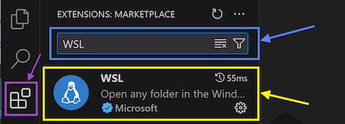

Visual Studio Code has an extensive library of *Extensions* that let you add improved functionality for languages, debuggers, and tools to support your development workflow.  
Using extensions in VS Code will make it easier and faster to code with whatever language or tools you are using.

## C# Language Extensions

For **C#** code, we recommended that you install the `C#`, `C# Dev Kit` and `IntelliCode for C# Dev Kit` extensions.

:::tip[How do I install the C# extensions?]

1. Open Visual Studio Code and click on the *Extensions* tab in the left panel (shown in the purple box in the image below).
2. Type "C#" in the Search bar at the top (shown in the blue box).
3. Click "Install" for each of the extensions listed (shown in the green box).

Image not subject to The Programmer's Field Guide <a href="https://creativecommons.org/licenses/by-nc-nd/4.0/">CC BY-NC-ND 4.0 License</a>

:::

## C++ Language Extensions

For **C++** code, we recommended that you install the `C/C++` extension.  

You can also install the `C/C++ Extension Pack` extension which includes multiple extensions bundled together. If you have issues with syntax highlighting, the `Better C++ Syntax` extension is one of the best for this.

:::tip[How do I install the C++ extensions?]

1. Open Visual Studio Code and click on the *Extensions* tab in the left panel (shown in the purple box in the image below).
2. Type "C++" in the Search bar at the top (shown in the blue box).
3. Click "Install" for the "C/C++" extensions (shown in the green box).
4. (Optional) Click "Install" for any other extensions you want to install (shown in the orange box).

Image not subject to The Programmer's Field Guide <a href="https://creativecommons.org/licenses/by-nc-nd/4.0/">CC BY-NC-ND 4.0 License</a>

:::

## Using WSL on Windows

If you are using the **Windows (WSL)** setup guide, you will also need to install the `WSL` extension.

:::tip[How do I install the WSL extension?]

1. Open Visual Studio Code and click on the *Extensions* tab in the left panel (shown in the purple box in the image below).
2. Type "WSL" in the Search bar at the top (shown in the blue box).
3. Click "Install" for the "WSL" extension (shown in the yellow box).

Image not subject to The Programmer's Field Guide <a href="https://creativecommons.org/licenses/by-nc-nd/4.0/">CC BY-NC-ND 4.0 License</a>

:::
