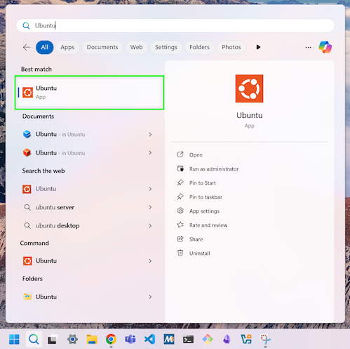

import { Tabs, TabItem } from '@astrojs/starlight/components';

Now we need to get our hands dirty and start playing with the Terminal. This will be a very quick tour, but will help get you started. We will expand on this in the next chapter.

Open the terminal on your computer.

:::tip[How do I open the Terminal?]

<Tabs syncKey="terminal-type">
<TabItem label="macOS">
  
To open the Terminal on macOS, press ***Command*** (⌘) + ***Space bar*** to open the Spotlight Search, start typing "Terminal" and then click the **Terminal** app.


<div class="caption">Image not subject to The Programmer's Field Guide <a href="https://creativecommons.org/licenses/by-nc-nd/4.0/">CC BY-NC-ND 4.0 License</a></div>

</TabItem>
<TabItem label="Linux">

- To open the Terminal on **Debian**:

    Click "Activities" in the top left of the screen and type "Terminal" in the search bar, then click on the Terminal icon.

    
    <div class="caption">Image not subject to The Programmer's Field Guide <a href="https://creativecommons.org/licenses/by-nc-nd/4.0/">CC BY-NC-ND 4.0 License</a></div>

- To open the Terminal on **Raspberry Pi**:

    Click the Terminal icon in the task bar or press `Ctrl + Alt + T`.

    
    <div class="caption">Image not subject to The Programmer's Field Guide <a href="https://creativecommons.org/licenses/by-nc-nd/4.0/">CC BY-NC-ND 4.0 License</a></div>

</TabItem>

<TabItem label="Windows (MSYS2)">

You will need to have installed MSys2. Use the instructions in the [appendix](/book/appendix/0-manual-installation/2-5-setup-win-msys) if you haven't already installed the tools you need.

To open the **MINGW64** terminal (not MSYS2, UCRT64, etc), search "mingw64" in the Windows Start menu and then select the **MSYS2 MINGW64** App (green box below):


<div class="caption">Image not subject to The Programmer's Field Guide <a href="https://creativecommons.org/licenses/by-nc-nd/4.0/">CC BY-NC-ND 4.0 License</a></div>

</TabItem>

<TabItem label="Windows (WSL)">

To open a WSL Terminal, search "Ubuntu" in the Windows Start menu, and then select the Ubuntu App (green box below):


<div class="caption">Image not subject to The Programmer's Field Guide <a href="https://creativecommons.org/licenses/by-nc-nd/4.0/">CC BY-NC-ND 4.0 License</a></div>

*You can also follow the steps in the [Configure 'Windows Terminal'](/book/appendix/0-manual-installation/2-6-setup-win-wsl/#configure-windows-terminal) section of the WSL installation page to set up the Windows "Terminal" app to use the WSL terminal.*

</TabItem>
</Tabs>

:::

At this point, you should see a “prompt” within the terminal. This is the **shell** asking you to give it an instruction. You type commands, and press the Enter or Return key on your keyboard to get the shell to do what you have asked.

Try the following:

```sh
echo "Hello `whoami`"
```

:::caution[Make sure to use backticks]

For these commands to work, make sure you are using double quotes (") around the text and backticks (\`) not single quotes (') around the `whoami`. We will look at why soon.

:::

Now let's have a look at the basic commands you will need to use... these will be enough to get you started and you can learn more as you go.
