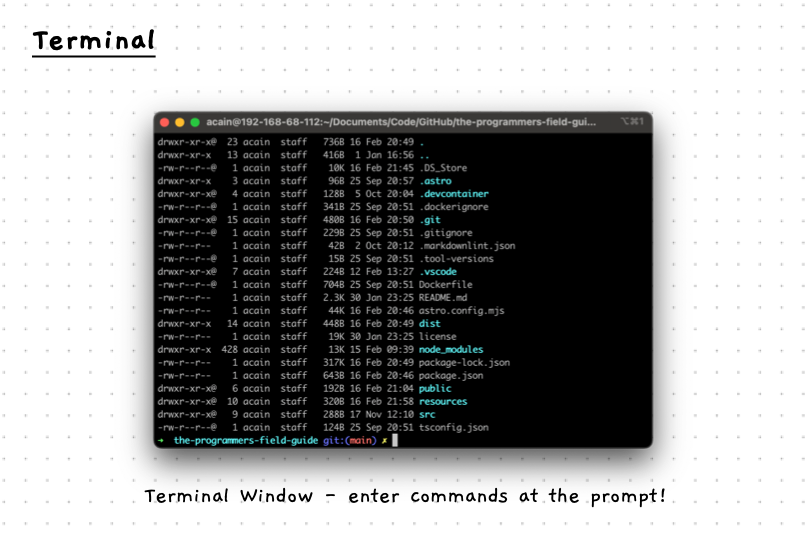

Once upon a time, computers were rare, large, and shared between many users. Each computer (picture a whole room, not something in your pocket) had a number of connected monitors and keyboards to allow people to access it. These monitors and keyboards were built into a single box called a **terminal**. To use the computer, you would go to the terminal and respond to the prompts the computer provided you with.

The terminal gave you access to the low-level workings of the computer. These terminals looked like the following image, which is a [DEC VT52 terminal](https://en.wikipedia.org/wiki/Computer_terminal#Video_display_units_(VDUs)) (image from Wikipedia).

## Modern Terminals

Now, computers are everywhere, but we still need a way of accessing them at a lower level. The name "terminal" has stuck, but now the **terminal** is a **program** that gives you command line access to the computer. With command line access the computer will give you a prompt to enter commands. You can type text, and hit *enter* (or *return*) to have the computer run that command. Programs you run at the terminal output details back to the terminal for you to read, and interactive programs can receive input from you through this same terminal.

Being able to interact with programs via the terminal will give you access to an entirely new world of computing. There are utilities and tools for many useful tasks that can only be used through the terminal. Because they can be run through the terminal, these utilities and tools can be combined and built into programs. This kind of programming is called **scripting**, and it will help you analyse data, set up servers, automate repetitive tasks, and understand errors or issues in getting complex programs to work.

:::note
**Scripting** is a kind of programming used for small tasks that don't require a lot of code.
An entire script is usually contained in a single file, and is typically run through the terminal.

All programming languages used for scripting are [interpreted](/book/part-0-getting-started/1-digital-realities/2-trailside/6-source-code#compilers-and-interpreters).
This enables users to make quick changes without the overhead of recompiling an entire program.
It also allows scripts to be easily shared, as they can be run on any device with a compatible interpreter.
Windows, OSX, and Linux all come with in-built support for at least one scripting language.
:::

## Using the Terminal

Getting experience using the terminal to interact with the computer through the command line will mean that you can start using these utilities and tools yourself. Understanding how they work will also help you understand the options available to you and help you debug any errors that occur.

The challenge with command line applications is that while you can do more, with more flexibility, there is less guidance.
Without a convenient graphical interface you need to remember the commands yourself.
As we introduce different tools and their commands, think about strategies you could use to remember them.
One idea might be to create a cheat sheet you can refer to.
