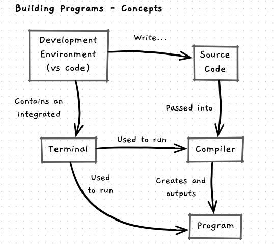

This chapter focuses on the following:

Our main focus will be on building and running [Programs](/book/part-0-getting-started/1-building-programs/5-reference/1-programs) - executables files that you can run to perform a task. To do this we will need a basic understanding of:

- [Source Code](/book/part-0-getting-started/1-building-programs/5-reference/6-source-code): text files that contain structured instructions written in a programming language. 
- [Compiler](/book/part-0-getting-started/1-building-programs/5-reference/6-source-code): the program you use to convert source code into programs ([machine code](/book/part-0-getting-started/1-building-programs/5-reference/4-machine-code)).
- [Terminal](/book/appendix/2-computer-use/2-trailside/01-terminal): the environment where you can enter commands to run.
- **Integrated Development Environment**: the tools we use to write code and run programs.

