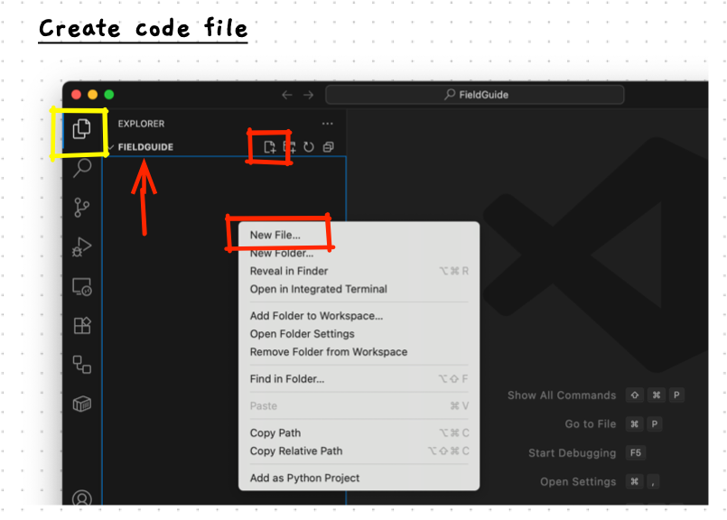

import { Steps } from '@astrojs/starlight/components';

Let's get straight into building our first program. You will use these steps over and over as you progress through this material... so make sure you know how to work through each step.

## 1. Open Visual Studio Code

Most of our programming work can be undertaken in Visual Studio Code. We will be able to use this to create the files we need, edit and compile our code, and run our programs.

<Steps>
1. Open **Visual Studio Code**

    :::note[Using Windows WSL?]
    If you are using Windows WSL, you now need to connect the Ubuntu system you installed.

    1. Open the VS Code Command Palette using Ctrl + Shift + P.
    2. Type **WSL** and select the `Connect to WSL` option.

    If the option is not available make sure you have [WSL installed correctly](/book/part-0-getting-started/1-building-programs/3-intro-tour/0-install-os/2-5-setup-win-wsl), and the WSL extension for VS Code.
    :::
</Steps>

## 2. Create Code Folder

We need somewhere to store our program code. Files are organised by the [file system](/book/appendix/2-computer-use/2-trailside/03-files-systems) in files and folders. You can use folders to organise where things are stored, making it easy to find where your code is when you need it.

Create and open a folder for your program code.

<Steps>
2. In VS Code, click on the **File** menu and choose **Open Folder**.
3. Then use the dialog that appears to create a new folder somewhere on your computer.
   :::tip
   Generally you will have a home folder that contains a Documents folder. This is probably a good place to store your code. Create a **Code** folder in your documents.

   When you start working on larger projects, you can create separate folders for the project as its files.
   :::

</Steps>

## 3. Create a Code File

Code for each program will be written in a simple text file. We will give this file a **.cpp** extension to help Visual Studio Code understand the kind of code we are working with.

<Steps>
4. Make sure you can see the *Explorer* on the left of VS Code. You can open using the top icon in the toolbar on the left, the one highlighted in yellow below, if needed.

    
5. Note the folder that you have open. The image above is in the *FieldGuide* folder, indicated by the red arrow. You may need this later if you need to access any of the files you create.
6. Click the *New File* icon at the top of the Explorer, or Right-Click and select *New File...*. These are highlighted in red boxes in the image above.
7. Now type the name of the file you want. In this case type **hello-world.cpp** then press enter.
</Steps>

## 4. Add the Code

Now we need to write the code. For our first program we will write the classic *Hello World* program. This will get the computer to echo the message "Hello World" to the Terminal when it runs.

<Steps>
8. Click on the *hello-world.cpp* file in the Explorer.
9. Copy the following code and paste it into *hello-world.cpp*. This will be the code we run.
    
    ```cpp
    #include "splashkit.h"

    int main()
    {
        write_line("Hello World");
        return 0;
    }
    ``` 
</Steps>

## 5. Compile and Run

## 6. Edit the Code

## 7. Compile and Run again