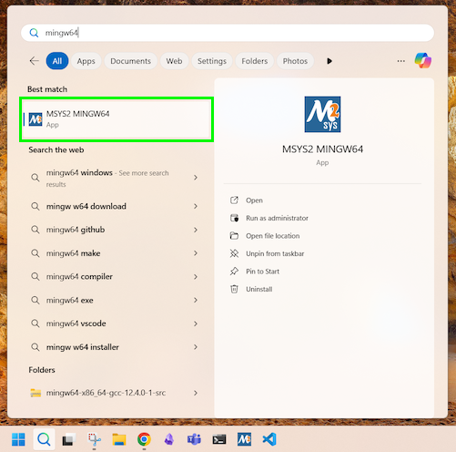

import { YouTube } from 'astro-embed';
import { Steps } from '@astrojs/starlight/components';

In this guide, we will walk through the steps to install the necessary Applications and Tools using **MSYS2** (a **M**inimal Unix **SYS**tem) on Windows.

Now, let's get started!

To get SplashKit and other coding tools installed on Windows, using MSYS2, follow the steps outlined below:

## 1. Install MSYS2/MINGW64

<Steps>

1. Download the installer from the official MSYS2 website: [www.msys2.org](https://www.msys2.org/)

2. To install MSYS2, double-click the downloaded executable file, and follow the on-screen instructions.

    :::caution[Use the default install path]

    Make sure to use the default install path: `C:\msys64`

    *Using other paths may cause issues.*

    :::

</Steps>

:::note[MSYS2 Installation Video:]
<div class="not-content">
  <YouTube id="Hayjgo1Kqg0" params="fs=1&modestbranding=1&rel=0"/>
</div>
:::

## 2. Open a MINGW64 Terminal

<Steps>

3. Search for the "MINGW64" terminal

    MSYS2 comes with a number of terminal environments.

    Make sure to use the **MINGW64** terminal version (not MSYS or UCRT). Search for "mingw64" in the Windows Start menu and selecting the **MSYS2 MINGW64** App.

    
    <div class="caption">Image not subject to The Programmer's Field Guide <a href="https://creativecommons.org/licenses/by-nc-nd/4.0/">CC BY-NC-ND 4.0 License</a></div>

    :::note[Blue Terminal icon]
    Not sure if you have the right one? The MINGW64 Terminal has a blue icon.
    :::

4. Open the **MINGW64** Terminal using **"Run as Administrator"**

</Steps>

## 3. Run Automated Setup

<Steps>

5.  In the MINGW64 Terminal, run the following command:

    ```bash
    curl -s "https://programmers.guide/resources/MSYS2_InstallScript.sh" | bash /dev/stdin
    ```

    :::note
    This script may take a while to run (approx. 5-10 mins).
    :::

6. Once the automated script has finished running, close the MINGW64 Terminal.
7. Open a new MINGW64 Terminal.
8. Run the command `skm` to check SplashKit is installed correctly.

</Steps>

## 4. All done!

Everything should now be installed, you are all good to go!

:::tip[What next?]
Jump to the [next step](/book/part-0-getting-started/1-building-programs/3-guided-tour/2-disable-ai), where we will use these tools to build and run some programs.
:::

:::caution[Had problems?]

If you had problems with the automated installation, or want to do things yourself, you can follow the [manual install instructions](/book/appendix/0-installation/2-5-setup-win-msys).

:::
