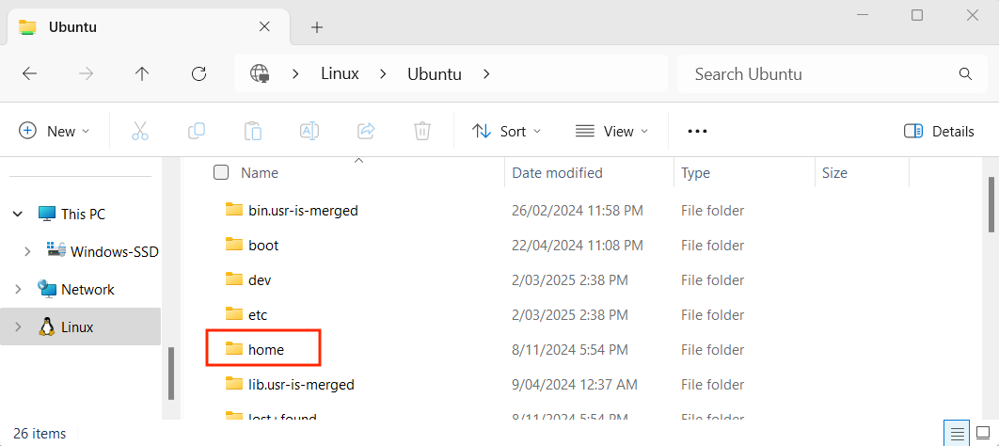

import { Steps } from '@astrojs/starlight/components';

In this guide, we will walk through the steps to install the necessary applications and tools on **WSL** (**W**indows **S**ubsystem for **L**inux) with Ubuntu.

Now, let's get started!

## 1. Install Windows Subsystem for Linux (WSL)

Windows Subsystem for Linux (WSL) is a feature of Windows that allows you to run a Linux environment on your Windows machine, without the need for a separate virtual machine or dual booting.

:::note[WSL 1 vs WSL 2]
*WSL 2 (recommended) is the default version, but you can look at [this article](https://learn.microsoft.com/en-us/windows/wsl/install-manual) if you have issues, or if you are using an older Windows 10 version.*
:::

<Steps>
1. Open the Microsoft Store app.
2. [Click this link](https://apps.microsoft.com/store/detail/9P9TQF7MRM4R) or search for **WSL** in the Microsoft Store app (as shown below).
3. Install WSL.
   
   <div class="caption">Image not subject to The Programmer's Field Guide <a href="https://creativecommons.org/licenses/by-nc-nd/4.0/">CC BY-NC-ND 4.0 License</a></div>
4. [Click this link](https://apps.microsoft.com/store/detail/9PDXGNCFSCZV) or search the Microsoft Store for **Ubuntu**.
5. Install Ubuntu.
</Steps>

## 2. Create Ubuntu User Account

<Steps>
   6. **Restart** your computer if you haven't done so already.

   7. A terminal window installing Ubuntu should pop up automatically, otherwise open the "Ubuntu" application. You can search for this in the Windows start menu.

      
      <div class="caption">Image not subject to The Programmer's Field Guide <a href="https://creativecommons.org/licenses/by-nc-nd/4.0/">CC BY-NC-ND 4.0 License</a></div>

   8. When prompted, enter a UNIX username and password.  
      For example, with the username "**default-user**", your terminal would look like this:
      
      
      <div class="caption">Image not subject to The Programmer's Field Guide <a href="https://creativecommons.org/licenses/by-nc-nd/4.0/">CC BY-NC-ND 4.0 License</a></div>
      
      You can see in the image above where the "**default-user**" username was first entered (shown in the pink box), and the same username being used with the terminal prompt (shown in the orange box).

      :::tip[Troubleshooting tip:]
      If you have issues installing the WSL with Ubuntu, go to the [Issues creating Ubuntu user account](https://splashkit.io/troubleshoot/windows-wsl/issue-1-user-account-issues/) page on the SplashKit website for a way to reset the Ubuntu installation and user account setup.
      :::
</Steps>

WSL is now setup and ready to use!

## 3. Run Automated Setup

:::caution[Script asking for your password?]
Before running any script that uses **sudo**, make sure to review its contents to understand what it does. If you choose not to inspect the script, it should only be because you fully trust the source. Running unverified code with elevated privileges can pose serious security risks.
:::

<Steps>
   9. Open the **Ubuntu terminal**.

   10. Run the following command:

</Steps>

   ```bash
   curl -s "https://programmers.guide/resources/WSL_InstallScript.sh" | bash /dev/stdin
   ```

   :::note
    This script may take a while to run (approx. 5-10 mins).

    If `curl` is not already pre-installed in your WSL environment, you can run the following command to install it:

    ```bash
    sudo apt install curl
    ```
   :::

## 4. Reopen the Terminal

Once the automated script has finished running, close and reopen the terminal.

Run the command `skm` to check SplashKit is installed correctly.

## 5. Almost done!

Everything should now be installed, but before we can move on you will need to know a little more about how WSL works and where you can locate the files you create.

### Finding Files when Using WSL

When you are running WSL, you have a Linux distribution running alongside Windows. This Linux distribution has its own file system. The good thing is that you can use the following instructions to access the files within the Linux system from within Windows.

<Steps>
   1. In the left sidebar panel of the File Explorer, scroll to the bottom and click on the "Linux" folder (red box below), then navigated into the "Ubuntu" folder (orange box below)
   

   2. Go into the "home" folder (red box below):
   

   3. You should see a folder with the username that you used to create your WSL/Ubuntu account earlier. This is the **home** (`~`) directory for WSL, which is the location that VS Code and your Ubuntu terminal will start in when you interact with the file system. Double click on this folder to see your WSL folders and files.
</Steps>

:::caution
If you ever need to reinstall or recreate your WSL Ubuntu account, these folders and files will be removed. Make sure to create a backup of any important folders/files beforehand.
:::

## 6. All done!

:::tip[What next?]
Jump to the [next step](/book/part-0-getting-started/1-building-programs/3-guided-tour/2-disable-ai), where we will use these tools to build and run some programs.
:::

:::caution[Had problems?]
If you had problems with the automated installation, or want to do things yourself, you can follow the [manual install instructions](/book/appendix/0-installation/2-0-setup-linux).
:::
