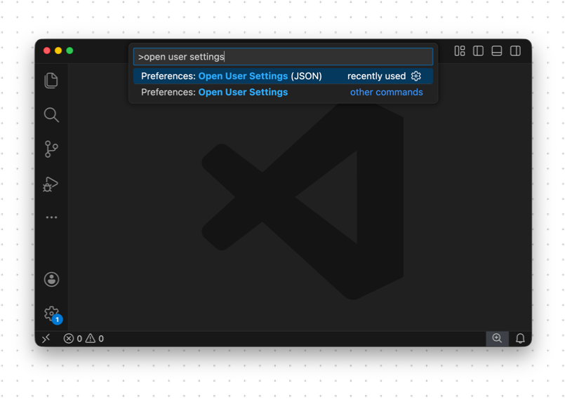
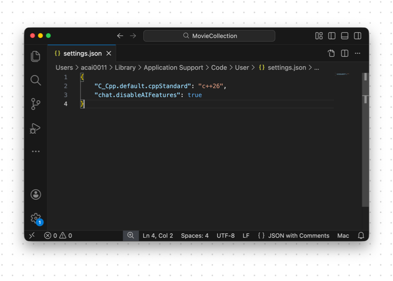

import { Steps } from '@astrojs/starlight/components';

Before we build our first program we need to make one quick change to our settings in VS Code.

VS Code includes plugins that allow it to interact with Gen AI. This can be useful when you have mastered the basics, but for now we need to switch these off so that we can focus on how everything works ourselves.

Don't worry, we will look at using these features later on, but for now it's essential to practice the basics yourself.

To disable AI for now, do the following in VS Code:

<Steps>
   1. Open the Command Palette (Ctrl+Shift+P, or Cmd+Shift+P on macOS), then type "open user settings".
   

   2. Select the "Open User Settings (JSON)" version.
   This will open a file within VS Code that you can edit.

   3. Add the following setting between the `{ }` in the file, making sure to leave any existing settings in place.

      ```
      "chat.disableAIFeatures": true,
      ```

      This setting will disable the AI chat and code suggestions.

   4. Add the following setting between the `{ }` in the file, again making sure to leave any existing settings in place.

      ```
      `"C_Cpp.default.cppStandard": "c++26",`
      ```

      This setting isn't needed for the AI, but will tell VS Code which version of C/C++ we are intending of using.

</Steps>

When you're finished, the file should look like this (assuming you had no pre-existing settings):



We will come back to look at how to work with AI productively later. For now, you want to be in control so that you are thinking through how each part of your program works.
