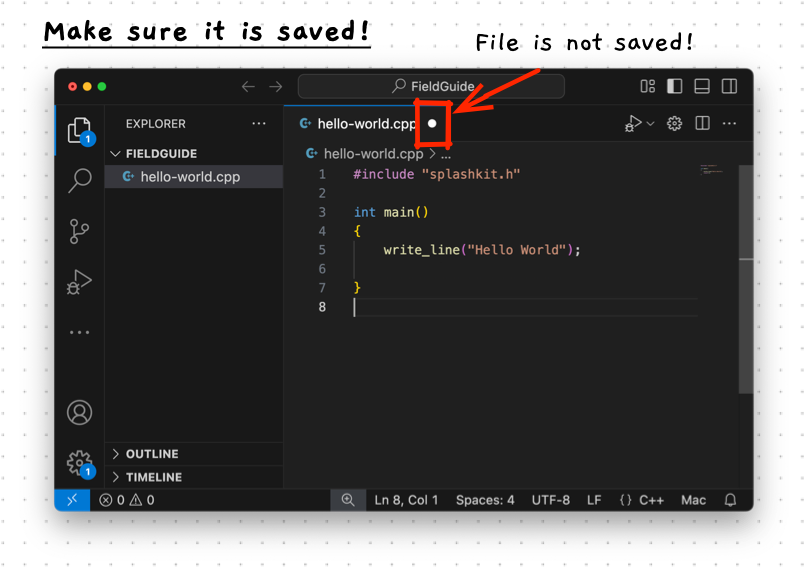
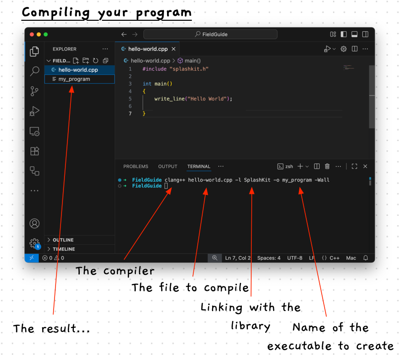
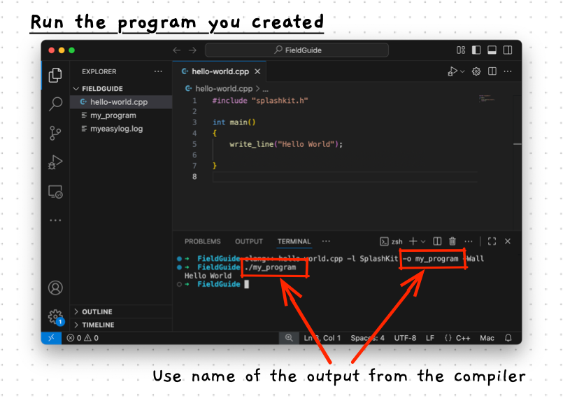

import { Steps } from '@astrojs/starlight/components';
import { Tabs, TabItem } from "@astrojs/starlight/components";

Let's get straight into building our first program. You will use these steps over and over as you progress through this material... so make sure you know how to work through each step.

:::tip
Make sure to work through these steps with us. These will show you how to use the tools you have installed to build and run programs.
:::

## 1. Open Visual Studio Code

Most of our programming work can be undertaken in Visual Studio Code. We will be able to use this to create the files we need, edit and compile our code, and run our programs.

<Steps>
1. Open **Visual Studio Code**

    :::note[Using Windows and WSL?]
    If you are using Windows WSL, you now need to connect VS Code to the Ubuntu system you installed.

    1. Open the VS Code Command Palette using Ctrl + Shift + P.
    2. Type **WSL** and select the `Connect to WSL` option.

    If the option is not available make sure you have [WSL installed correctly](/book/part-0-getting-started/1-building-programs/3-guided-tour/1-install-os/2-5-setup-win-wsl), and the WSL extension for VS Code.
    :::
</Steps>

## 2. Create Code Folder

We need somewhere to store our program code. Data is organised by the [file system](/book/appendix/2-computer-use/2-trailside/03-files-systems) in files and folders. You can use folders to organise where things are stored, making it easy to find where your code is when you need it.

Create and open a folder for your program code.

<Steps>
1. In VS Code, click on the **File** menu and choose **Open Folder**.
2. Then use the dialog that appears to create a new folder somewhere on your computer.
   :::tip
   On your computer, each user will have a home folder that contains a Documents folder. This is probably a good place to store your code. Create a **Code** folder in your Documents folder.

   When you start working on larger projects, you can create separate folders for projects when these start getting larger. For now a single folder for your code will be sufficient.
   :::

   <Tabs syncKey="terminal-type">
    <TabItem label="Linux">
    </TabItem>
    <TabItem label="macOS">
    
    </TabItem>
    <TabItem label="Widows (MSYS2)">
    </TabItem>
    <TabItem label="Widows (WSL)">
    </TabItem>
   </Tabs>
</Steps>


## 3. Create a Code File

Code for each program will be written in a simple text file. We will give this file a **.cpp** extension to help Visual Studio Code understand the kind of code we are working with.

<Steps>
1. Make sure you can see the *Explorer* on the left of the VS Code. If the explorer is not visible, you can open it using the top icon in the toolbar on the left, the one highlighted in yellow below.

    
2. Notice that the folder name is indicated at the top of the Explorer. The image above shows we are in a *FieldGuide* folder, indicated by the red arrow.
3. Click the *New File* icon at the top of the Explorer, or Right-Click and select *New File...*. These are highlighted in red boxes in the image above.
4. Now type the name of the file you want to create. In this case type **hello-world.cpp** then press enter.
</Steps>

## 4. Add the Code

Now we need to write the code. For our first program, you can copy the code for the classic *Hello World* program from below. This program will get the computer to output the message "Hello World" to the Terminal when it runs.

<Steps>
1. Double click on the *hello-world.cpp* file in the Explorer to open it.
2. Copy the following code and paste it into *hello-world.cpp*. This will be the code we run.

    ```cpp
    #include "splashkit.h"

    int main()
    {
        write_line("Hello World");
        return 0;
    }
    ```
3.  A filled circle next to the filename in a file's tab header indicates it has not been saved. You need to make sure that the file is saved before you compile it. Save the file by clicking the **File** menu and selecting **Save**, or by pressing Ctrl + S (Cmd + S on macOS).

    
</Steps>

## 5. Compile and Run

At this stage you have the code for the program you want to create. In order to run this, you need to convert the code into something the computer can run: an executable file (a program).

<Steps>
4.  Open a Terminal in VS Code. There are several ways to do this:
    * Click the **View** menu and select **Terminal**.
    * Open the *Command Palette* by pressing Ctrl + Shift + P (Cmd + Shift + P on macOS), type **View Terminal**, then select the "View: Toggle Terminal" option.
    * Press Ctrl + `

    <Tabs syncKey="terminal-type">
    <TabItem label="Linux">
    </TabItem>
    <TabItem label="macOS">
    
    </TabItem>
    <TabItem label="Widows (MSYS2)">
        We are going to be using Unix commands and compilers. With MSYS2, you need to make sure you get a bash shell in your Terminal. If you get a Terminal that has the text "Windows PowerShell" and/or has prompts that start with "PS" then you need to configure VS Code to open a bash shell using [MSys2](/book/appendix/0-installation/2-5-setup-win-msys/#set-up-vs-code-terminal).
        
        
    </TabItem>
    <TabItem label="Widows (WSL)">
    </TabItem>
    </Tabs>

5.  In the Terminal type the following command:

    ```bash
    clang++ hello-world.cpp -l SplashKit -o my_program -Wall
    ```

    You should now see something similar to what is shown in the following image. This image shows my VS Code after follow the steps up to this point. I have created a *FieldGuide* folder in which I created **hello-world.cpp**. I have copied the code above into the *hello-world.cpp* and saved the file.

    

6. Run the program by typing the following command into the Terminal:
   ```bash
   ./my_program
   ```

   Make sure to use the same name as the output from the compiler. The following image shows the output that you should get when running the program.

    
</Steps>

You have now built and run your first program.
