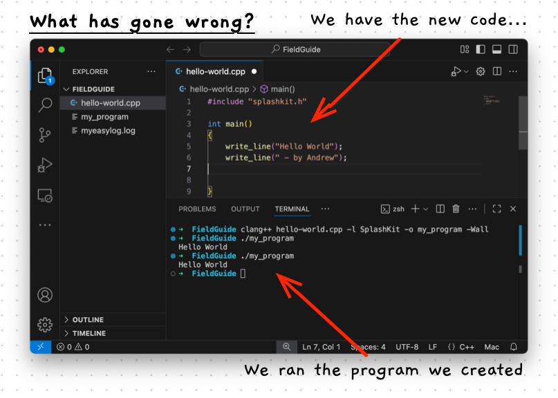
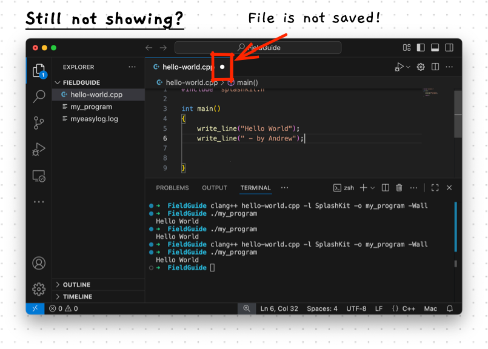
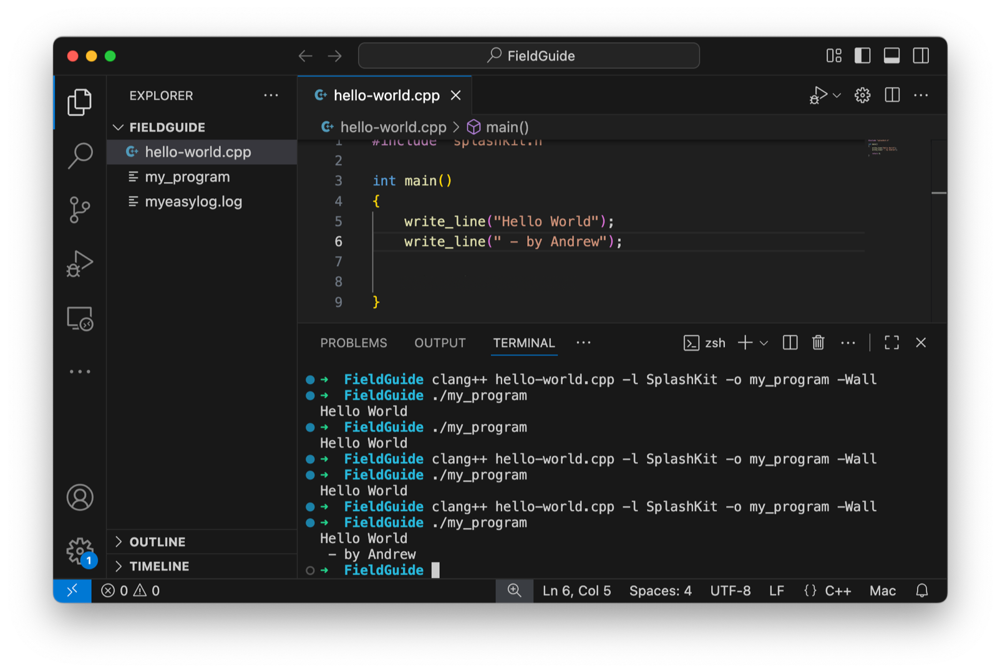

import { Steps } from '@astrojs/starlight/components';
import { Tabs, TabItem } from "@astrojs/starlight/components";
import { Accordion, AccordionItem } from 'accessible-astro-components'

Programming involves frequent iterative cycles of editing and running your program. You build a program iteratively, writing the code for one small feature, compiling it, testing the resulting program, and repeating this over and over to build up the program's features.

Let's make a small enhancement to our current code to step through this process.

<Steps>
1. Make sure you have VS Code running, with your code open, and a terminal all ready to go. If you have followed along from the previous page you should be ready.
   It should look something like this:
   
2. Now, let's make a small change to the program's code. Update the code to output your name by copying and modifying the following code.

    ```cpp {5-6}
    #include "splashkit.h"
    int main()
    {
        write_line("Hello World");
        write_line(" - by Andrew");
        
        return 0;
    }
    ```

    The highlights shows the code that has been added. Add this to your code, but update to show your name.
3. Switch to your terminal in VS Code, and try running the program again.
   You should see something like this:
   

   This is not what we expected...there is no output to show the new name line!
   
   What has gone wrong?
   
   Have a think and then click below to explore the answers and next steps.
</Steps>

<Accordion>
<AccordionItem header="Click to reveal the problems and their solutions">

There are actually a couple of problems here. Let's step through them.

1. The first problem is that we are running the program we created *earlier*.

   When you create a program, the compiler will read the code and produce an executable file from the code at that time. If you change the code, then you have to **rebuild** the program.

    To rebuild the program, you simply run the compiler again.
    
    Switch to your terminal and run:

    ```sh
    clang++ hello-world.cpp -l SplashKit -o my_program -Wall
    ```

    Then run the resulting program again. Do you see the output now? Maybe not.

2. In my case, the program still shows the old output. Why?
   
   Looking at the code I can see the instruction that should be running, but it isn't.
   
   What have I missed?
   
   Did you spot the problem in my screenshot above?

   

   The problem is the file was not saved.
   
   Remember, the compiler will read the file from the **storage**, which is not necessarily what is shown in VS Code. Make sure to **save your files before you compile** them.

   :::tip
   The fastest, and easiest way to save your file is to use the shortcut `ctrl-s` (`cmd-s` on macOS). Alternatively, you can access the "Save" option from the "File" menu.
   :::

</AccordionItem>
</Accordion>

<Steps>
3. Make sure you get your updated program working before continuing. When you successfully compile and run your program you should see two lines output to the terminal. My version is shown below.
   
   
</Steps>
