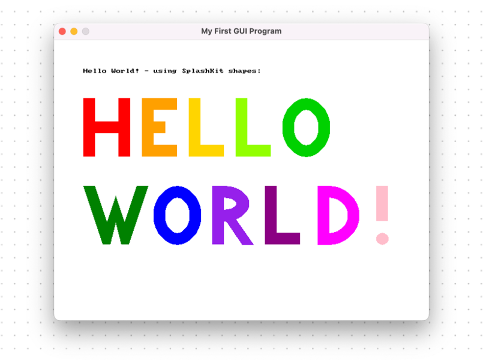
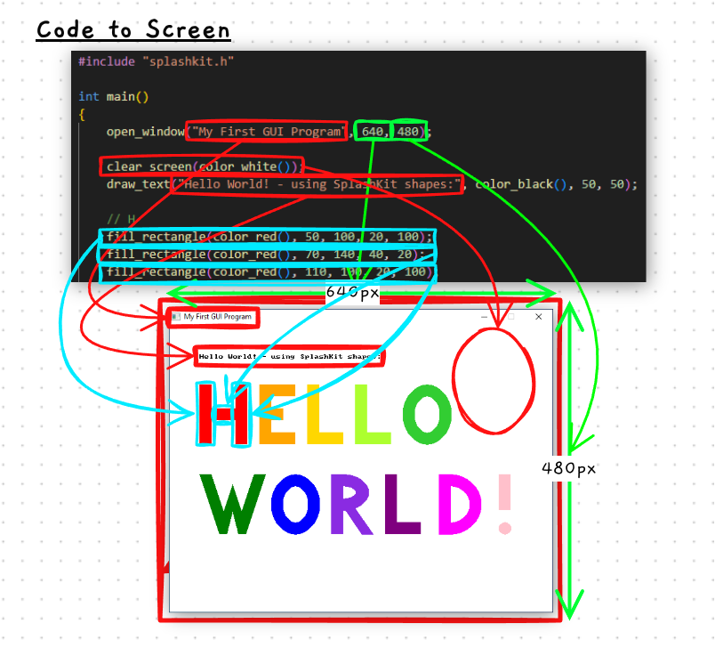
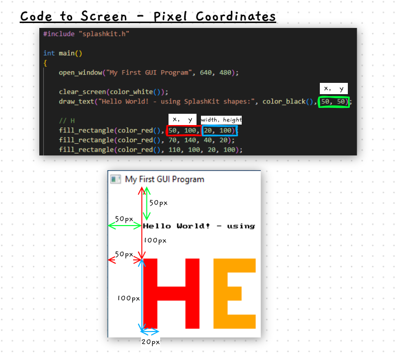

import { Steps } from '@astrojs/starlight/components';
import { FileTree } from '@astrojs/starlight/components';
import CodeScroll from '/src/components/CodeScroll.astro'

Hopefully now you're starting to become familiar with the steps needed to create, compile, and run a project - we'll now use these same concepts to compile something a bit different.

The previous program we compiled was a _command line program_ (or CLI program - **C**ommand **L**ine **I**nterface) - it runs inside the terminal. Command line programs are awesome (we promise!), but of course we'll want to be able to develop _graphical_ programs as well. That's what we'll do now, with a GUI (**G**raphical **U**ser **I**nterface) Hello World program.
<details>
  <summary>Side note - Why is the command line great?</summary>
  Command line programs might seem a bit strange at first, but they have some large benefits, particularly when it comes to _automation_. It's difficult to automate clicking through a bunch of menus and buttons, but it's very easy to join together textual commands into complex systems! Here's a simple example you can try using right away:

    ```sh
    clang++ hello-world.cpp -l SplashKit -o my_program -Wall && ./my_program
    ```

    See how it's the two commands we used previously, joined with `&&`? `&&` just means "do the first thing, and _if it succeeds_, do the second thing". So in our case, first try compiling the program, and if there aren't any errors, run it!

    There are plenty of more powerful ways to use the command line, but hopefully you can already see why it might be useful :)

:::tip
Use the up arrow key to re-use your last command! No need to type it out every time (though it is good practice at first)
:::
</details>
<p style="text-align:center;">_Click me! ^_</p>

## Let's start!

We'll go a little more briskly this time - if you get stuck at any point you can always check the [previous pages](/book/part-0-getting-started/1-building-programs/3-guided-tour/3-first-project/).
<Steps>
1. Create a C++ file

    To start, go ahead and create (and open) a C++ file we can write our code into. I'll call mine `gui-hello-world.cpp`.

    <details>
    <summary>Try structuring your folders too!</summary>
        Now might be a good time to consider how you _structure your folders_ a bit - for instance you could make a folder for each section/task:

        <FileTree>
        - Documents
            - code
                - building-programs
                    - hello-world.cpp
                    - gui-hello-world.cpp
                - sequence
                    - test-your-knowledge.cpp
                    - ...
                - ...
        </FileTree>

        _Just remember to `Open Folder` when you switch between projects! Otherwise `clang++` won't be be able to find your C++ source files._
    </details>


2. Copy the following code and paste it into your C++ file:
    <CodeScroll maxHeight="350px">
    ```cpp
    #include "splashkit.h"

    int main()
    {
        open_window("My First GUI Program", 640, 480);

        clear_screen(color_white());
        draw_text("Hello World! - using SplashKit shapes:", color_black(), 50, 50);

        // Draw the H
        fill_rectangle(color_red(), 50, 100, 20, 100);
        fill_rectangle(color_red(), 70, 140, 40, 20);
        fill_rectangle(color_red(), 110, 100, 20, 100);

        // Draw the E
        fill_rectangle(color_orange(), 150, 100, 20, 100);
        fill_rectangle(color_orange(), 170, 100, 40, 20);
        fill_rectangle(color_orange(), 170, 140, 20, 20);
        fill_rectangle(color_orange(), 170, 180, 40, 20);

        // Draw the L
        fill_rectangle(color_gold(), 230, 100, 20, 100);
        fill_rectangle(color_gold(), 250, 180, 40, 20);

        // Draw the L
        fill_rectangle(color_green_yellow(), 310, 100, 20, 100);
        fill_rectangle(color_green_yellow(), 330, 180, 40, 20);

        // Draw the O
        fill_ellipse(color_lime_green(), 390, 100, 80, 100);
        fill_ellipse(color_white(), 410, 120, 40, 60);

        // Draw the W
        fill_triangle(color_green(), 50, 250, 90, 370, 120, 250);
        fill_triangle(color_green(), 90, 250, 120, 370, 160, 250);
        fill_triangle(color_white(), 70, 250, 90, 310, 110, 250);
        fill_triangle(color_white(), 100, 250, 120, 310, 140, 250);
        fill_rectangle(color_white(), 70, 350, 80, 30);

        // Draw the O
        fill_ellipse(color_blue(), 170, 250, 80, 100);
        fill_ellipse(color_white(), 190, 270, 40, 60);

        // Draw the R
        fill_triangle(color_blue_violet(), 270, 250, 270, 350, 340, 350);
        fill_triangle(color_white(), 252, 250, 252, 350, 320, 350);
        fill_ellipse(color_blue_violet(), 252, 250, 80, 60);
        fill_ellipse(color_white(), 270, 270, 40, 20);
        fill_rectangle(color_white(), 252, 250, 20, 100);
        fill_rectangle(color_blue_violet(), 270, 250, 20, 100);

        // Draw the L
        fill_rectangle(color_purple(), 360, 250, 20, 100);
        fill_rectangle(color_purple(), 380, 330, 40, 20);

        // Draw the D
        fill_ellipse(color_magenta(), 420, 250, 100, 100);
        fill_ellipse(color_white(), 440, 270, 60, 60);
        fill_rectangle(color_white(), 420, 250, 30, 100);
        fill_rectangle(color_magenta(), 450, 250, 20, 101);

        // Draw the !
        fill_rectangle(color_pink(), 550, 250, 20, 60);
        fill_circle(color_pink(), 560, 340, 10);

        refresh_screen();
        delay(5000);
    }
    ```
    </CodeScroll>
    _It's a bit longer than the last one! We'll take a look at what it does in a moment..._

4. Now compile and run it!

    I won't put the exact command here this time, but here's the general _template_ of how it should look - try filling in the input values yourself between the `<...>` (angle brackets):
    ```sh
    clang++ <source-file.cpp> -o <program-name> -l SplashKit -Wall
    ./program-name
    ```

    For me, my source file is named `gui-hello-world.cpp`, and I want the program to be called 'hello-gui', so those are the _parameters_ I'll pass to `clang++`.

3. Here is what the code above will create:

    

    Pretty neat!

</Steps>

## But how does it work?

This has been good practice in building programs, but so far we've mainly just copy pasted code. Let's try making some more small modifications - it's fine that we don't have any programming knowledge yet!

First, let's just try _reading the code_.

:::tip
Learning programming is a lot like learning a new language, except most of the _words_ are ones you probably already know!

Even if you don't know the _grammar_ (or _syntax_) yet, you can still take a guess at what the code might be doing, and try changing it.
:::

Of course we'll cover this all in depth later, but let's just get our feet wet first :)

Here's the first part of the program, I've highlighted some interesting lines:
```cpp {5,7,8,10,11}
#include "splashkit.h"

int main()
{
    open_window("My First GUI Program", 640, 480);

    clear_screen(color_white());
    draw_text("Hello World! - using SplashKit shapes:", color_black(), 50, 50);

    // Draw the H
    fill_rectangle(color_red(), 50, 100, 20, 100);
    fill_rectangle(color_red(), 70, 140, 40, 20);
    fill_rectangle(color_red(), 110, 100, 20, 100);
```

Have a read through those lines, and have a guess at what it's doing - how is each line affecting what the program shows on the screen? Try writing it down :)

<details>
<summary>You've written down your guesses? Let's see how they compare:</summary>
    Just from reading the text, we can probably guess it's doing the following things:
    - It opens a _window_, and somehow the text "My First GUI Program", and the numbers 640 and 480 are used.
    - It _clears the screen_ with the colour white.
    - It _draws some text_, coloured black.
    - And it starts drawing a H by _filling in red rectangles_.

    We can see how each line of code _does something_, and sends in parameters to change its behavior (for instance what colour to use, what text to write, etc). Here's a (messy) diagram showing each line maps to the screen:

    


    <details>
    <summary>Is each line similar to running a program at the command line?</summary>
    Conceptually yes! At the command line, we run a program by writing its _name_, and then a series of _parameters_ (or _arguments_). For instance when we write:

        ```sh
        clang++ gui-hello-world.cpp -l SplashKit -o hello-gui -Wall
        ```

        `clang++` is the program we're running, and the rest of the line are the parameters. `clang++` takes those inputs, and goes and _does something_ for us (compiles our program).

        Similarly, when we write

        ```c++
        draw_text("Hello World! - using SplashKit shapes:", color_black(), 50, 50);
        ```
        `draw_text` is the _procedure_ we're runnning (or more commonly, _calling_), and the things inside the brackets `()` are the parameters. `draw_text` then also goes and _does something_ (in this case, it, unsurprisingly, draws text)

        The underlying technical aspects between the two are quite different, but conceptually they are very similar. Understanding this pattern early on will make reading code much easier :)
    </details>
</details>

Have a go now at reading through the rest of the code - hopefully you can see how each letter is drawn by just filling in a bunch of shapes at different locations. We don't need to understand exactly what all the numbers do (yet!), to still grasp the general idea.

<details>
<summary> Here's the code again, for reference:</summary>

    ```cpp
    #include "splashkit.h"

    int main()
    {
        open_window("My First GUI Program", 640, 480);

        clear_screen(color_white());
        draw_text("Hello World! - using SplashKit shapes:", color_black(), 50, 50);

        // Draw the H
        fill_rectangle(color_red(), 50, 100, 20, 100);
        fill_rectangle(color_red(), 70, 140, 40, 20);
        fill_rectangle(color_red(), 110, 100, 20, 100);

        // Draw the E
        fill_rectangle(color_orange(), 150, 100, 20, 100);
        fill_rectangle(color_orange(), 170, 100, 40, 20);
        fill_rectangle(color_orange(), 170, 140, 20, 20);
        fill_rectangle(color_orange(), 170, 180, 40, 20);

        // Draw the L
        fill_rectangle(color_gold(), 230, 100, 20, 100);
        fill_rectangle(color_gold(), 250, 180, 40, 20);

        // Draw the L
        fill_rectangle(color_green_yellow(), 310, 100, 20, 100);
        fill_rectangle(color_green_yellow(), 330, 180, 40, 20);

        // Draw the O
        fill_ellipse(color_lime_green(), 390, 100, 80, 100);
        fill_ellipse(color_white(), 410, 120, 40, 60);

        // Draw the W
        fill_triangle(color_green(), 50, 250, 90, 370, 120, 250);
        fill_triangle(color_green(), 90, 250, 120, 370, 160, 250);
        fill_triangle(color_white(), 70, 250, 90, 310, 110, 250);
        fill_triangle(color_white(), 100, 250, 120, 310, 140, 250);
        fill_rectangle(color_white(), 70, 350, 80, 30);

        // Draw the O
        fill_ellipse(color_blue(), 170, 250, 80, 100);
        fill_ellipse(color_white(), 190, 270, 40, 60);

        // Draw the R
        fill_triangle(color_blue_violet(), 270, 250, 270, 350, 340, 350);
        fill_triangle(color_white(), 252, 250, 252, 350, 320, 350);
        fill_ellipse(color_blue_violet(), 252, 250, 80, 60);
        fill_ellipse(color_white(), 270, 270, 40, 20);
        fill_rectangle(color_white(), 252, 250, 20, 100);
        fill_rectangle(color_blue_violet(), 270, 250, 20, 100);

        // Draw the L
        fill_rectangle(color_purple(), 360, 250, 20, 100);
        fill_rectangle(color_purple(), 380, 330, 40, 20);

        // Draw the D
        fill_ellipse(color_magenta(), 420, 250, 100, 100);
        fill_ellipse(color_white(), 440, 270, 60, 60);
        fill_rectangle(color_white(), 420, 250, 30, 100);
        fill_rectangle(color_magenta(), 450, 250, 20, 101);

        // Draw the !
        fill_rectangle(color_pink(), 550, 250, 20, 60);
        fill_circle(color_pink(), 560, 340, 10);

        refresh_screen();
        delay(5000);
    }
    ```
</details>

Now let's try changing it! See you in the [next section](/book/part-0-getting-started/1-building-programs/3-guided-tour/5-2-hello-world-gui-edit).

----

&nbsp;
<details>
<summary> -- Extra -- <br/> But wait, what are the numbers for?</summary>
Good question! Let's look at one example:
```c++
draw_text("Hello World! - using SplashKit shapes:", color_black(), 50, 50);
```
You may have guessed this already, but the numbers, `50, 50` here represent the _position_ the text will be drawn at on the screen.
 - The first number is the `x` coordinate - from the left edge of the window, how far to the right?
 - The second number is the `y` coordinate - from the top edge of the window, how far down?

They are measured in _pixels_. Similarly, `fill_rectangle` also uses pixel coordinates:
```c++
fill_rectangle(color_red(), 50, 100, 20, 100);
```
The `50, 100` are again the x/y coordinates. The last two numbers are the _width_ and _height_, again in pixels.

Take a look a the diagram below for a visualization - hopefully you can see how each number specifies a position or size on the screen:


:::tip
Think about a 2D game you've played recently - the player's position was likely represented as `x`/`y` coordinates within the game world! When you moved right or left, the `x` coordinate will have increased or decreased.

Have a think about how this might work in 3D!
:::

If you're interested in learning more about drawing graphics, have a check over the guide [here!](https://splashkit.io/guides/graphics/drawing-using-procedures/) It's a little advanced right now, but it might be something you can keep re-reading as you learn more :)
</details>
