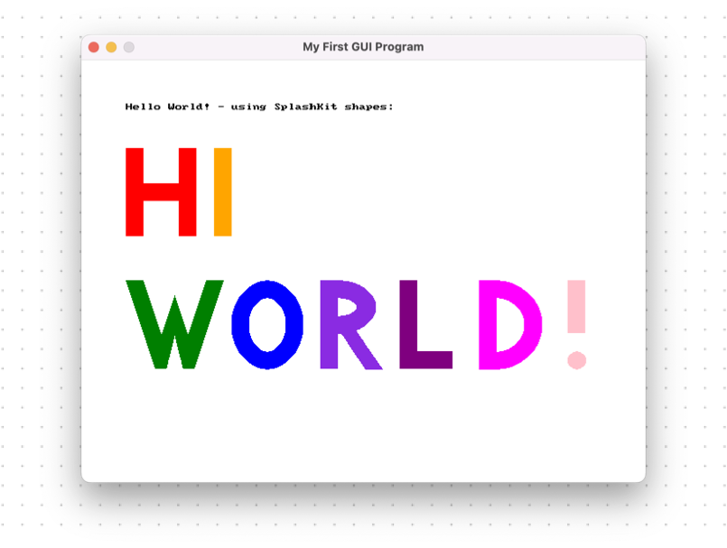
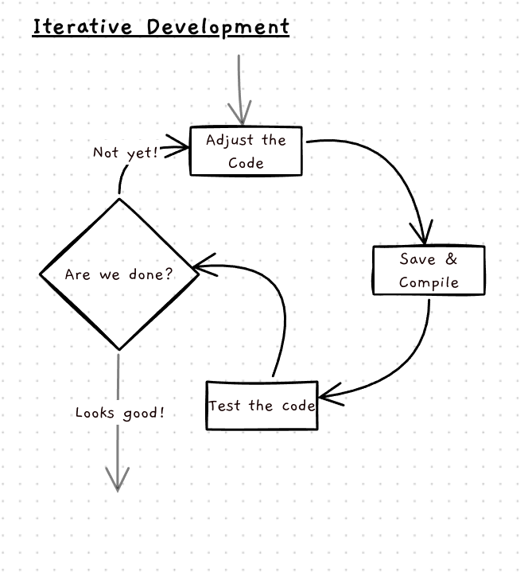
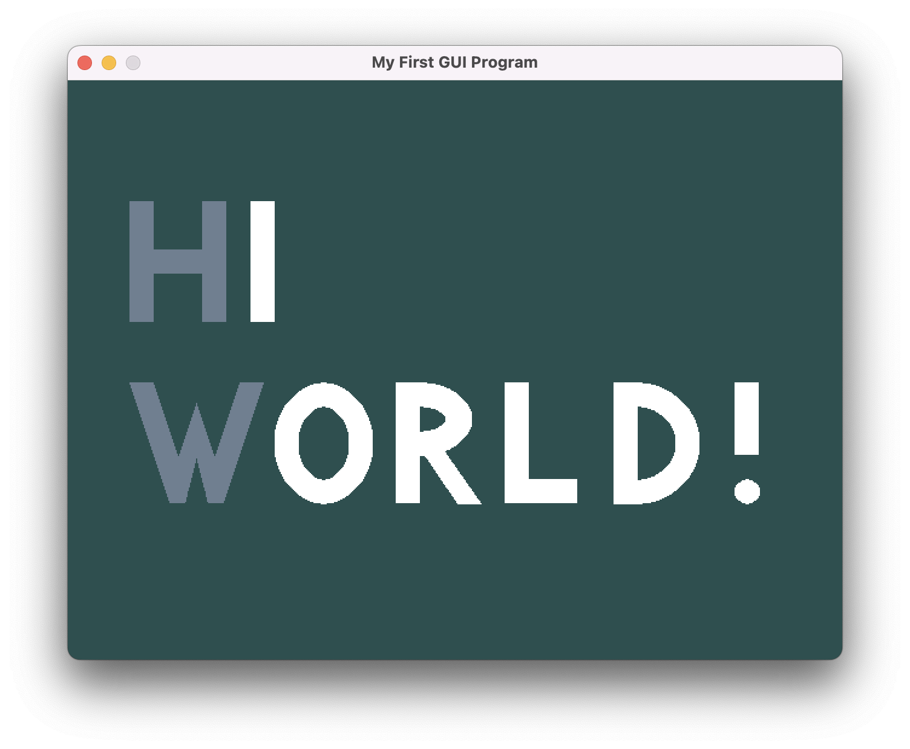

import { Steps } from '@astrojs/starlight/components';
import { FileTree } from '@astrojs/starlight/components';

Continuing from the [previous section](../5-1-hello-world-gui/), we've briefly analysed the GUI Hello World, and are ready to try customizing it.

## Let's change it!

Now that we know what we know, there are some easy ways we can change the code:
 - We can _delete_ lines of code, to, for instance, delete the letters (or parts of the letters!)
 - We can _change parameters_, for instance the colours or positions of the shapes
 - We can _add_ lines of code, by copy pasting and adjusting them. For instance we could add a whole new letter! Although I have something else in mind...

<Steps>
1. First let's delete some code - we'll turn the `HELLO` into `HI`
    ```diff lang="cpp"
        clear_screen(color_white());
        draw_text("Hello World! - using SplashKit shapes:", color_black(), 50, 50);

        // Draw the H
        fill_rectangle(color_red(), 50, 100, 20, 100);
        fill_rectangle(color_red(), 70, 140, 40, 20);
        fill_rectangle(color_red(), 110, 100, 20, 100);

    -    // Draw the E
    +    // Draw the I
        fill_rectangle(color_orange(), 150, 100, 20, 100);
    -    fill_rectangle(color_orange(), 170, 100, 40, 20);
    -    fill_rectangle(color_orange(), 170, 140, 20, 20);
    -    fill_rectangle(color_orange(), 170, 180, 40, 20);
    -
    -    // Draw the L
    -    fill_rectangle(color_gold(), 230, 100, 20, 100);
    -    fill_rectangle(color_gold(), 250, 180, 40, 20);
    -
    -    // Draw the L
    -    fill_rectangle(color_green_yellow(), 310, 100, 20, 100);
    -    fill_rectangle(color_green_yellow(), 330, 180, 40, 20);
    -
    -    // Draw the O
    -    fill_ellipse(color_lime_green(), 390, 100, 80, 100);
    -    fill_ellipse(color_white(), 410, 120, 40, 60);

        // Draw the W
        fill_triangle(color_green(), 50, 250, 90, 370, 120, 250);
        fill_triangle(color_green(), 90, 250, 120, 370, 160, 250);
        fill_triangle(color_white(), 70, 250, 90, 310, 110, 250);
        fill_triangle(color_white(), 100, 250, 120, 310, 140, 250);
        fill_rectangle(color_white(), 70, 350, 80, 30);
    ```
    _Just delete all the red lines, easy :)_

    What we've done here is delete all the code that creates the letters `L L O`, and _most_ of what makes the letter `E`. The `E` was drawn with four rectangles - we'll leave the line of code that draw the left-most vertical rectangle (which becomes our `I`), but delete the rest.

    <details>
    <summary>What about the `// Draw the E`? What does it do?</summary>
        The `// Draw the E` is just a _comment_. It helps _us_ understand the code, but the compiler pretty much just ignores it. You can leave it as `// Draw the E` and it won't have any effect :)

        But it's still better to change it to `// Draw the I` of course! We don't want our comments to become out-of-date and contradict the code, since it'll confuse other people (and ourselves in a few weeks!)
    </details>

2. Save, re-compile the code, and run it!

    Hopefully, if all goes well, you'll see the following:
    
    <details>
    <summary>Nothing changed...?</summary>
        Make sure to check with yourself:
            - Have I saved the `.cpp` file?
            - Have I re-compiled the program?

        It's easy to forget these things, but they're probably the reason :)
    </details>

    <details>
    <summary>Errors show up when I try to compile it!</summary>
        Oh no! We'll definitely cover how to figure out errors later on, but for now feel free to refer to the following code instead:
        <div class="scroll-snippet">
        ```cpp
        #include "splashkit.h"

        int main()
        {
            open_window("My First GUI Program", 640, 480);

            clear_screen(color_white());
            draw_text("Hello World! - using SplashKit shapes:", color_black(), 50, 50);

            // Draw the H
            fill_rectangle(color_red(), 50, 100, 20, 100);
            fill_rectangle(color_red(), 70, 140, 40, 20);
            fill_rectangle(color_red(), 110, 100, 20, 100);

            // Draw the I
            fill_rectangle(color_orange(), 150, 100, 20, 100);

            // Draw the W
            fill_triangle(color_green(), 50, 250, 90, 370, 120, 250);
            fill_triangle(color_green(), 90, 250, 120, 370, 160, 250);
            fill_triangle(color_white(), 70, 250, 90, 310, 110, 250);
            fill_triangle(color_white(), 100, 250, 120, 310, 140, 250);
            fill_rectangle(color_white(), 70, 350, 80, 30);

            // Draw the O
            fill_ellipse(color_blue(), 170, 250, 80, 100);
            fill_ellipse(color_white(), 190, 270, 40, 60);

            // Draw the R
            fill_triangle(color_blue_violet(), 270, 250, 270, 350, 340, 350);
            fill_triangle(color_white(), 252, 250, 252, 350, 320, 350);
            fill_ellipse(color_blue_violet(), 252, 250, 80, 60);
            fill_ellipse(color_white(), 270, 270, 40, 20);
            fill_rectangle(color_white(), 252, 250, 20, 100);
            fill_rectangle(color_blue_violet(), 270, 250, 20, 100);

            // Draw the L
            fill_rectangle(color_purple(), 360, 250, 20, 100);
            fill_rectangle(color_purple(), 380, 330, 40, 20);

            // Draw the D
            fill_ellipse(color_magenta(), 420, 250, 100, 100);
            fill_ellipse(color_white(), 440, 270, 60, 60);
            fill_rectangle(color_white(), 420, 250, 30, 100);
            fill_rectangle(color_magenta(), 450, 250, 20, 101);

            // Draw the !
            fill_rectangle(color_pink(), 550, 250, 20, 60);
            fill_circle(color_pink(), 560, 340, 10);

            refresh_screen();
            delay(5000);
        }
        ```
        _Try comparing it to your code and see where things might have gone wrong!_
        </div>
    </details>

3. Now let's try changing parameters - we'll have a go at changing the colours of the background and the letters.

    For instance, anywhere you see `color_red()`, you could replace this with `color_blue()` (or any other colour!).

    :::tip
    Have a look [here](https://splashkit.io/guides/color/splashkit-colors/) for all the colours you can use!
    :::

    I'm going to try and make mine a bit Programmer's Field Guide themed. So I'll be changing the colours passed into the `clear_screen`, `fill_rectangle`, `fill_triangle`, `fill_ellipse`, and `fill_circle` procedures. See if you can come up with something you think looks nice :)

    For this part you'll want to try changing things, testing, then changing things again, testing again, etc. This _iterative development_ is very important, so feel free to take your time trying out different changes.

    
    <details>
    <summary>Errors show up when I try to compile it!</summary>
        Here are some tips:
         - If the error isn't too long, have a go at reading it! It might be as simple as a typo that the compiler picked up on.
         - Make small changes at a time - that way you can easily undo (Ctrl-Z) whenever an error occurs.
        - Be careful with spelling and capitalization! Keep in mind that SplashKit uses American English spelling, so it's `color_red()`, _not_ `colour_red()`.
        - Make sure SplashKit (the _library_ we're using that does the drawing for us) knows the colour! (check on the page mentioned above)
        - Don't forget the `()` (we'll learn more about what this does later)
    </details>

    Here's what I ended up with:
    
    _Feel free to make yours more exciting!_

3. For the last part, we're going to make the letters type themselves out one at a time!

    Right now we don't know exactly how to do this, but let's think it through.

    Here's the code for drawing the `H` and the `I`:

    ```c++ {6-7}
        // Draw the H
        fill_rectangle(color_slate_gray(), 50, 100, 20, 100);
        fill_rectangle(color_white(), 70, 140, 40, 20);
        fill_rectangle(color_white(), 110, 100, 20, 100);


        // Draw the I
        fill_rectangle(color_white(), 150, 100, 20, 100);
    ```

    We can see there are two clear sections - one draws the `H`, and the other draws the `I`.

    An important thing to note here, is that **code runs from top to bottom, in sequence**. So what we want, is to put something _between_ the code for the two letters, that says "show the previous letter, and wait a moment!"

    The secret to doing this is in the last few lines of the program:
    ```c++ {5-6}
        // Draw the !
        fill_rectangle(color_white(), 550, 250, 20, 60);
        fill_circle(color_white(), 560, 340, 10);

        refresh_screen();
        delay(5000);
    }
    ```

    We didn't look at these before, so let's try and understand them.

    `delay`, as the name suggests, _delays_ the program - it pauses at that line. But what is the `5000` for? If you timed how long the program stays open for, you'll find it's 5 seconds - `delay` takes milliseconds, so that's where the `5000` comes in.

    Now we know that we can put a `delay` in at any point in the program, and make it pause there however long we want!

    `refresh_screen` is a little more complicated, but the simplest way to picture it is this:
        - `fill_rectangle`, etc, all make the computer draw shapes. The _canvas_ the computer is drawing on, however, is hidden from us. `refresh_screen` makes it turn the canvas around, and show us what it was drawing. If we forget the `refresh_screen`, we'll never see the drawing!

    If we copy paste the `refresh_screen()` and `delay(5000)` lines in-between each letter, we can make the program show the current letters, then pause before drawing the next one. Give this a go and see if you can get it working well :)


    <details>
    <summary>I'm stuck!</summary>
        No worries! Try adding this code exactly here and see if things make more sense:
        ```diff lang="c++"
        #include "splashkit.h"

        int main()
        {
            open_window("My First GUI Program", 640, 480);

            clear_screen(color_white());
            draw_text("Hello World! - using SplashKit shapes:", color_black(), 50, 50);

            // Draw the H
            fill_rectangle(color_slate_gray(), 50, 100, 20, 100);
            fill_rectangle(color_slate_gray(), 70, 140, 40, 20);
            fill_rectangle(color_slate_gray(), 110, 100, 20, 100);

        +    refresh_screen();
        +    delay(1000);

            // Draw the I
            fill_rectangle(color_white(), 150, 100, 20, 100);
        ```
    </details>

    <details>
    <summary>The program pauses but no letters show up!</summary>
        You've likely added a `delay`, but forgotten to add the `refresh_screen()` _before_ it - without that, the computer has drawn the letter, but hasn't turned around the canvas to show us yet.
    </details>
    <details>
    <summary>Can I change how long it pauses for?</summary>
        Of course! Just change the `5000` to whatever you want. For example. `delay(1000)` will delay for a second.
    </details>
</Steps>


If all goes well, you'll now have your letters typing across the screen! Feel free to continue playing around with this - you could try adding your own shapes, drawing your own text, and so on.

Hopefully from this you feel more confident with looking at and modifying simple code. In the next section you'll start learning the concepts more formally, but hopefully some of the intuition you built during this section will come in handy.
