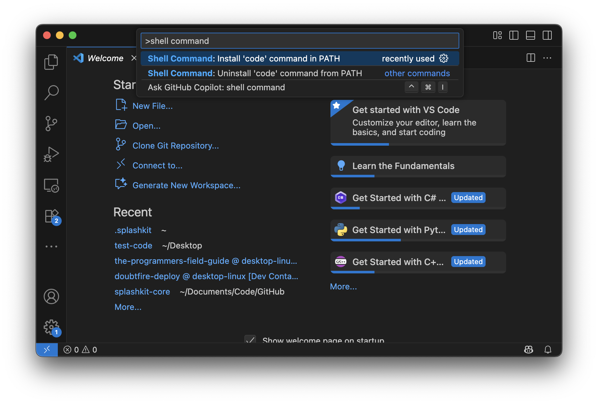

Here are some extra steps that you may want to consider setting up on your computer:

## Add 'code' command to PATH

The Terminal is a powerful way of interacting with your computer. If you are going to be exploring the user of the Terminal further, then you should get VS Code to add the `code` command to your path. This will allow you to open any file or folder in a new Visual Studio Code window, right from your Terminal!

1. Launch VS Code
2. Open the Command Palette (Ctrl+Shift+P, or Cmd+Shift+P on macOS). Type 'shell command', select the "Shell Command: install 'code' command in PATH".



:::tip[Troubleshooting tip:]
If you are having issues with the `code` command not working after following the steps above, go to the ['zsh: command not found: code'](https://splashkit.io/troubleshoot/macos/issue-4-code-not-found/) page on the SplashKit website for to use an alternative installation process.
:::

## Install Extensions

VS Code includes extensions to help you work effectively with the languages that you use. SplashKit can help get you set up quickly by installing relevant *Extensions* in VS Code. Run the following command in your Terminal.

```bash
skm vscode extensions
```

## Finding Files when Using WSL

If you are using WSL in Windows you will need to know how to find your files.

*Follow the instructions below to access your WSL folders and files in File Explorer*:

In the left sidebar panel, scroll to the bottom and click on the "Linux" folder (red box below), then navigated into the "Ubuntu" folder (orange box below):


Next, go into the "home" folder (red box below):


You will then see a folder with the username that you used to create your WSL/Ubuntu account. Click into this folder to see your WSL folders and files.

:::note
This is the *home* (~) directory for WSL, which is the location that your Ubuntu terminal will start in when you open a new terminal.

Also, if you have issues and need to reinstall/recreate your Ubuntu account, these folders and files will be removed. Make sure to create a backup of any important folders/files beforehand.
:::
