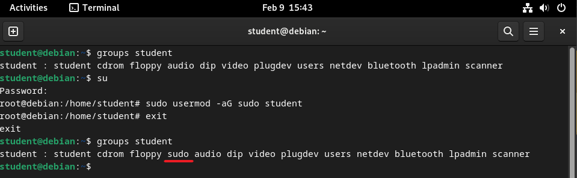
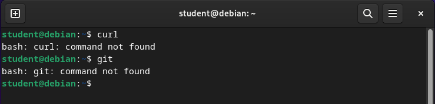

In this guide, we will walk through the steps to install the necessary Applications and Tools on your Linux PC. This guide will focus on Debian, which is the base for many popular Linux distros such as Ubuntu and Raspberry Pi OS. If you use a different Linux distro, you may need to follow the [manual install instructions](/book/appendix/0-installation/2-0-setup-linux).

Now, let's get started!

## 1. Open the Terminal

To open the Terminal on Debian, click activities in the top left of the screen and type "Terminal" in the search bar, then click on the Terminal icon.


<div class="caption">Image not subject to The Programmer's Field Guide <a href="https://creativecommons.org/licenses/by-nc-nd/4.0/">CC BY-NC-ND 4.0 License</a></div>

## 2. Check you can run as super user

`sudo` is a command that allows you to run a program with superuser privileges and is often required for installing software. Debian does not add the main user to the sudoers file by default.

The following commands will let you check if your user is in the suders group and add it if required. To take effect, you must reboot your computer after adding your user to the sudoers group.

*You will need to know your root user password* (*replace `username` with your username*):

```bash
groups username
su
sudo usermod -aG sudo username
exit
groups username
```


<div class="caption">Image not subject to The Programmer's Field Guide <a href="https://creativecommons.org/licenses/by-nc-nd/4.0/">CC BY-NC-ND 4.0 License</a></div>

## 3. Make sure you have git and curl installed

A number of the commands in the setup require `git`, `curl`, and `clang` to be installed to function correctly. To check if they are installed on your system, type `curl`, `clang++`, then `git` into the terminal and press enter after each.

If you see the following error messages you will need to install the missing programs.


<div class="caption">Image not subject to The Programmer's Field Guide <a href="https://creativecommons.org/licenses/by-nc-nd/4.0/">CC BY-NC-ND 4.0 License</a></div>

To install curl, git, and clang run the following commands in the Terminal (if only one is required, you can delete the other from the command):

```bash
sudo apt update
sudo apt install curl git clang -y
```

## 4. Run the Installation Script

:::caution[Script asking for your password?]

Before running any script (particularly those that use **sudo**) make sure to review its contents to understand what it does. If you choose not to inspect the script, it should only be because you fully trust the source. Running unverified code with elevated privileges can pose serious security risks.

:::

Open the Terminal and run the following command:

```bash
curl -s "https://programmers.guide/resources/Linux_InstallScript.sh" | bash /dev/stdin
```

:::note
This script will take a while to run (approx. 12-15 mins).
:::

When the script ends, review the output messages in the terminal. If there are errors, you will need to review the messages and try again or try the [manual install instructions](/book/appendix/0-installation/2-0-setup-linux).

## 5. Reopen the terminal

Once the automated script has finished running, close and reopen the Terminal.

Run the command `skm` to check SplashKit is installed correctly.

## 6. All done!

If everything is working you should be all good to go!

:::tip[What next?]
Jump to the [next step](/book/part-0-getting-started/1-building-programs/3-intro-tour/2-code), where we will use these tools to build and run some programs.
:::

:::caution[Had problems?]

If you had problems with the automated installation, or want to do things yourself, you can follow the [manual install instructions](/book/appendix/0-installation/2-0-setup-linux).

:::
