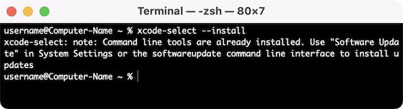
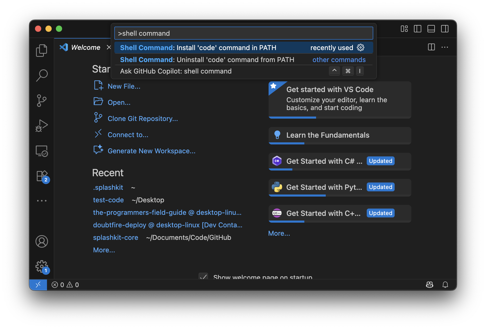

import { YouTube } from 'astro-embed';

To get SplashKit and other coding tools installed on macOS, follow the steps outlined below:

## 1. Install XCode Command Line Tools

**Xcode Command Line Tools** is a package of tools provided by Apple for developers to enable command-line development and building of software on macOS, using your **Terminal** app. *It includes tools you will need for installing SplashKit and coding in the next chapters.*

The following steps will show you how to install this. The video below shows these steps.

Start by opening your terminal.

1. Press ***Command*** (⌘) + ***Space bar*** to open the Spotlight Search.  
2. Start typing "Terminal".  
3. Click the **Terminal** app.

To install these tools, run the command below in your *Terminal* app:

```bash
xcode-select --install
```

:::note[XCode Command Line Tools Installation Video:]
<div class="not-content">
  <YouTube id="3CHGbyVY2F8" params="fs=1&modestbranding=1&rel=0"/>
</div>
:::

If you get the following message when you run this, that means you've already installed Xcode and are ready to move to the next step!


<div class="caption">Image not subject to The Programmer's Field Guide <a href="https://creativecommons.org/licenses/by-nc-nd/4.0/">CC BY-NC-ND 4.0 License</a></div>

## 2. Install SplashKit

:::caution[Script asking for your password?]

Before running any script make sure to review its contents to understand what it does. If you choose not to inspect the script, it should only be because you fully trust the source. Running unverified code with elevated privileges can pose serious security risks.

:::

Copy and paste the following command into your Terminal window to download and run the SplashKit installer:

```bash
bash <(curl -s https://raw.githubusercontent.com/splashkit/skm/master/install-scripts/skm-install.sh)
```

Once the script has finished running, close and reopen the Terminal.

Run the command `skm` to check SplashKit is installed correctly.

:::tip[Troubleshooting tips:]

1. If the command above **does nothing**, go to [this troubleshooting page](https://splashkit.io/troubleshoot/macos/issue-1-bash-curl-not-working/) on the SplashKit website for an alternative installation process.
2. If you see a message about "**permission denied**" or "**Operation not permitted**", go to the [Permission issue when running SplashKit installation command](https://splashkit.io/troubleshoot/macos/issue-2-zshrc-permission-issues/) page on the SplashKit website for steps to follow to resolve this issue.

:::

:::note[SplashKit Installation Video:]
<div class="not-content">
  <YouTube id="KlT_PCoc0pw" params="fs=1&modestbranding=1&rel=0"/>
</div>
:::

## 3. Install SplashKit Globally

Finally, you will need to install the SplashKit Global Libraries. This will install the SplashKit libraries and library include files into the system's default global locations so that the compiler can find these files when building (compiling) programs created with SplashKit.

To install SplashKit globally, copy and paste the following command into your Terminal window:

```bash
skm global install
```


<div class="caption">Image not subject to The Programmer's Field Guide <a href="https://creativecommons.org/licenses/by-nc-nd/4.0/">CC BY-NC-ND 4.0 License</a></div>

:::note[What does this command do specifically?]
The command above will add the **SplashKit libraries** into the `/usr/local/lib/` folder, and the required **SplashKit library include files** into the `/usr/local/include` folder.
:::

## 4. Install Visual Studio Code

Visual Studio Code, also commonly known as *VS Code* or just *Code*, is a powerful and versatile code editor that enables efficient coding, debugging, and collaboration for your SplashKit projects!

:::tip[VS Code has it all!]
Once you have your code project set up, Visual Studio Code will be the main program you will use to write, build, run and debug your code.
:::

First you will need to download the zip file from: [code.visualstudio.com/Download](https://code.visualstudio.com/Download)

To install: double-click the downloaded zip file, then click and drag the **Visual Studio Code** Application file into the ***Applications*** folder.


<div class="caption">Image not subject to The Programmer's Field Guide <a href="https://creativecommons.org/licenses/by-nc-nd/4.0/">CC BY-NC-ND 4.0 License</a></div>

### Add 'code' command to PATH

You can install the `code` command to allow you to open any file or folder in a new Visual Studio Code window, right from your Terminal!

1. Launch VS Code
2. Open the Command Palette (Cmd+Shift+P). Type 'shell command', select the "Shell Command: install 'code' command in PATH".



:::tip[Troubleshooting tip:]
If you are having issues with the `code` command not working after following the steps above, go to the ['zsh: command not found: code'](https://splashkit.io/troubleshoot/macos/issue-4-code-not-found/) page on the SplashKit website for to use an alternative installation process.
:::

### Install Extensions

The final step to complete the setup of VS Code is to install a few *Extensions* in VS Code. Run the following command in your Terminal.

```bash
skm vscode extensions
```

Everything should now be installed, you are all good to go!

:::tip[What next?]
Jump to the [next step](/book/part-0-getting-started/1-building-programs/3-intro-tour/2-code), where we will use these tools to build and run some programs.
:::
