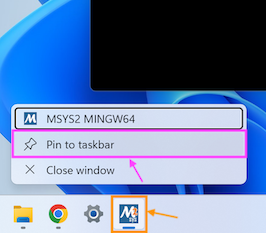
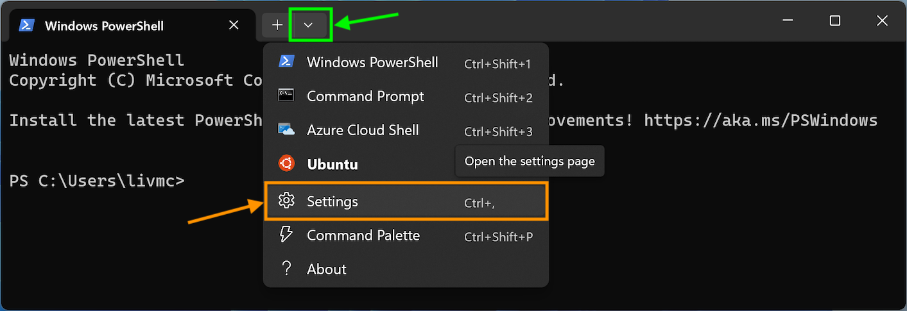
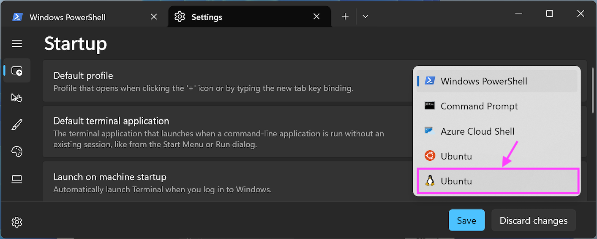
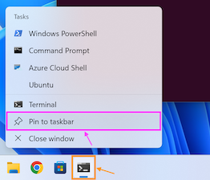
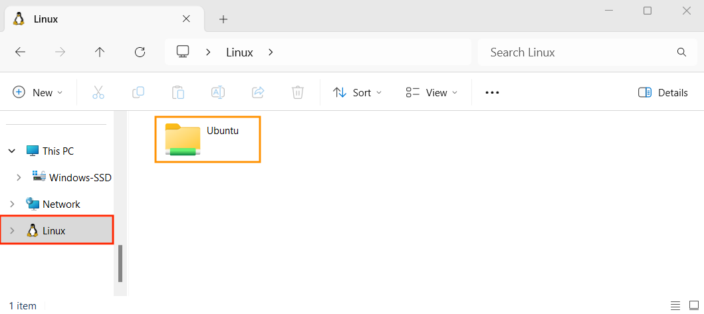
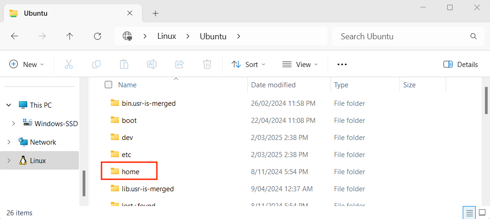

## Using MSYS2

MSYS installs a minimal Linux environment on top of Windows. This will give you easy access to all of your Windows files and folder. The one challenge is that MSYS2 has its own home folder that does not map to your Windows home folder.

If you want to access your Windows home folder you will need to use the `cd` command to move into that folder. Each of your system drives (C: for example) is mapped to a folder with the drive name in the root of the file system. So `C:` is `/c/` in MSYS. To access my Windows Documents folder, I can use the path `/c/Users/andrew/Documents`. You will need to change `andrew` to be your username, so the path will be in the format `/c/Users/<username>/Documents`. The following commands move to my Documents folder.

```bash
# Move to my C drive
cd /c/

# Move to my Documents folder
cd /c/Users/andrew/Documents
```

### File Explorer

Using these commands you should be able to save your projects in a `Code` folder inside your Windows Documents folder for easy access.

You can also use the `explorer.exe` program to open a folder in the File Explorer.

```bash
# Move into my Documents folder
cd /c/Users/`whoami`/Documents

# Open the current directory in File Explorer
explorer .
```

:::note[Shortcut/Alternative way to use "cd" command:]

Here is a video showing how you can click and drag folders into your MSYS2/MINGW64 terminal to make using the `cd` command quicker/easier.

Note that you need to type `cd` then add a *space* before you drag the folder.

<div class="not-content">
  <YouTube id="s2YTKsRjkWI" params="fs=1&modestbranding=1&rel=0"/>
</div>
:::


## Pin MINGW Terminal

2. Pin MINGW64 Terminal to the taskbar:

    To make it easier to open each time, you can pin your terminal to the Taskbar.

    - Open MINGW64 terminal.
    - Right-click on the MSYS2 App icon in the taskbar (shown in the orange box in the image below).
    - Select "Pin to taskbar" (shown in the pink box):

    
    <div class="caption">Image not subject to The Programmer's Field Guide <a href="https://creativecommons.org/licenses/by-nc-nd/4.0/">CC BY-NC-ND 4.0 License</a></div>

### Configure 'Windows Terminal' WSL

Note: This step is *optional*, but encouraged.

If you want to be able to have your 'Windows **Terminal**' app automatically open with WSL, you can change the *Default profile* to use WSL (with Ubuntu) using the steps below:

Firstly, open the Terminal app, and click the drop-down arrow at the top of the window (shown in the green box in the image below), then click on "Settings" (shown in the orange box):


<div class="caption">Image not subject to The Programmer's Field Guide <a href="https://creativecommons.org/licenses/by-nc-nd/4.0/">CC BY-NC-ND 4.0 License</a></div>

Next, click on the drop-down menu within the *Default profile* section and select either of the **Ubuntu** profiles. *If you're unsure, select the one with the Linux penguin icon* (shown in the pink box):


<div class="caption">Image not subject to The Programmer's Field Guide <a href="https://creativecommons.org/licenses/by-nc-nd/4.0/">CC BY-NC-ND 4.0 License</a></div>

Click **Save**. (Don't forget this!)

Now your Terminal app will automatically use the WSL/Ubuntu command line when you open it.

:::note
Don't worry if you have different profiles in your Settings, as long as you can see at least one profile that has "Ubuntu" in the name (if you are using the default setup from [step 1](#1-install-windows-subsystem-for-linux-wsl)).
:::

:::tip[Pin it!]
To make it easier to open each time, you can pin your Terminal to the Taskbar.

- Open the Terminal App.
- Right-click on the Terminal App icon in the taskbar (shown in the orange box in the image below).
- Select "Pin to taskbar" (shown in the pink box):


<div class="caption">Image not subject to The Programmer's Field Guide <a href="https://creativecommons.org/licenses/by-nc-nd/4.0/">CC BY-NC-ND 4.0 License</a></div>
:::

### Accessing WSL Files and Folders from Windows

If you have been working on your projects in WSL, you can access these from Windows using the `\\wsl$` path in the File Explorer. When you access this folder you will see a list of the distributions you have installed in WSL. If you navigate into the `Ubuntu` folder you will have access to the root of your Linux environment. So I can access my Linux home folder using the path `\\wsl$\Ubuntu\home\andrew\Documents`. You will need to change `andrew` to the name of the user you created in Ubuntu, so it will be in the format: `\\wsl$\Ubuntu\home\<username>\Documents`.

One convenient way of accessing your files is to run the `explorer.exe` program from within your WSL terminal. When you do this, you can open a File Explorer and give it a path to open. Running the following commands at the WSL Terminal will let me open my Linux Documents folder in File Explorer.

```bash
# Create Documents folder
mkdir ~/Documents

# Move to my Documents folder in Linux
cd ~/Documents

# Open the current folder in Explorer
explorer.exe .
```

Using this option you can work within your Linux files for your programming projects, and then access these from the File Explorer when needed.

### Accessing WSL Files in File Explorer

*Follow the instructions below to access your WSL folders and files in File Explorer*:

In the left sidebar panel, scroll to the bottom and click on the "Linux" folder (red box below), then navigated into the "Ubuntu" folder (orange box below):



Next, go into the "home" folder (red box below):



You will then see a folder with the username that you used to create your WSL/Ubuntu account. Click into this folder to see your WSL folders and files.

:::note
This is the *home* (~) directory for WSL, which is the location that your Ubuntu terminal will start in when you open a new terminal.

Also, if you have issues and need to reinstall/recreate your Ubuntu account, these folders and files will be removed. Make sure to create a backup of any important folders/files beforehand.
:::


## Using WSL

When you are using WSL, you have a Linux environment running in parallel with Windows. This is why you had to set up a new user account. You were setting up the account within the Linux environment. When you are working in this way, one of the challenges you will have is thinking about where the files are that you are working on, as your Windows and Linux environments will each have their files and folders. To help you get started with this, let's consider how you can access the files in the different environments.

### Accessing Windows Files and Folders from WSL

When you are in the Linux environment, your home directory is not mapped to your Windows home directory. If you want to access files from Windows, you can access this in the **/mnt/c** folder.

```bash
# Output the path to my Linux home
pwd

# Move into my C: on Windows
cd /mnt/c
# Move into my Home (change to use your username!)
cd /mnt/c/Users/andrew/Documents
```

The shell is now in the `C:\Users\andrew\Documents` folder, so I can access the different things I have saved here. When you use this, replace `andrew` with your username. So it will be in the format: `/mnt/c/Users/<username>/Documents`.

:::caution

When you are working in WSL, you are best to keep your projects within the Linux environment and then access these from the Windows environment as described below. Being able to access your Windows files will be useful if you want to copy things from there into your programming projects.

:::

