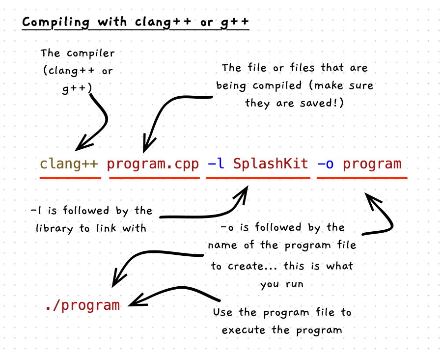

import { Accordion, AccordionItem } from 'accessible-astro-components'

C/C++ are **compiled** languages. This means that you compile source code, and then directly run the resulting program. If you're not already familiar with the general steps, check out the [guided tour](/book/part-0-getting-started/1-building-programs/3-guided-tour/0-overview) first! On this page we'll look more in-depth at the commands we're using.

## Compile your program



When compiling C/C++ code, you generally need to provide the following options:

- `-l` is used to link with an external library. For the programs in this guide, we need to link to the **SplashKit** library.
- `-o` will indicate the name of the executable file to create. By default, the compiler will create a file called `a.out`. Usually you want a different name than `a`, so you can use this option to specify one. For our hello world program we will name the file **program**.

If you have SplashKit installed globally it will be installed in paths that the compiler should search automatically. Given this, you should be able to compile your program using the following command:

```zsh
clang++ source_code.cpp -l SplashKit -o program -Wall
```

<Accordion>
<AccordionItem header="I don't have SplashKit installed globally!">
If you do not have the library installed globally, the easiest thing would be to install it globally with `skm global install`.
If you don't want to do this, then you will need to tell the compiler where to find the different files you are referring to. This can be achieved using the following command line options:

- `-I <path>` lets you add a folder to search for header files you have included (such as with `#include "splashkit.h"`). For SplashKit you use `-I ~/.splashkit/clang++/include`.
- `-L <path>` lets you add a folder to search for libraries. For SplashKit you use `-L ~/.splashkit/lib/linux`, `-L ~/.splashkit/lib/macos`, or `-L ~/.splashkit/lib/win64`, depending on what operating system you are using.
- `-Wl,-rpath,` is used to indicate where to find the library files. The `rpath` is the path that the computer will search at runtime when it is loading libraries. You need to tell this where you have installed the SplashKit library (Linux, macOS, and WSL only).

For example:

```zsh title="Example of compiling without SplashKit globally installed"
clang++ source_code.cpp -I ~/.splashkit/clang++/include -L ~/.splashkit/lib/linux -l SplashKit -Wl,-rpath,~/.splashkit/lib/linux -o program  -Wall
```

If you are using MSys2, there are a few more options that you can also include if you want to be able to run the program by double-clicking it in the Windows explorer instead of only from within MSys2. These settings ensure that the program will embed the aspects of MSys2 needed to run it independently.

```zsh title="Compiling on MSys2 so the executable can be double clicked"
clang++ source_code.cpp -Wl,--as-needed -static-libstdc++ -static-libgcc -lSplashKit -Wl,-Bstatic -lstdc++ -lpthread -o program -Wall
```

:::tip[When all else fails...]
When you install splashkit it includes `skm`, a set of scripts to help compile and run SplashKit programs. If you get stuck, you can use `skm` to compile your program and this will add in the necessary compiler options for you.

```zsh title="Compiling using skm"
skm clang++ source_code.cpp -o program -Wall
```
:::

</AccordionItem>
</Accordion>

## Run your program

When the compiler runs successfully it will output an executable file: the program. With the above commands, we used the `-o` option to indicate the name of the program file to create. So, when you compile your code you should see a **program** file appear. This is the machine code for the program all ready to go, so you can run this directly from the terminal. For example, the following shell commands would build and run a hello world program.

```zsh
# Compile source_code.cpp into a program file called "program"
clang++ source_code.cpp -l SplashKit -o program

# Now we can run it
./program
```

:::tip[Program's path]
When you want to run the program, you need to specify the path to it even though it is in the current folder. This is why we have the **./** in front of the filename here. If your program isn't running, make sure you included this.
:::

Once this is working, you have everything set up and ready to go. Getting this to work can be a bit finicky, as the C/C++ tools were designed for a professional audience and do not include much to make this user-friendly. If you have others you are studying with, make sure to ask for help if you get stuck.

:::caution
Remember to make sure you save, compile, and then run your program as you make changes. If you forget to save the file, or you forget to compile it then you will be running the old version of the program and not what you have coded.

Remember: **save**, **compile**, and then **run**.
:::

## Activities

Do these commands work? How do you run the programs created using the following commands?

1. `clang++ test.cpp -l SplashKit -o test`
2. `g++ program.cpp -o my_program`
3. `clang++ program.cpp -o my_program`
4. `clang++ program.cpp utilities.cpp -o program`

<details>
  <summary role="button">Answers</summary>
  <ul>
    <li><strong>1: </strong>Compiles test.cpp into a program called "test". You run using `./test`.</li>
    <li><strong>2: </strong>This compiles program.cpp into "my_program". This does not link with SplashKit, so this will only work if you do not use any SplashKit code in your project. You run the program using `./my_program`</li>
    <li><strong>3: </strong>This is the same as 2.</li>
    <li><strong>4: </strong>This compiles program.cpp and utilities.cpp into a program called "program". You can run this using `./program`.</li>
  </ul>
</details>
