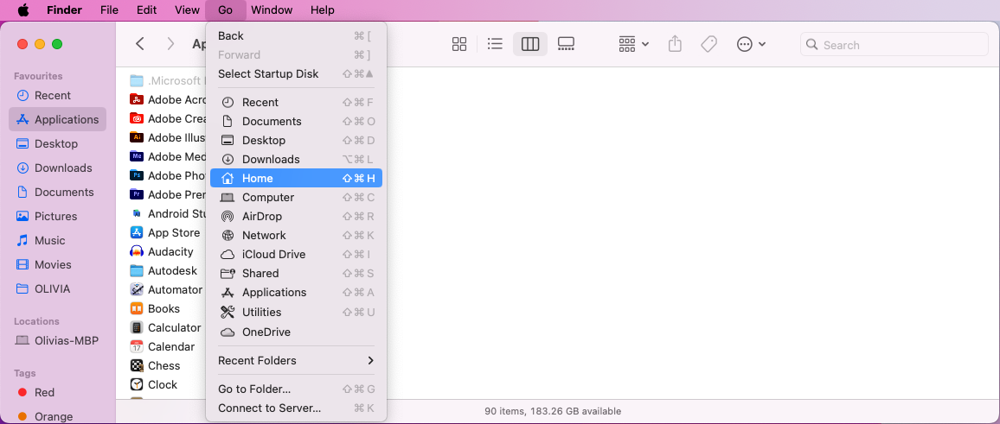
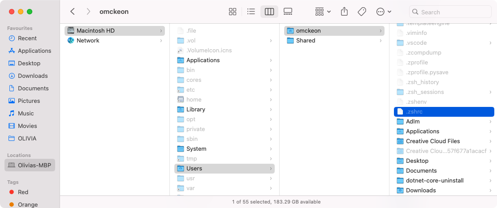
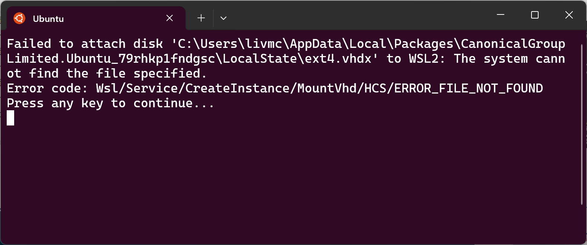

As you go through the installation guide for your operating system, you may encounter errors or issues that prevent you from completing a particular step.

Troubleshooting these issues to find a solution that works can be difficult and discouraging if you're just getting started with programming. We hope to make things a little easier for you by sharing our troubleshooting tips and tricks!

:::tip[How to make it easier when you get stuck?]
Never be afraid to ask for help!
This guide is here to help with general troubleshooting tips, as well as some specific issues that we have encountered already.
:::

## General Troubleshooting

To help make the installation/troubleshooting process as smooth and painless as possible, here are some suggested solutions that you can try if you run into issues during any of the installation steps.

### Check your firewall settings

One of the main causes for installation issues is that your firewall is preventing the software from accessing your computer's system or your network. This can happen when the software you are trying to download or install is not recognised, or is perceived as a threat in some way.


<div class="caption">Image from <a href="https://giphy.com/gifs/male-FjhCTrjPaPy6s">Giphy</a></div>

It is most common the with terminal-based install commands such as the command used to install SplashKit.

If you are not confident with how to update your firewall settings to allow the required connection, try **turning your firewall off** ***temporarily*** while you perform the installation step again.  

:::danger
Only do this when you trust that the software you're trying to install is not malicious, and don't forget to turn your firewall back on afterwards!
:::

If this does not solve your issue, try the next possible solution below.

### Disable antivirus software

Your antivirus software is another layer of protection against malicious software, and can sometimes block harmless software accidentally.

Try **disabling your antivirus software** ***temporarily*** while you perform the installation step again.  

:::danger
Only do this when you trust that the software is not malicious, and don't forget to turn your antivirus software back on afterwards!
:::

If your issue is persisting, don't be discouraged! Have a look at the suggestions below.

### Search the issue online

You probably already know how to search for information using [Google](https://www.google.com/) or your preferred search engine, but sometimes there is a bit of an art to getting the results you want.

If you ***can*** **see an error message**, try searching the entire error message text first.  
This is useful if the software is widely used and the error is encountered often by users.
However, most of the time you will need to simplify the text of the error message to make it as generic as possible. This will give you more results, and more chances to find helpful information.

:::tip
You can also try searching individual keywords, or a combination of just a few keywords.
:::

If you ***can't*** **see an error message**, or something is not quite working as expected, try searching using:

1. The name of the program/software,
2. the word "error" or "issue", and
3. a few keywords that describe the issue you are experiencing.  

Adjust the descriptive keywords a few times if needed to see if your results improve.

Still stuck? The next step would be to refine your search.

### Refine your search by learning

While you are searching for solutions to your issue, you will come across a lot of potentially useful information related to what you are trying to do.

Take the time to try to *understand* what you are reading, especially related to "why" and "how" a suggested solution might have been formulated. Looking into the context behind the issue can give you a broader view of what is happening. This will then either help you solve the issue, or help you improve your search terms.

### Revise the concepts

Understanding a bit about the software or context of your issue can drastically improve your skills in searching for issues online or understanding the suggested solutions enough to know if it could work for your situation.

It might be helpful to go back and revise the content in the "Concepts" pages in [1: Digital Realities](../../../1-digital-realities/1-concepts/1-programs) and [2: Computer Use](../../1-concepts/01-terminal) now that you have more context for how to interpret the information on those pages.

:::tip[Learning from errors]
Troubleshooting errors/issues can be a fantastic opportunity to learn more about how your computer works, or clarify your understanding of related concepts!

Although it can be frustrating and tedious, going through the process of troubleshooting an issue will inadvertently improve your problem-solving skills and understanding of your how your computer works.
:::

### Move to the next install step

Sometimes an issue can feel like it is defeating you in your battle to learn to code, which can be quite overwhelming and make it actually harder to solve the problem.
If you feel like you're spinning around in circles with no results, it is often helpful to change what you are doing.

<!-- Link below currently broken -->
<!-- 
<div class="caption">Image from <a href="https://y.yarn.co/5fb0bbbb-3698-46fd-8833-01b30eb30991_text.gif">Yarn</a></div> -->

In the context of going through the installation/set up guide, you can move to the next step in the guide that doesn't rely on a previous step.
Completing other steps may improve your understanding and skills, which you can then use when you come back to the step you had issues with.

:::tip[Using your time wisely]
Sometimes you will need some more specific help to solve a problem, and you may need to wait for someone to be available or respond to your query.

You can use the time you are waiting!

By finishing all the installation steps that you are able to complete successfully, you will be able to get started with coding much quicker once you get help to complete the installation step you were having trouble with.
:::

### Restart your computer

There is a reason there are so many jokes online about "turning it off and on again".


<div class="caption">Image from <a href="https://giphy.com/embed/DUtVdGeIU8lmo">Giphy</a></div>

Restarting your computer is sometimes **needed** after installing software, but can be helpful if your computer ever starts giving you issues without an identifiable cause.

Restart your computer, and then try the troublesome installation step again.

## Specific Issues

Here are some specific solutions to known issues.

### No response when running SplashKit installation command

If the `bash <(curl -s https://raw.githubusercontent.com/splashkit/skm/master/install-scripts/skm-install.sh)` command does not produce any response, ensure that your computer is connected to the internet and try disabling your firewall.

***Still no luck?***  
If you still encounter issues, you can download the install script locally by right-clicking on [this link](https://raw.githubusercontent.com/splashkit/skm/master/install-scripts/skm-install.sh) and selecting "Save Link As".

To run the downloaded shell script, open the Terminal and navigate to the folder where you saved the file. Then run the following command:

```bash
bash skm-install.sh
```

### Permission issue when running SplashKit installation command

If the `bash <(curl -s https://raw.githubusercontent.com/splashkit/skm/master/install-scripts/skm-install.sh)` command shows an error message near the end that looks similar to either of the following images:


<div class="caption">Image not subject to The Programmer's Field Guide <a href="https://creativecommons.org/licenses/by-nc-nd/4.0/">CC BY-NC-ND 4.0 License</a></div>


<div class="caption">Image not subject to The Programmer's Field Guide <a href="https://creativecommons.org/licenses/by-nc-nd/4.0/">CC BY-NC-ND 4.0 License</a></div>

Then, you can update the file permissions with the following steps:

1. Open Finder.
2. Click on "Go" at the top of the screen, then "Home":

    
    <div class="caption">Image not subject to The Programmer's Field Guide <a href="https://creativecommons.org/licenses/by-nc-nd/4.0/">CC BY-NC-ND 4.0 License</a></div>

3. Click into the **Macintosh HD** (or similar) folder, then the **Users** folder, and finally, click into the folder with your computer's username.
4. Show the hidden files with the shortcut: `Shift` + `Command` + `.` and you should be able to scroll down to see the file mentioned in the terminal error.  
    Here is an example to show the hidden `.zshrc` file mentioned in the screenshots above:

    
    <div class="caption">Image not subject to The Programmer's Field Guide <a href="https://creativecommons.org/licenses/by-nc-nd/4.0/">CC BY-NC-ND 4.0 License</a></div>

    :::note
    If the error message mentions a different file such as `.bash_profile`, then you will edit that file instead of the `.zshrc` file used in this example.
    :::

5. Right-click on the file and then select "**Get Info**".  
    You will see something that looks similar to this:

    
    <div class="caption">Image not subject to The Programmer's Field Guide <a href="https://creativecommons.org/licenses/by-nc-nd/4.0/">CC BY-NC-ND 4.0 License</a></div>

6. Check the information in the orange boxes shown in the image above:

   - Make sure the "**Locked**" checkbox is **not** ticked (as shown above).
   - Make sure the file has "**Read & Write**" Privileges for at least your username, but sometimes you may need to change all of them to Read & Write.

7. Close the Info window.
8. Open your terminal and run the SplashKit installation script command again:

    ```bash
    bash <(curl -s https://raw.githubusercontent.com/splashkit/skm/master/install-scripts/skm-install.sh)
    ```

9. If you get a message the SplashKit is already installed, copy the text to uninstall (highlighted in the image below - yours will have a different username):

    
    <div class="caption">Image not subject to The Programmer's Field Guide <a href="https://creativecommons.org/licenses/by-nc-nd/4.0/">CC BY-NC-ND 4.0 License</a></div>

10. Paste and run the command to uninstall SplashKit.
11. Close and re-open the Terminal and run the SplashKit installation script command again.
12. SplashKit should now be able to install successfully, so you can continue on with the next installation step.

### 'zsh: command not found: code'

If you are having issues getting the `code` command to work, an alternative method you can try is to run the following command (adapted from the [Alternative Manual Instructions](https://code.visualstudio.com/docs/setup/mac#_alternative-manual-instructions) section).

```zsh
cat << EOF >> ~/.zshrc
export PATH="\$PATH:/Applications/Visual Studio Code.app/Contents/Resources/app/bin"
EOF
```

And make sure you have put the **Visual Studio Code** app into the Applications folder.

### Issues creating Ubuntu user account

If you have issues with the WSL (with **Ubuntu**) installation, such as:

- No window pops up after restarting your computer (after running the `wsl --install` command)
- You accidentally closed the Ubuntu window before it finished
- You made a mistake when creating your username or password
- You get an error that might look similar to this:

    
    <div class="caption">Image not subject to The Programmer's Field Guide <a href="https://creativecommons.org/licenses/by-nc-nd/4.0/">CC BY-NC-ND 4.0 License</a></div>

Then you can reset the Ubuntu user account with the following steps:

1. Open a **Powershell** Terminal window.
2. Run the following command to reset the Ubuntu setup:

    ```bash
    wsl --unregister Ubuntu
    ```

3. Close any Terminal/Powershell windows.
4. Open the Ubuntu app (search in the start menu)

This should then open a Terminal window that will start ***Installing Ubuntu*** again, and then you can set up your username and password again.

If you still have issues, try uninstalling Ubuntu and WSL and then run the `wsl --install` command again.

### macOS version pre-12.0

If you are using an older macOS version (pre version 12.0), you will likely encounter issues when trying to compile and run SplashKit programs.

:::note[If you can't run SplashKit programs:]
Follow the instructions below if you encounter an error message similar to `System.DllNotFoundException unable to load DLL splashkit.dll` when trying to compile or run code using SplashKit:
:::

#### Option 1: Update macOS

The first step is to make sure your macOS is fully updated to the latest OS software version, if possible. If your computer is able to update past 12.0, it will make your coding experience much simpler.

#### Option 2: Downgrade SplashKit

If you are using an older macOS version (pre version 12.0), you will need to downgrade SplashKit to an older version.
To do this:

1. Open the Terminal app.
2. Copy each command below (one line at a time), paste it into the terminal, and press the enter key on your keyboard:

```bash
cd ~/.splashkit
git fetch –unshallow
git checkout cbb68dc
```

:::note
By using an older version of SplashKit, you won't be able to install SplashKit globally.

Therefore, you will need to use the commands mentioned in the [section below](#no-splashkit-global-install).
:::

### No SplashKit Global Install

If you have had issues installing the SplashKit global libraries, or you are using an older version of SplashKit, you will need to use `skm` at the start of any compiling/building commands, or when running C# programs.

For example, you will need to use the following versions of the terminal commands mentioned at the end of the [Build and Run](../../../3-building-programs/1-concepts/03-build-and-run) page:

- `skm dotnet new console`: create a new C# terminal project in the current working directory.
- `skm dotnet build`: compile the project in the current working directory.
- `skm dotnet run`: build if needed, then execute your program.

You may encounter other limitations, but with the commands above, you will be able to create and run SplashKit projects successfully.

<!-- Add other specific issues here -->