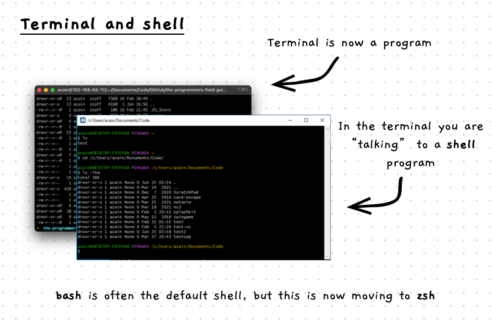

Behind the graphical user interface there is a powerful text driven interface that lets you interact with the computer using text alone. Understanding how to use this is important for IT professionals, as it gives you the capability to automate processes, manage remote machines, and opening up ways for your programs to interact with the computer as well.

:::note[The terminal...]

- is a program you can run to interact with the computer
- connects you with a shell program that interprets your commands

:::

:::note[The shell...]

- is an interactive program that is used to run commands
- it accepts text input and sends output to the terminal
- different shells require different commands
- we will be using the Unix shells - either bash or zsh

:::

:::tip

Getting started with the terminal can be challenging. We can start small, but over time you should look to explore more commands to open up opportunities for you to make use of this very powerful tool.

:::

## Example

The images at the top of the page show some example Terminals, with the output from shell commands.
