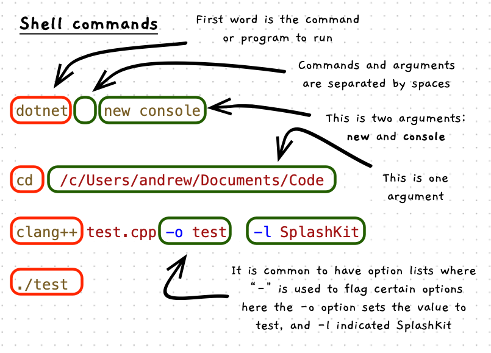

import { Tabs, TabItem } from "@astrojs/starlight/components";

Each shell has its own set of commands that it understands, but they all follow the same general format. Commands are broken into words (separated by spaces) with the first word being the command or program to run, and subsequent words being passed to the program as arguments for it to use.



:::note[Shell commands...]

- are broken into parts based on white space characters (space, tab, etc)
- use the first word to indicate the command or program to run
- use arguments to pass values to the program to tell it what you want to do
- often use flags starting with a `-` to set options.

:::

:::tip
Avoid spaces in file, folder, and usernames!

Watch out for spaces in file, folder, or account names. Working with these on terminal is challenging as spaces are used to separate arguments. If you want one argument to have the value "my username" then you have to use `my\ username` where the `\` tells the shell the next space should be part of this value not an argument separator.
:::

## Run as admin (`sudo`)

Operating systems restrict some actions to admin users, particularly when the actions will change the behaviour of the system. In Unix, you can use the `sudo` shell command to get the **superuser** to **do** something. You follow the `sudo` command with the details of the command you want to do.

:::tip
If you have lots of things you want to run as the superuser, you can use `sudo` to run a new shell. When you are finished, you can close that shell using **ctrl-d**.

```sh
sudo bash
# or
sudo zsh
# You are now in a shell as the super user
```

Please note that this won't work in the MSys as it does not have the capacity to escalate you to admin in the Windows operating system. Most of the setup in MSys will not need admin access, as you can install and work with MSys components as a standard user. If you do ever really need admin access you have to run the MSys terminal as the admin user.

:::

## Example

The following are some example shell commands. Lines starting with a `#` are comments, so these are ignored by the shell program. We use them here to explain how each shell command is structured.

Note: These commands are not expected to be used directly all together (copied and pasted), but rather as information to explain the commands shown, or using individual sections.

<Tabs syncKey="terminal-type">
<TabItem label="macOS">

```shell
# the ls command with flags -l -h and -a
ls -l -h -a

# shorthand for the above, with -lha
ls -lha

# cd command, with a folder path as an argument
cd /Users/andrew/Documents/Code

# mkdir command with Project1 as an argument
mkdir Project1

# dotnet program with 2 arguments: new and console
dotnet new console

# dotnet program with 3 arguments: add, package, and splashkit
dotnet add package splashkit

# clang++ program with 5 arguments: test.cpp, -o, test, -l, SplashKit
# -o and test are linked (test is the value for the -o option)
# -l and splashkit are linked (splashkit is the value for this -l)
clang++ test.cpp -o test -l SplashKit
```

</TabItem>
<TabItem label="Windows (WSL) & Linux">

```shell
# the ls command with flags -l -h and -a
ls -l -h -a

# shorthand for the above, with -lha
ls -lha

# cd command, with a folder path as an argument
cd /home/andrew/Documents/Code

# mkdir command with Project1 as an argument
mkdir Project1

# dotnet program with 2 arguments: new and console
dotnet new console

# dotnet program with 3 arguments: add, package, and splashkit
dotnet add package splashkit

# clang++ program with 5 arguments: test.cpp, -o, test, -l, SplashKit
# -o and test are linked (test is the value for the -o option)
# -l and splashkit are linked (splashkit is the value for this -l)
clang++ test.cpp -o test -l SplashKit
```

</TabItem>
<TabItem label="Windows (MSYS2)">

```shell
# the ls command with flags -l -h and -a
ls -l -h -a

# shorthand for the above, with -lha
ls -lha

# cd command, with a folder path as an argument
cd /c/Users/andrew/Documents/Code

# mkdir command with Project1 as an argument
mkdir Project1

# dotnet program with 2 arguments: new and console
dotnet new console

# dotnet program with 3 arguments: add, package, and splashkit
dotnet add package splashkit

# clang++ program with 5 arguments: test.cpp, -o, test, -l, SplashKit
# -o and test are linked (test is the value for the -o option)
# -l and splashkit are linked (splashkit is the value for this -l)
clang++ test.cpp -o test -l SplashKit
```

</TabItem>
</Tabs>
