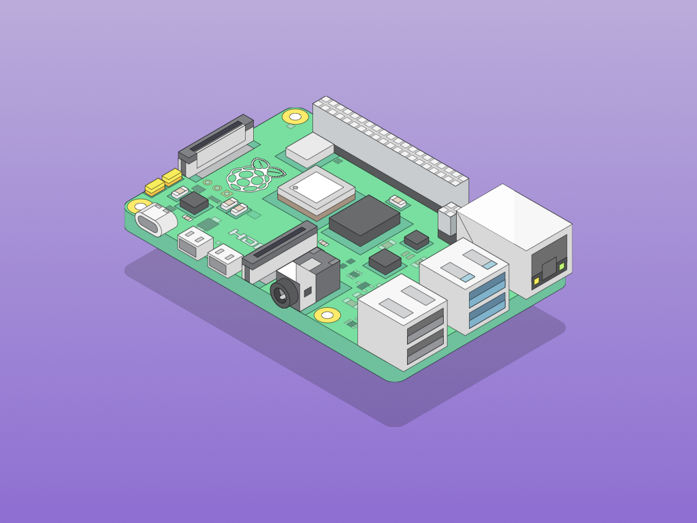

The Raspberry Pi is an affordable, yet surprisingly powerful, "pocket-sized" computer designed to help you explore coding, electronics, and digital systems.

Image from <a href="https://learn.littlebirdelectronics.com.au/guides/getting-started-with-the-raspberry-pi-4">Little Bird Electronics</a>

Despite its small size, the Raspberry Pi is a **fully functional computer** capable of running a Linux-based operating system, such as Raspberry Pi OS (a variant of Debian). This means you get the full experience of coding with a Unix system, combined with the fun of interacting with physical hardware components such as LEDs, buttons, joystick modules and more!

:::note

The Raspberry Pi is not required to learn the coding concepts covered in this book, but with it, you'll get some unique learning opportunities:

- **Hands-On Fun:** You get to see the results of your code come alive — lighting up LEDs, moving motors, or even playing sounds!
- **Explore Embedded Systems:** Discover how code interacts with real-life gadgets and electronics and gain more understanding of how software and hardware can work together.
- **Creative Exploration:** Tinker with sensors, buttons, and displays to create fun projects such as controlling the LEDs on a 7-segment display using inputs from a sensor or your code commands.
- **Easy to Start:** Even if you’re new to programming, the Raspberry Pi offers a gentle introduction with plenty of support when you get stuck.

:::

:::tip[Official Documentation]

The official **[Raspberry Pi Documentation](https://www.raspberrypi.com/documentation/)** includes a variety of useful guides, such as setting up your Raspberry Pi, configuring settings, accessing your Pi remotely, and much more.

:::
