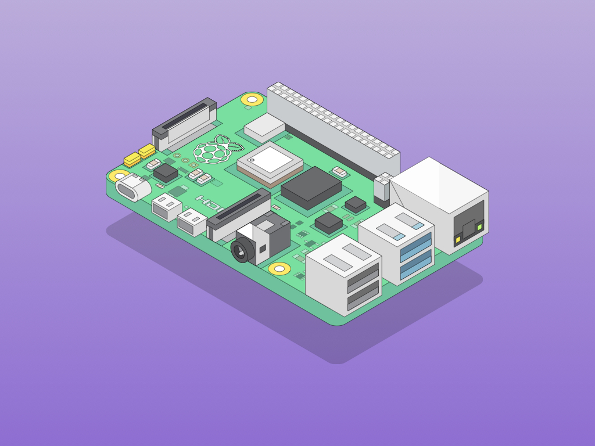

# What’s a Raspberry Pi, Anyway?

Imagine having a mini-computer that fits in the palm of your hand—cool, right? The Raspberry Pi is exactly that! It’s a tiny, affordable computer packed with power and endless possibilities. Whether you want to create your own video game, build a robot, or set up a secret spy project, the Raspberry Pi is your launchpad for creativity and fun.

:::note[Did You Know?]
Raspberry Pi was created to make computer science accessible and enjoyable for everyone. With its friendly size and versatile capabilities, it’s like a magic box that turns your ideas into reality!
:::

# Why Are We Using It?

Learning with the Raspberry Pi is like mixing science with a dash of adventure. Here’s what makes it so awesome:

- **Hands-On Fun:** You get to see the results of your code come alive—lighting up LEDs, moving motors, or even playing sounds!
- **Creative Exploration:** Tinker with sensors, buttons, and displays. Every project is an exciting opportunity to learn something new.
- **Easy to Start:** Even if you’re new to programming, the Raspberry Pi offers a gentle introduction with plenty of support.
- **Real-World Experience:** From simple experiments to complex projects, it’s the perfect tool to learn how software and hardware work together.

# What’s in Store for You?

In our course, you’ll embark on a thrilling journey where you’ll:
  
1. **Learn the Basics:** Understand programming fundamentals in a clear, straightforward way.
2. **Explore Embedded Systems:** Discover how code interacts with real-life gadgets and electronics.
3. **Build Awesome Projects:** From a blinking LED to your very own interactive device, you’ll create projects that are both fun and impressive.

## Need a Little Extra Help?

If you ever want to dive deeper, here are some official guides and resources you can explore:

- **[Getting Started with Raspberry Pi](https://www.raspberrypi.com/documentation/)**  
  This guide is perfect for beginners. It walks you through setting up your Raspberry Pi, installing the operating system, and getting your first project up and running. It’s like a friendly roadmap that makes your first steps in the world of computing smooth and enjoyable.
  
- **[Raspberry Pi Projects](https://projects.raspberrypi.org/en/)**  
  Looking for inspiration? Check out this treasure trove of projects. Whether you’re into art, science, or robotics, you’ll find ideas and step-by-step instructions to ignite your creativity.

:::tip
Remember, every big programmer started as a beginner. Don’t worry about making mistakes—they’re simply stepping stones to mastering new skills. Have fun, experiment boldly, and let your curiosity lead the way!
:::

Get ready to have a blast learning and creating with your Raspberry Pi. Let’s turn those brilliant ideas into real-world projects—one exciting step at a time!