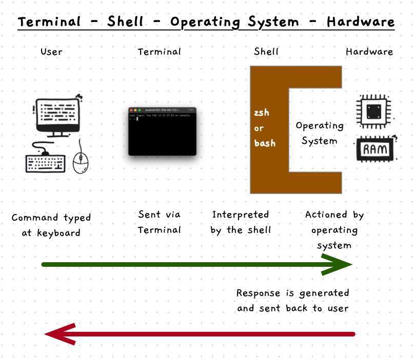

*What commands can I enter at the terminal?*

The **terminal** program provides a text environment, allowing text input and output much like the old physical terminals once did. A terminal on its own is not very helpful though. Something within the computer needs to receive the text you type into the terminal and respond to it. We call this program a **shell**.

## Shell?

*Why is this program called a shell?*

This comes from an analogy relating to nuts. In the real world, the shell of a nut is a thin wrapper around its kernel or core. In a computer, the shell is the command interpreter that gives you access to the core of the operating system. Continuing the analogy, the operating system is also known as a **kernel**, the same as the inside of a nut. The kernel provides tools which abstract away many of the lower-level details of interacting with the computer's hardware. All other programs *grow* out of the kernel, just like plants grow out of the kernel of a nut or seed.

## Terminal and Shell

A shell program runs within a terminal program to interpret your commands and instruct the kernel to perform the actions you request. 
A shell program is very simple. It provides a text prompt at which you can enter commands. The shell reads the text you entered, and performs an action based on this text.
You can use the shell to perform operations like copying and deleting files, starting programs, and more.

There are several shell programs you can choose from, each of which has its advantages and disadvantages. The shell we are going to use for this journey will be **Z shell**, which is built into most modern Unix operating systems.

:::tip[Charlotte's tip]
Understanding the difference between the terminal and the shell can be challenging, especially as many people refer to them as the same thing.

The quick summary is that the **terminal** allows you to input commands and view output.
The **shell** has the actual *logic* to interpret and execute your commands.
:::
