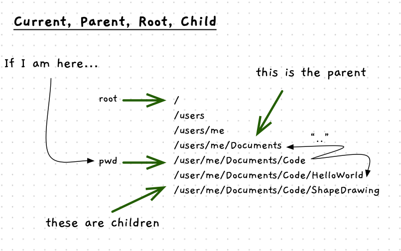

To use the shell and the terminal tools effectively, we need to understand a little about files and file systems. When you interact with the terminal, the shell will position you within the file system to enable you to easily access and manipulate files.

Let’s return to our low-level thinking on how the computer actually works. You should recall that the computer is an electronic device. Current flows through the transistors within the computer, enabling different values and actions to be achieved. However, this all disappears when the power is turned off. In order to retain data, some other technologies are required.

Storage devices can retain data in a way that does not require power. To use this data, you need to read it from the storage device. This converts the stored data back into electronic current that can be used within the processors. New and changed data can then be written back to the storage device.

Operating systems provide ways of organising stored data into **files** and **folders**.
These terms were chosen because files and folders in the computer are abstractions of the paper-based files and folders used in the real world.
Organising data into digital files and folders on our computers helps the computer store the information efficiently, and helps users to find (and retrieve) information when they need it.

## Files and Folders

A **file** stores data associated with a single thing such as a document, image, song, or program. Through the operating system, programs can open files and read the data within them, change the data stored, or add new data. You could picture this as a book, or as sheets of paper, where you can read, edit, or add information.

**Folders** are used to organise files. This allows files to be organised into groups. Files within folders are listed in a **directory** that records the details of each file such as its name, size, owner, and permissions on who can access it. Users can list the files in a folder to find the one they want to interact with.

:::note
Many people use the term "folder" and "directory" interchangeably!
The difference usually does not matter, but they are actually different things.
:::

*How are folders organised?*

In addition to containing files, folders can also contain other folders. This gives you directories of files, that can contain sub-directories. This simple concept allows you to create large file systems, with folders and files organised in complex ways. For example, in your home folder you can have folders for documents, downloads, pictures, music, etc. In your documents folder you can have more folders to divide your documents between different projects, or organise your files in any other way you like.

## Tree Metaphor

This organisation results in files and folders creating a tree structure, much like a family tree. This similarity has resulted in the use of metaphors based on genealogy and family relationships to describe file systems. For example, the files and folders within a folder are called that folder's *children*, and a folder can be referred to as the *parent* of the files and folders it contains.

You can picture this as a hierarchy. The file system starts with a folder we call the **root** of the file system. It is the one folder that does not have a parent. The name "root" comes from the tree analogy, as the root folder is the point from which all other folders "grow".

As a user, you need a way of indicating which file you want to use. This means that each file must be uniquely identifiable. To achieve this, files and folders must have a unique name within their parent folder. If you move a file into a folder that already contains a file with the same name, the file you moved will replace the existing file and you will lose all the data associated with the file that has been replaced. You have probably already encountered this during your normal computer use.

## Paths

To identify a file within the file system, you can list the **path** to follow from the root to the file. The path is an ordered list of folders, separated by `/`. For example, `/home/multitool/Documents/code/program1.cs` is a path to the file "program1.cs". It describes that the file can be located by starting from the root of the file system, then travelling into the *home* folder, then into the *multitool* folder within *home*, followed by *Documents* folder, then the *code* folder. The last element on the path is the *program.cs* file itself. Here we can see that *Documents* folder is the parent of the *code* folder, and the *multitool* folder is the parent of the *Documents* folder.

This is an example of an **absolute path**, which is a path that is lists out every folder from the root of the file system to a specific file or folder.
We will discuss an alternative to absolute paths when we learn how to [navigate the file system in a terminal](../04-files-shell/#folder-shortcuts).

:::tip[Where does it start?]
The root of the file system is the `/` folder. Therefore, `/` on its own is a valid path! It is also why the path in our example starts with `/`, to indicate that we are starting from the root.
:::

:::caution
To be different, Windows uses `\` to separate folders. This can be more challenging to program with as `\` also has a special meaning in many programming languages.
:::
