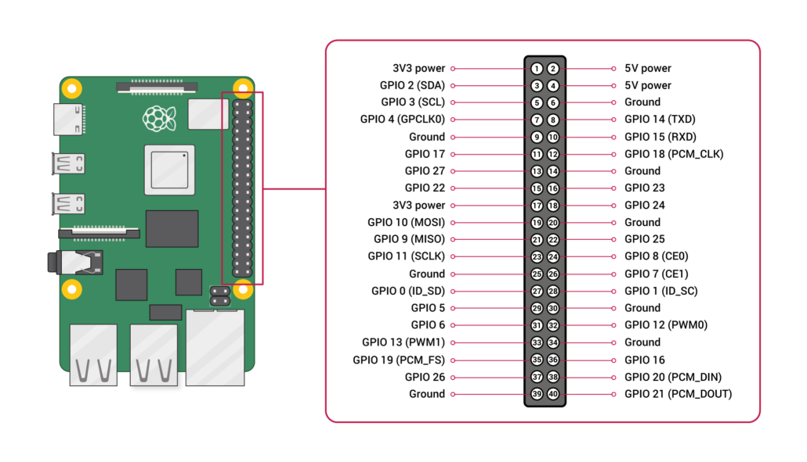

## How Does Raspberry Pi Work?

Think of the Raspberry Pi as a mini-computer that packs a serious punch in a tiny package. Inside, it has a processor, memory, and storage (thanks to its microSD card) that allow it to run a full operating system, usually Raspberry Pi OS. This little computer isn’t just about crunching numbers—it’s also built to interact with the world around you!

:::note[Inside the Magic]
At its heart, the Raspberry Pi has a CPU (the brain), RAM (its short-term memory), and various ports like HDMI and USB. But the real magic happens with its GPIO pins!
:::

## Understanding the GPIO Pins

Image from <a href="https://www.raspberrypi.com/documentation/computers/raspberry-pi.html#gpio">Raspberry Pi Foundation</a>

The **General Purpose Input/Output (GPIO)** pins are like a set of super-flexible connectors on your Raspberry Pi. Here’s how you can use them:

- **Input Mode:**  
  You can attach sensors (like temperature or light sensors) to the pins. The Raspberry Pi can read signals from these sensors to understand its environment.

- **Output Mode:**  
  Connect LEDs, motors, buzzers, and more! With a bit of code, you can make an LED blink, a motor spin, or even create sound effects.

- **Digital and PWM Signals:**  
  Some pins work in a digital on/off mode (perfect for simple tasks), while others support Pulse Width Modulation (PWM), which lets you control the speed of a motor or the brightness of an LED by varying the power output.

:::tip[Check out SplashKit's Raspberry Data types!]

- The pins shown in the diagram above can be seen in the [GPIO Pin](https://splashkit.io/api/types/#gpio-pin) table.
- The modes mentioned above can be seen in the [GPIO Pin Mode](https://splashkit.io/api/types/#gpio-pin-mode) table.
- The values available for the pins can be seen in the [GPIO Pin Value](https://splashkit.io/api/types/#gpio-pin-value) table.

:::

:::caution[Always check your project’s voltage requirements]
The Raspberry Pi’s GPIO pins work with 3.3V logic. Overloading them with higher voltage can damage your board.
:::

## Utilizing the Power of Raspberry Pi

By combining programming with hardware, you can create projects that respond to real-world events. Here are a few ideas:

- **Interactive LED Displays:**  
  Use GPIO pins to control an array of LEDs that react to sensor input or your code commands.

- **Home Automation:**  
  Control devices like fans, lights, or alarms with your own custom scripts.

- **Robotics:**  
  Connect motors and sensors to build a robot that can navigate and react to its surroundings.

Each project is an opportunity to see your code make a tangible difference. With the GPIO pins as your bridge between software and hardware, you can bring your creative ideas to life!

## Getting Started: Setup Your Raspberry Pi

Before you start exploring the endless possibilities, you need to get your Raspberry Pi up and running. For a step-by-step guide on setting up the Raspberry Pi OS (including downloading the OS, installing it on your microSD card, and initial configuration), follow the instructions here:

[Setup Raspberry Pi OS](/book/appendix/0-installation/2-3-setup-pi/#3-setup-raspberry-pi-os)

Read through this guide carefully--It walks you through everything from burning the OS image to your SD card to configuring your Pi’s settings like the keyboard layout, Wi-Fi network, and more.

:::tip
*Take your time during setup* and don’t be afraid to explore! Every step is a learning opportunity, and once you have your Raspberry Pi ready, you’re on your way to building amazing projects.
:::

Happy tinkering, and may your experiments spark innovation and endless fun!
