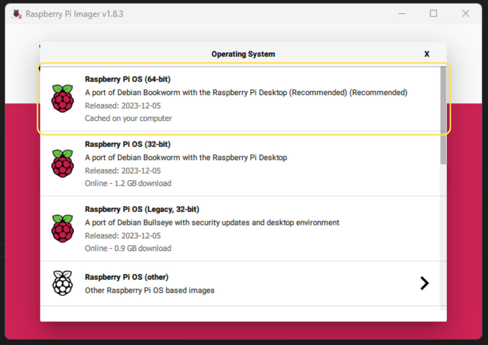
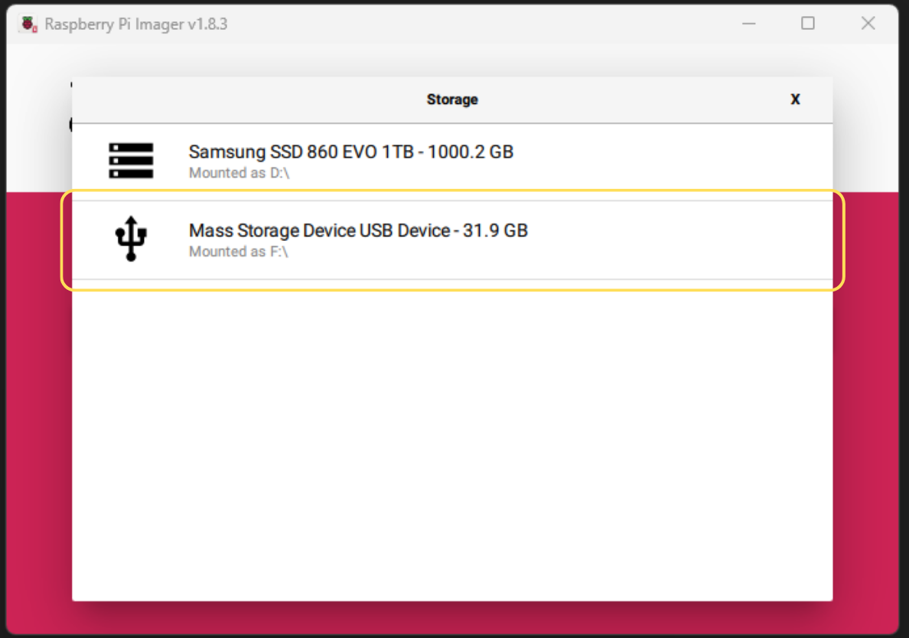
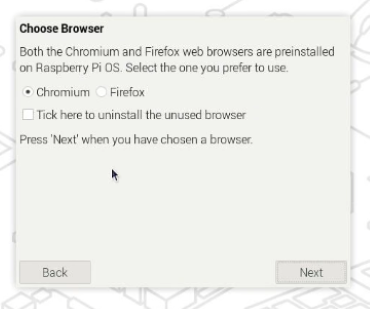
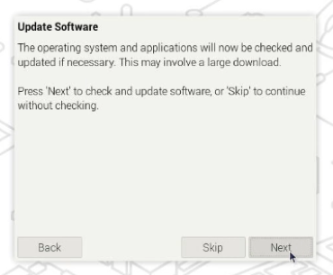
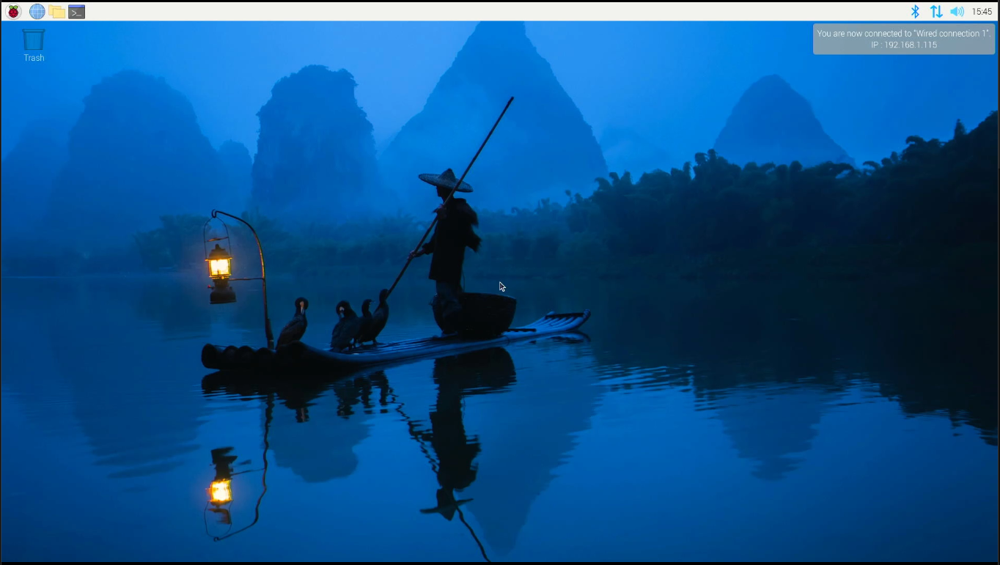

This guide will go through how to set up the software on your Raspberry Pi, including how to:

- Download and burn Raspberry Pi OS to an SD card.
- Install Raspberry Pi Operating System (OS).
- Install programs and tools used in the next chapters (continued on next page).

## 1. Download Raspberry Pi OS

Follow the steps below to download the recommended Raspberry Pi OS:

1. Download and install the Raspberry Pi Imager from [raspberrypi.org](https://www.raspberrypi.org/software/)
    - Select the version for your operating system.
    - Run the installer and follow the instructions.
2. Insert the micro SD card into your computer.
    - You may need a Micro SD card adapter and/or a USB SD card reader.
    - We recommend using a micro SD card with a size of at least 16 GB (32 GB preferred).
3. Open the Raspberry Pi Imager.
4. Click CHOOSE OS.

    

5. Select Raspberry Pi OS (64b-bit)

    

6. Click storage and select the micro SD card and click next.

    :::danger[Which Device should I select?]
    Make sure you select the correct storage device. Selecting the wrong device will result in the data on that device being erased.

    In the image below we are using a 32 GB micro SD card connected via a USB SD card reader:

    

    :::

7. Click `No` to the question "Would you like to apply OS customisation setting?
    - Optionally you can click edit settings to preconfigure options like the hostname, password, and Wi-Fi settings. Click yes if you want to do this.
8. Click `Yes` to the question Are you sure you want to continue?
    - **WARNING**: This will erase all data on the selected storage device.
9. Wait until the Raspberry Pi Imager has downloaded, written and verified the image on micro SD card. (This may take a while)
10. Click continue and remove the micro SD card from your computer.

    

## 2. Install Raspberry Pi OS

Follow the steps below to install the Raspberry Pi OS on the micro SD card:

1. Insert the micro SD card into the Raspberry Pi and power on. (See [Build my Raspberry Pi](./1-0-pi-computer.md) for setup instructions)
2. On the Welcome screen click next.
3. Set your country, language and time zone and click next.

    :::note[Important!]
    For the correct keyboard layout that is used for most Australian-produced keyboards (and the Raspberry Pi Keyboard that we are using), make sure to **_tick_** the option: "**Use US keyboard**", as shown in the image below.
    :::

    

4. Set your username and password, click next.

    

5. \*\*Optional\*\*  
   Select Wi-Fi network and enter password, click next.

    

6. Select your preferred browser: Chromium or Firefox, Click next.

    

7. \*\*Optional\*\*  
   Update Software, Click next.

    :::tip[Reduce initial setup time]
    This process will take some time to complete.

    Click "Skip" to perform this task later.
    :::

    

8. Click restart.

9. After the reboot you will be presented with the Raspberry Pi Desktop:

    

10. Raspberry Pi OS Install Complete!

## 3. Setup Raspberry Pi OS

The Raspberry Pi OS (originally named "Raspbian") is a derivative of the Debian Linux distribution. Therefore, you can follow the installation steps on the next page: [Set up my Linux Box](../2-2-setup-linux) to finish setting up your Raspberry Pi.
