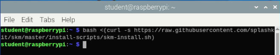

**TODO:** Phil to update

*Let's get your Raspberry Pi ready to start coding!*

This section will go through all the steps to install the required Applications and Tools that you will need to code in C# and C++ with SplashKit.

To make things easier we have an automated script for fresh installs that will install all the required tools and applications for you, or you can follow the manual steps below.

:::note[How do I open the Terminal on my Pi?]
*Click the Terminal icon in the task bar (shown in the Red Box below), or press `Ctrl + Alt + T`*


:::

### Automated Setup

This script will install the following applications and tools:

- Visual Studio Code
  - C/C++ Extension
  - C# Extension
- .NET SDK
- SplashKit
  - SplashKit Global
- wget
- git
- curl
- clang

Open the Terminal and run the following command:  

```bash
curl -s "https://raw.githubusercontent.com/splashkit/the-programmers-field-guide/main/src/content/docs/book/part-0-getting-started/2-computer-use/2-put-together/scripts/_Linux_Pi_InstallScript.sh" | bash /dev/stdin
```

:::note
This script will take a while to run (approx. 12-15 mins).
:::

Once the automated script has finished running, close and reopen the Terminal.

Run the command `skm` to check SplashKit is installed correctly.

:::tip[Using options with the script]
The linux_pi_install script supports a number of options that can be used to customise the installation.  
They can be added to the end of the command.

The example below will display the help menu which lists the available options (scroll the command across to see the end):

```bash
curl -s "https://raw.githubusercontent.com/splashkit/the-programmers-field-guide/main/src/content/docs/book/part-0-getting-started/2-computer-use/2-put-together/scripts/_Linux_Pi_InstallScript.sh"| bash /dev/stdin --help
```

:::

### Manual Setup Steps

If you choose not to use the automated set up above, or are experience issues with this, you can follow these steps below:

### 1. Install the SplashKit SDK

SplashKit is a beginner's all-purpose software toolkit that will allow you to create fun and exciting programs more easily, especially for Graphical User Interface (GUI) programs.

:::tip[Curious to know more?]
The **SplashKit SDK** is installed using the `skm-install.sh` shell script which is stored in the [**skm**](https://github.com/splashkit/skm) GitHub repository (in the **install-scripts** folder).

It will also add the required paths to your PATH environment variable.
:::

Copy and paste the following command into your Terminal window:

```bash
bash <(curl -s https://raw.githubusercontent.com/splashkit/skm/master/install-scripts/skm-install.sh)
```

:::danger[My install command is not working. Help!]
What if the command above does nothing? (as shown in the image below)



Make sure your computer is connected to the internet.

***Still no luck?***  
Download the install script locally by right-clicking on [this link](https://raw.githubusercontent.com/splashkit/skm/master/install-scripts/skm-install.sh) and selecting "Save Link As".

To run the downloaded shell script, open the Terminal and navigate to the folder where you saved the file and then use the command: `bash skm-install.sh`.  
For example, if the file is in your *Downloads* folder:


:::

Close and reopen the Terminal, then run the command below to build SplashKit on the Pi:

```bash
skm linux install
```

When prompted, type `y` and press enter to confirm the installation.


:::note
This may take a while (approx. 10 mins).
:::

### 2. Install SplashKit Globally

Finally, you will need to install the SplashKit Global Libraries. This will install the SplashKit libraries and library include files into the system default global locations so that when building (compiling) programs created with SplashKit, the compiler can find these files automatically.

To install SplashKit globally on your machine:

Copy and paste the following command into your Terminal window:

```bash
skm global install
```

:::note[What does this command do specifically?]
The command above will add the **SplashKit libraries** into the `/usr/local/lib/` folder, and the required **SplashKit library include files** into the `/usr/local/include` folder.
:::

### 3. Install Visual Studio Code

Visual Studio Code, also commonly known as *VS Code* or just *Code*, is a powerful and versatile code editor that enables efficient coding, debugging, and collaboration for your SplashKit projects!

:::note[VS Code has it all!]
Once you have your code project set up, Visual Studio Code will be the main program you will use to write, build, run and debug your code.
:::

Run the following command in the Terminal to install Visual Studio Code:

```bash
sudo apt install code
```


:::tip[Open Code from Terminal]
You can open Visual Studio Code from the Terminal by typing `code` and pressing enter.  
`code .` will open the current folder in Visual Studio Code.
:::

### Recommended Extensions

Visual Studio Code has an extensive library of *Extensions* that let you add improved functionality for languages, debuggers, and tools to support your development workflow.  
Using extensions in VS Code will make it easier and faster to code with whatever language or tools you are using.

#### C# Language Extensions

For **C#** code, we recommended that you install the `C#`, `C# Dev Kit` and `IntelliCode for C# Dev Kit` extensions.

:::tip[How do I install the C# extensions?]

1. Open Visual Studio Code and click on the icon in the left panel (shown in the purple box in the image below).
2. Type "C#" in the Search bar at the top (shown in the blue box).
3. Click "Install" for each of the extensions listed (shown in the green box).


:::

#### C++ Language Extensions

For **C++** code, we recommended that you install the `C/C++` extension.

You can also install the `C/C++ Extension Pack` extension which includes multiple extensions bundled together. If you have issues with syntax highlighting, the `Better C++ Syntax` extension is one of the best for this.

:::tip[How do I install the C++ extensions?]

1. Open Visual Studio Code and click on the icon in the left panel (shown in the purple box in the image below).
2. Type "C++" in the Search bar at the top (shown in the blue box).
3. Click "Install" for the "C/C++" extensions (shown in the green box).
4. (Optional) Click "Install" for any other extensions you want to install (shown in the orange box).


:::

### 4. Install Language Specific Tools

Some coding languages require specific tools/frameworks to be installed to be able to build and run your code files.  
As you will be coding in C# and C++ in this book, let's look at the tools needed for these languages:

### C# Tools

For coding in C#, you will need to install the `.NET` framework, also commonly called *dotnet*.  
You will use this to create, build, and run your C# project code.

:::tip[Which version should I use?]
We recommend using **.NET 8.0**, which you can be installed with the following command:

```bash
curl -sSL https://dot.net/v1/dotnet-install.sh | bash /dev/stdin
```

You will also need to add .dot to your PATH environment variable.

```bash
echo 'export DOTNET_ROOT=$HOME/.dotnet' >> ~/.bashrc
echo 'export PATH=$PATH:$HOME/.dotnet' >> ~/.bashrc
source ~/.bashrc
```

Test dotnet is installed correctly by running `dotnet --version` in the Terminal.
For more details on the process refer to this article [Deploy .NET apps on ARM single-board computers](https://docs.microsoft.com/en-us/dotnet/iot/deployment)

:::

### C++ Tools

For coding in C++, you will need to have a C++ compiler installed to build your C++ code into a file you can use to run your program.  
Commonly used compilers are `g++` and `clang++`.
`g++` is installed by default on the Raspberry Pi to install `clang++` run the following command:

```bash
sudo apt install clang -y
```

## 4. Optional Steps

:::tip[What is nano?]
Nano is a command line text editor that is installed by default on the Raspberry Pi. It has a number of features but as a quick start these are the most important commands

- To edit a file in nano use `nano [filename]`
- navigate the cursor using the arrow keys
- `Ctrl + O` to save the file
- `Ctrl + X` to exit the editor

:::

### Setup zsh shell

When using the terminal you are actually interacting with a shell, where the default for the Raspberry Pi is **bash**, but there are other shells available.

Here we will install ***zsh*** and ***oh-my-zsh*** to customise the terminal. These will give you a more user-friendly terminal experience with themes and plugin support.

**To install zsh**, run the following command in your Terminal:

```bash
sudo apt install zsh -y
```

**To install oh-my-zsh**, run the following command in your Terminal:

```bash
sh -c "$(curl -fsSL https://raw.githubusercontent.com/ohmyzsh/ohmyzsh/master/tools/install.sh)"
```


Answer `y` to the question `Do you want to change your default shell to zsh?`

Add SplashKit and dotnet to the PATHs to zsh

```bash
echo "export PATH=$PATH:$HOME/.dotnet" >> ~/.zshrc
echo "export DOTNET_ROOT=$HOME/.dotnet" >> ~/.zshrc
echo "export PATH=$PATH:$HOME/.splashkit" >> ~/.zshrc
source ~/.zshrc
```

:::note[You may need to restart the Pi for the terminal to update]
:::

### Plugins

There are a number of plugins available for **oh-my-zsh** that add additional functionality to the terminal.  
[This article](https://github.com/ohmyzsh/ohmyzsh/wiki/Plugins) has a list of pre-installed plugins, although there are others available as well.

To install a plugin you need to add it to the plugins list in the `~/.zshrc` file.

Using `autojump` as an example:


First you will install it with:

```bash
sudo apt install autojump -y
```

Then add it to the plugins list in `~/.zshrc`

```bash
nano ~/.zshrc
```

Navigate to the plugins line and add `autojump` to the list. `git` will be listed already.  
Use a space to separate the plugins as shown below:

```bash
plugins=(git autojump)
```
