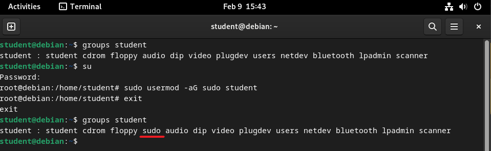
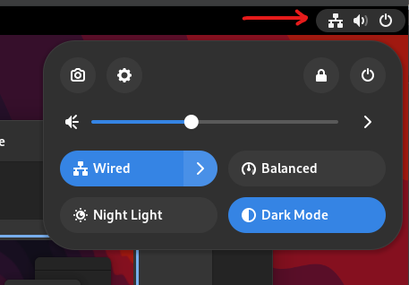
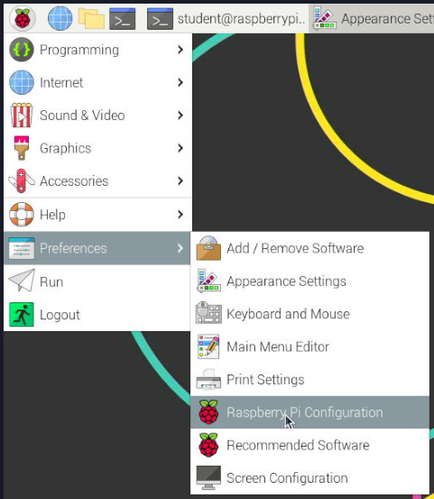

Linux is an open-source operating system that is widely used for programming and development. Being open-source, there are several versions available called distributions (distros); this guide will focus on Debian, which is the base for many popular distros such as Ubuntu and Raspberry Pi OS. If you use a different Linux distro, the steps may differ slightly.

In this guide, we will walk through the steps to install the necessary Applications and Tools that you will need to code in C# and C++ with SplashKit. To simplify things, we have an automated script for fresh installs that will install all the required tools and applications for you, or you can follow the manual steps.

:::note[How do I open the Terminal?]
To open the Terminal on Debian, click activities in the top left of the screen and type "Terminal" in the search bar, then click on the Terminal icon.


*Using a **Raspberry Pi**? Click the Terminal icon in the taskbar (shown in the Red Box below), or press `Ctrl + Alt + T`*


:::

:::tip[Do you sudo?]
`sudo` is a command that allows you to run a program with superuser privileges and is often required for installing software. Debian does not add the main user to the sudoers file by default.

*On a **Raspberry Pi** the main user is added to the sudoers file, so this step is not required*

The following commands will let you check if your user is in the suders group and add it if required. To take effect, you must reboot your computer after adding your user to the sudoers group.

*You will need to know your root user password* (*replace `username` with your username*):

```bash
groups username
su
sudo usermod -aG sudo username
exit
groups username
```


:::

:::danger[Do you have git and curl installed?]

A number of the commands in the setup require `git` and `curl` to be installed to function correctly. To check if they are installed on your system, type `curl`, then `git` into the terminal and press enter after each.

If you see the following error messages you will need to install the missing programs.


To install curl and git run the following commands in the Terminal (if only one is required, you can delete the other from the command):

```bash
sudo apt update
sudo apt install curl git -y
```

:::

## 1. Automated Setup

This script will install the following applications and tools:

- Visual Studio Code
  - C/C++ Extension
  - C# Extension
- .NET SDK
- SplashKit
  - SplashKit Global
- wget
- git
- curl
- clang

Open the Terminal and run the following command:

```bash
curl -s "https://raw.githubusercontent.com/splashkit/the-programmers-field-guide/main/src/content/docs/book/part-0-getting-started/2-computer-use/2-put-together/scripts/_Linux_Pi_InstallScript.sh" | bash /dev/stdin
```

:::note
This script will take a while to run (approx. 12-15 mins).
:::

Once the automated script has finished running, close and reopen the Terminal.

Run the command `skm` to check SplashKit is installed correctly.

:::tip[Using options with the script]
The linux_pi_install script supports several options that can be used to customise the installation; these can be added to the end of the command.

The example below will display the help menu, which lists the available options (scroll the command across to see the end):

```bash
curl -s "https://raw.githubusercontent.com/splashkit/the-programmers-field-guide/main/src/content/docs/book/part-0-getting-started/2-computer-use/2-put-together/scripts/_Linux_Pi_InstallScript.sh"| bash /dev/stdin --help
```

:::

## 2. Manual Setup Steps

If you choose not to use the automated setup above or are experiencing issues, you can follow these steps below:

### 1. Install the SplashKit SDK

SplashKit is a beginner's all-purpose software toolkit that will allow you to create fun and exciting programs more easily, especially for Graphical User Interface (GUI) programs.

:::tip[Curious to know more?]
The **SplashKit SDK** is installed using the `skm-install.sh` shell script which is stored in the [**skm**](https://github.com/splashkit/skm) GitHub repository (in the **install-scripts** folder).

It will also add the required paths to your PATH environment variable.
:::

Copy and paste the following command into your Terminal window to download and run the SplashKit installer:

```bash
bash <(curl -s https://raw.githubusercontent.com/splashkit/skm/master/install-scripts/skm-install.sh)
```

:::danger[My install command is not working. Help!]
If the command above does not produce any response, ensure that your computer is connected to the internet and try disabling your firewall.

***Still no luck?***  
If you still encounter issues, you can download the install script locally by right-clicking on [this link](https://raw.githubusercontent.com/splashkit/skm/master/install-scripts/skm-install.sh) and selecting "Save Link As".

To run the downloaded shell script, open the Terminal and navigate to the folder where you saved the file. Then run the following command:

```bash
bash skm-install.sh
```

:::

Close and reopen the Terminal, then run the command below to build SplashKit:

```bash
skm linux install
```

:::note
If prompted, enter your password, type `y`, and press enter to confirm the installation.

This may take a while (approx. 10 mins).
:::


### 2. Install SplashKit Globally

Finally, you will need to install the SplashKit Global Libraries. This will install the SplashKit libraries and library include files into the system's default global locations so that the compiler can find these files when building (compiling) programs created with SplashKit.

To install SplashKit globally, copy and paste the following command into your Terminal window:

```bash
skm global install
```

:::note[What does this command do specifically?]
The command above will add the **SplashKit libraries** into the `/usr/local/lib/` folder, and the required **SplashKit library include files** into the `/usr/local/include` folder.
:::

### 3. Install Visual Studio Code

Visual Studio Code, also commonly known as *VS Code* or just *Code*, is a powerful and versatile code editor that enables efficient coding, debugging, and collaboration for your SplashKit projects!

:::note[VS Code has it all!]
Once you have your code project set up, Visual Studio Code will be the main program you will use to write, build, run, and debug your code.
:::

:::danger[Using the Raspberry Pi?]
Run the following command in the Terminal to install Visual Studio Code:

```bash
sudo apt install code
```


:::

On Debian, running the following commands will download and then install Visual Studio Code:

```bash
wget -O vscode.deb https://go.microsoft.com/fwlink/?LinkID=760868
sudo dpkg -i vscode.deb
sudo apt-get install -f
rm vscode.deb
```

:::tip[Open Code from Terminal]
You can open Visual Studio Code from the Terminal by typing `code` and pressing enter. `code .` will open the current folder in Visual Studio Code.
:::

### Recommended Extensions

The final step to complete the setup of VS Code is to install a few *Extensions* in VS Code:

[**Set up my VS Code Extensions**](../2-7-setup-vscode)

Go to the page linked above, follow the steps to install both the C# and C/C++ recommended extensions, and then come back here and continue to the next step. *You can use the "Back button" in your browser to return to this page.*

### 4. Install Language Specific Tools

Some coding languages require specific tools/frameworks to be installed to be able to build and run your code files.  
As you will be coding in C# and C++ in this book, let's look at the tools needed for these languages:

### C# Tools

For coding in C#, you will need to install the `.NET` SDK which will allow you to use the *dotnet* terminal command to create, build, and run your C# project code.

Download the latest version of the .NET SDK using the following command:

```bash
curl -sSL https://dot.net/v1/dotnet-install.sh | bash /dev/stdin
```

You will also need to add .dotnet to your PATH environment variable.

```bash
echo 'export DOTNET_ROOT=$HOME/.dotnet' >> ~/.bashrc
echo 'export PATH=$PATH:$HOME/.dotnet' >> ~/.bashrc
source ~/.bashrc
```

Test dotnet is installed correctly by running `dotnet --version` in the Terminal.

For more details on the process, refer to this article [Deploy .NET apps on ARM single-board computers](https://docs.microsoft.com/en-us/dotnet/iot/deployment)

:::

### C++ Tools

For coding in C++, you will need to have a C++ compiler installed to build your C++ code into a file you can use to run your program. Commonly used compilers are `g++` and `clang++`.

`g++` is installed by default on the Raspberry Pi.

To install `clang++` run the following command:

```bash
sudo apt install clang -y
```

## 3. Optional Steps

### Setup zsh shell

When using the terminal, you are actually interacting with a shell, where the default for the Raspberry Pi is **bash**, but other shells are available.

Here, we will install ***zsh*** and ***oh-my-zsh*** to customise the terminal. These will give you a more user-friendly terminal experience with themes and plugin support.

**To install zsh**, run the following command in your Terminal:

```bash
sudo apt install zsh -y
```

**To install oh-my-zsh**, run the following command in your Terminal:

```bash
sh -c "$(curl -fsSL https://raw.githubusercontent.com/ohmyzsh/ohmyzsh/master/tools/install.sh)"
```


Answer `y` to the question `Do you want to change your default shell to zsh?`

Add SplashKit and dotnet to the PATHs to zsh

```bash
echo 'export PATH=$PATH:$HOME/.dotnet' >> ~/.zshrc
echo 'export DOTNET_ROOT=$HOME/.dotnet' >> ~/.zshrc
echo 'export PATH=$PATH:$HOME/.splashkit' >> ~/.zshrc
source ~/.zshrc
```

:::note[You may need to restart the system for the terminal to update]
:::

### Plugins

:::tip[What is nano?]
Nano is a command line text editor that is already installed on Debian. As a quick start, these are the most important commands

- To edit a file in nano use `nano [filename]`
- navigate the cursor using the arrow keys
- `Ctrl + O` to save the file
- `Ctrl + X` to exit the editor

:::

Several plugins are available for **oh-my-zsh** that add additional functionality to the terminal.  
[This article](https://github.com/ohmyzsh/ohmyzsh/wiki/Plugins) has a list of pre-installed plugins, although there are others available as well.

To install a plugin, add it to the plugin list in the `~/.zshrc` file.

Using `autojump` as an example:


First, you will install it with:

```bash
sudo apt install autojump -y
```

Then add it to the plugins list in `~/.zshrc`

```bash
nano ~/.zshrc
```

Navigate to the plugins line and add `autojump` to the list. `git` will be listed already.  
Use a space to separate the plugins as shown below:

```bash
plugins=(git autojump)
```

Save and close the file.
Then run the following command to update the terminal:

```bash
source ~/.zshrc
```

### Add Shortcut for the Programmers Field Guide

To add the Programmers Field Guide to the menu, run the following commands in the Terminal ***On the Raspberry Pi it will appear under programming in the menu***

```bash
    echo "Adding Programers Feild guide to Menu"
    sudo curl -s "https://raw.githubusercontent.com/splashkit/the-programmers-field-guide/main/public/favicon.svg" -o /usr/share/pixmaps/feildguide.svg

    touch ~/programmers-field-guide.desktop
    echo "[Desktop Entry]" >> ~/programmers-field-guide.desktop
    echo "Type=Application" >> ~/programmers-field-guide.desktop
    echo "Name=Programmers Field Guide" >> ~/programmers-field-guide.desktop
    echo "TryExec=/usr/bin/x-www-browser" >> ~/programmers-field-guide.desktop
    echo "Exec=/usr/bin/x-www-browser https://programmers.guide/" >> ~/programmers-field-guide.desktop
    echo "Icon=/usr/share/pixmaps/feildguide.svg" >> ~/programmers-field-guide.desktop
    echo "Categories=Development;" >> ~/programmers-field-guide.desktop
    sudo mv ~/programmers-field-guide.desktop /usr/share/applications/programmers-field-guide.desktop
```

### Desktop Background

To customise the desktop background, right-click anywhere on the desktop and select Change Background (**Properties on the Raspberry Pi**).
Then, select the image or theme you want to use as your background.


Debian also has Light/Dark mode; you can toggle dark mode by clicking on the icon in the top right of the screen and selecting the mode you want to use.



#### Set Deakin Desktop Background (Debian)

For Debian, run the following command in the Terminal to download the Deakin background images and set them for dark and light mode:

```bash
 curl -s "https://raw.githubusercontent.com/splashkit/the-programmers-field-guide/main/src/content/docs/book/part-0-getting-started/2-computer-use/2-put-together/images/setup-pi/Deakin-Backgound-1920x1080-outline-dark.jpg" -o ~/.local/share/backgrounds/Deakin-Backgound-1920x1080-outline-dark.jpg
 curl -s "https://raw.githubusercontent.com/splashkit/the-programmers-field-guide/main/src/content/docs/book/part-0-getting-started/2-computer-use/2-put-together/images/setup-pi/Deakin-Backgound-1920x1080-outline-light.jpg" -o ~/.local/share/backgrounds/Deakin-Backgound-1920x1080-outline-light.jpg

gsettings set org.gnome.desktop.background picture-uri file://$HOME/.local/share/backgrounds/Deakin-Backgound-1920x1080-outline-light.jpg
gsettings set org.gnome.desktop.background picture-uri-dark file://$HOME/.local/share/backgrounds/Deakin-Backgound-1920x1080-outline-dark.jpg

```

#### Set Deakin Desktop Background (Raspberry Pi)

For the Raspberry Pi, run the following command in the Terminal to download the Deakin background images and pick which one you want to use:

```bash
    sudo curl -s "https://raw.githubusercontent.com/splashkit/the-programmers-field-guide/main/src/content/docs/book/part-0-getting-started/2-computer-use/2-put-together/images/setup-pi/Deakin-Backgound-1920x1080-outline-dark.jpg" -o /usr/share/rpd-wallpaper/Deakin-Backgound-1920x1080-outline-dark.jpg
    sudo curl -s "https://raw.githubusercontent.com/splashkit/the-programmers-field-guide/main/src/content/docs/book/part-0-getting-started/2-computer-use/2-put-together/images/setup-pi/Deakin-Backgound-1920x1080-outline-light.jpg" -o /usr/share/rpd-wallpaper/Deakin-Backgound-1920x1080-outline-light.jpg
```

For the light image, run the following command:

```bash
    pcmanfm --set-wallpaper /usr/share/rpd-wallpaper/Deakin-Backgound-1920x1080-outline-light.jpg
```

For the dark image, run the following command:

```bash
    pcmanfm --set-wallpaper /usr/share/rpd-wallpaper/Deakin-Backgound-1920x1080-outline-dark.jpg
```

### Raspberry Pi Set Fan Control

If you are using a fan on your Raspberry Pi with GPIO control, you can configure it to turn on when the CPU reaches a specific temperature.
Click the menu, select `Preferences`, then `Raspberry Pi Configuration`, and select the `Performance` tab.



Toggle the fan on, select the GPIO pin you are using, and set the temperature the fan will turn on when reached.
If you follow our Pi setup guide, you will use GPIO 14, and we recommend setting the fan to turn on at 60 degrees.


