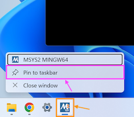

In this guide, we will walk through the steps to install the necessary Applications and Tools using **MSYS2** (**M**inimal **SYS**tem) on Windows. This will enable you to code in C# and C++ with SplashKit.

:::note[Already have SplashKit installed?]
If you have previously installed SplashKit (before 2024):

- Update SplashKit using your "MSYS2 MINGW64" terminal with the command: `skm update`
- Then you can skip to Step [4: Install SplashKit Globally](#4-install-splashkit-globally).

:::

Now, let's get started!

To get SplashKit and other coding tools installed on Windows, using MSYS2, follow the steps outlined below:

## 1. Install MSYS2

Download the installer (32-bit or 64-bit) from the official MSYS2 website: [www.msys2.org](https://www.msys2.org/)


To install MSYS2, double-click the downloaded executable file, and follow the on-screen instructions.  
*It is recommended to use the default install path, but you can customise the other installation options as needed.*

:::note[Which Terminal?]
MSYS2 comes with a variety of terminal environments. The **MINGW64** terminal environment is recommended for 64-bit computers (MINGW32 for 32-bit) as it has been found to support the C# and C++ terminal commands you will use.

Therefore, you should use the **MINGW64** (MSYS2 MINGW64) terminal, which you can find by searching "mingw64" in the Windows Start menu and selecting the **MSYS2 MINGW64** App.
:::

:::tip[Pin it!]
To make it easier to open each time, you can pin your terminal to the Taskbar.

- Open MINGW64 terminal.
- Right-click on the MSYS2 App icon in the taskbar (shown in the orange box in the image below).
- Select "Pin to taskbar" (shown in the pink box):


:::

## 2. Install git Command Line Tool

To install SplashKit, you will firstly need to install **Git**.

Copy and paste the following command into your **MINGW64** terminal window to install the `git` command-line tool:

```bash
pacman -S git --noconfirm --disable-download-timeout
```

:::caution[Paste commands into MINGW64 Terminal]
Unfortunately, you won't be able to use `Ctrl` + `V` to paste.

Instead, right-click anywhere in the terminal window and then select **Paste**.
:::

## 3. Install SplashKit SDK

SplashKit is a beginner's all-purpose software toolkit that will allow you to create fun and exciting programs more easily, especially for Graphical User Interface (GUI) programs.

:::tip[Curious to know more?]
The **SplashKit SDK** is installed using the `skm-install.sh` shell script which is stored in the [**skm**](https://github.com/splashkit/skm) GitHub repository (in the **install-scripts** folder).

It will also add the required paths to your PATH environment variable.
:::

Copy and paste the following command into your MINGW64 terminal to download and run the SplashKit installer:

```bash
bash <(curl -s https://raw.githubusercontent.com/splashkit/skm/master/install-scripts/skm-install.sh)
```

*For this step*, you can use any of the terminal environments provided by MSYS2, such as the **MSYS** terminal shown here:


:::danger[My install command is not working. Help!]
If the command above does not produce any response, ensure that your computer is connected to the internet and try disabling your firewall.

***Still no luck?***  
If you still encounter issues, you can download the install script locally by right-clicking on [this link](https://raw.githubusercontent.com/splashkit/skm/master/install-scripts/skm-install.sh) and selecting "Save Link As".  

To run the downloaded shell script, open the MINGW64 terminal and navigate to the folder where you saved the file. Then run the following command:

```bash
bash skm-install.sh
```

:::

## 4: Install SplashKit Globally

Finally, you will need to install the SplashKit Global Libraries. This will install the SplashKit libraries and library include files into the system's default global locations so that the compiler can find these files when building (compiling) programs created with SplashKit.

To install SplashKit globally, open the MINGW64 terminal as an **administrator**. Then run the following command in the terminal window:

```bash
skm global install
```


:::note[What does this command do specifically?]
The command above will add the **SplashKit libraries** into the `/usr/local/lib/` folder, and the required **SplashKit library include files** into the `/usr/local/include` folder.
:::

## 5. Install Visual Studio Code

Visual Studio Code, also commonly known as *VS Code* or just *Code*, is a powerful and versatile code editor that enables efficient coding, debugging, and collaboration for your SplashKit projects!

:::note[VS Code has it all!]
Once you have your code project set up, Visual Studio Code will be the main program you will use to write, build, run and debug your code.
:::

Download and run the installer from: [code.visualstudio.com/Download](https://code.visualstudio.com/Download).


:::tip[Open Code from Terminal]
You can open Visual Studio Code from the MINGW64 terminal by typing `code` and pressing enter. `code .` will open the current folder in Visual Studio Code.

*You will need to close and reopen any currently open terminal windows after installing VS Code for the above commands to work.*
:::

### Setup VS Code Terminal

Visual Studio Code has a built-in Terminal that you can use instead of needing to switch back and forth between VS Code and your MINGW64 terminal window. You will need to update some settings to get this working with your MINGW64 terminal.

Open Visual Studio Code, then press `Ctrl` + `Shift` + `P` to open the [Command Palette](https://code.visualstudio.com/docs/getstarted/userinterface#_command-palette).

Start typing "Open user..." and then select **Open User Settings (JSON)** (shown in the orange box in the image below):


This will open the **settings.json** file that you can now edit.

Create a new line just before the last closing curly brace `}` at the end of the file, and then copy and paste the text below into that line:

```json
    "terminal.integrated.profiles.windows": {
        "PowerShell": {
            "source": "PowerShell",
            "icon": "terminal-powershell"
        },
        "Command Prompt": {
            "path": [
                "${env:windir}\\Sysnative\\cmd.exe",
                "${env:windir}\\System32\\cmd.exe"
            ],
            "args": [],
            "icon": "terminal-cmd"
        },
        "Git Bash": {
            "source": "Git Bash"
        },
        "MSYS2": {
            "path": "C:\\msys64\\usr\\bin\\bash.exe",
            "args": [
                "--login",
                "-i"
            ],
            "env": {
                "MSYSTEM": "MINGW64",
                "CHERE_INVOKING": "1"
            }
        }
    },
    // You can use the line below to set the default profile
    // or you can remove it if you don't want this set automatically
    "terminal.integrated.defaultProfile.windows": "MSYS2",
```

:::note

- If you already have some settings included in this file, you will need to add a comma `,` after the closing curly brace `}` on the line above your new line.
- If you already see code that looks similar to the code above, you may need to copy only small parts to match the code above.
- The last line of the code above will set your default profile, so that it will automatically use the MSYS2 (MINGW64) terminal. You can also read this [article](https://code.visualstudio.com/docs/terminal/profiles) to see other ways to set the default terminal.

:::

Save the file for these changes to take effect.

Now you can open a new Terminal in VS Code with: ***Terminal* > *New Terminal*** (as shown below):


### Recommended Extensions

The final step to complete the setup of VS Code is to install a few *Extensions* in VS Code:

[**Set up my VS Code Extensions**](../2-7-setup-vscode)

Go to the page linked above, follow the steps to install both the C# and C/C++ recommended extensions, and then come back here and continue to the next step. *You can use the "Back button" in your browser to return to this page.*

## 6. Install Language Specific Tools

Some coding languages require specific tools/frameworks to be installed to be able to build and run your code files.  
As you will be coding in C# and C++ in this book, let's look at the tools needed for these languages:

### C# Tools

For coding in C#, you will need to install the `.NET` SDK which will allow you to use the *dotnet* terminal command to create, build, and run your C# project code.

Download the latest version of the .NET SDK for Windows from the official .NET website: [dotnet.microsoft.com/download](https://dotnet.microsoft.com/download)

Run the downloaded installer and follow on-screen instructions.

### C/C++ Tools

For coding in C++, you will need to have a C++ compiler installed to build your C++ code into a file you can use to run your program. Commonly used C++ compilers are `g++` and `clang++`, which can be installed with **GCC** (**G**NU **C**ompiler **C**ollection).

You will also need to install **GDB** (**G**NU **D**e**b**ugger), which you can use when debugging C++ programs.

To install GCC and GDB, copy and paste the following commands into your MINGW64 terminal window:

```bash
pacman -S mingw-w64-x86_64-gcc --noconfirm --disable-download-timeout
pacman -S mingw-w64-x86_64-gdb --noconfirm --disable-download-timeout
```

These commands will install the necessary C/C++ compilers and debuggers for your development environment.

Your Windows machine is now set up with MSYS2, Visual Studio Code, and SplashKit, ready for C# and C++ development. Happy coding!
