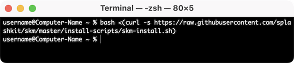
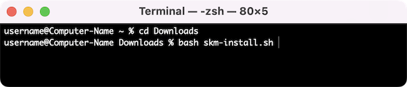
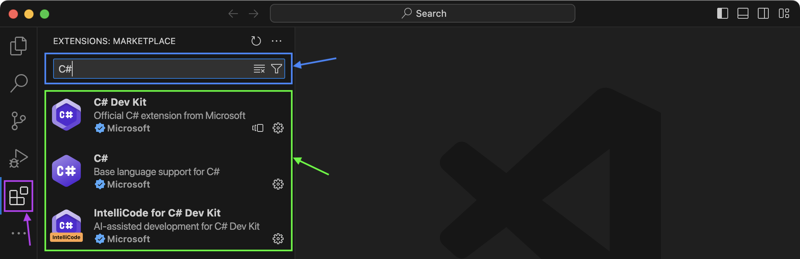
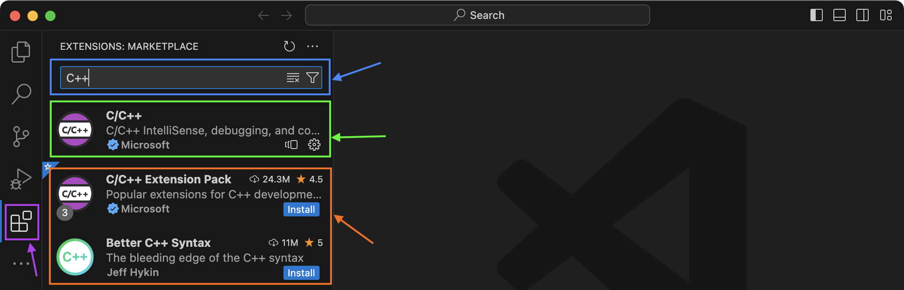
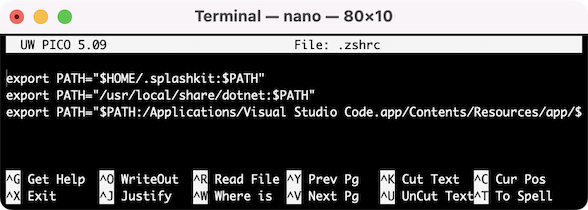

*Let's get your macOS computer ready to start coding!*

In this guide, we will go through all the steps to install the required Applications and Tools that you will need to code in C# and C++ with SplashKit.  
We will be using the **Terminal** app, with the **zsh** shell. You can also use the **bash** shell if you prefer.

:::note[Already have SplashKit installed?]
If you have previously installed SplashKit (before 2024):

- Update SplashKit using your Terminal, with the command: `skm update`
- Then you can skip to Step [5. Install SplashKit Globally](#5-install-splashkit-globally)
:::

Now, to get SplashKit and other coding tools installed on macOS, follow the steps outlined below:

## 1. Install Xcode Command Line Tools

The Command Line Tools provided by Xcode provide a large amount of developer tools required to compile and develop applications.

:::tip[Why Xcode Command Line Tools?]
By installing Xcode Command Line Tools, you will effectively install a large variety of tools (terminal commands you can use) all at once.  
Most importantly for these installation steps, you will need the **git** tool (used for *Step 2*) and the **C++ compilers** (mentioned in *Step 4*).
:::

To install these tools, copy the command below:

```bash
xcode-select --install
```

Then, open your **Terminal** app and paste the copied text.


:::note[How do I find the Terminal on my Mac?]

1. Press ***Command*** (⌘) + ***Space bar*** to open the Spotlight Search.  
2. Start typing "Terminal".  
3. Click the **Terminal** app.
:::

**Note:** After running the command above, if you get something like this:


That means you've already installed Xcode, and are ready to move to the next step!

## 2. Install the SplashKit SDK

SplashKit is a beginner's all-purpose software toolkit that will allow you to create fun and exciting programs more easily, especially for Graphical User Interface (GUI) programs.

:::tip[Curious to know more?]
The **SplashKit SDK** is installed using the `skm-install.sh` shell script which is stored in the [**skm**](https://github.com/splashkit/skm) GitHub repository (in the **install-scripts** folder).

This install script uses the `git` command (**that we installed with Xcode in Step 1!**) to access and download the contents of the GitHub repository.  
It will also add the required paths to your PATH environment variable.
:::

Copy and paste the following command into your Terminal window:

```bash
bash <(curl -s https://raw.githubusercontent.com/splashkit/skm/master/install-scripts/skm-install.sh)
```


:::danger[My install command is not working. Help!]
What if the command above does nothing? (as shown in the image below)



Make sure your computer is connected to the internet and try disabling your firewall.

***Still no luck?***  
Download the install script locally by right-clicking on [this link](https://raw.githubusercontent.com/splashkit/skm/master/install-scripts/skm-install.sh) and selecting "Save Link As".  

To run the downloaded shell script, open the Terminal and navigate to the folder where you saved the file and then use the command: `bash skm-install.sh`.  
For example, if the file is in your *Downloads* folder:

:::

## 3. Install Visual Studio Code

Visual Studio Code, also commonly known as *VS Code* or just *Code*, is a powerful and versatile code editor that enables efficient coding, debugging, and collaboration for your SplashKit projects!

:::note[VS Code has it all!]
Once you have your code project set up, Visual Studio Code will be the main program you will use to write, build, run and debug your code.
:::

First you will need to download the zip file from: [code.visualstudio.com/Download](https://code.visualstudio.com/Download)

To install: double-click the zip file, then click and drag the **Visual Studio Code** Application file into the ***Applications*** folder:


### Add 'code' command to PATH

You can install the `code` command to allow you to open any file or folder in a new Visual Studio Code window, right from your Terminal!

Follow the steps in the [Visual Studio Code on macOS](https://code.visualstudio.com/docs/setup/mac) article on the Visual Studio Code website to install this command.

:::caution['zsh: command not found: code']
If you are having issues with the `code` command not working after following the steps above, you can run the following command (adapted from the [Alternative Manual Instructions](https://code.visualstudio.com/docs/setup/mac#_alternative-manual-instructions) section).

```zsh
cat << EOF >> ~/.zshrc
export PATH="\$PATH:/Applications/Visual Studio Code.app/Contents/Resources/app/bin"
EOF
```

:::

### Recommended Extensions

Visual Studio Code has an extensive library of *Extensions* that let you add improved functionality for languages, debuggers, and tools to support your development workflow.  
Using extensions in VS Code will make it easier and faster to code with whatever language or tools you are using.

#### C# Language Extensions

For **C#** code, we recommended that you install the `C#`, `C# Dev Kit` and `IntelliCode for C# Dev Kit` extensions.

:::tip[How do I install the C# extensions?]

1. Open Visual Studio Code and click on the icon in the left panel (shown in the purple box in the image below).
2. Type "C#" in the Search bar at the top (shown in the blue box).
3. Click "Install" for each of the extensions listed (shown in the green box).


:::

#### C++ Language Extensions

For **C++** code, we recommended that you install the `C/C++` extension.  

You can also install the `C/C++ Extension Pack` extension which includes multiple extensions bundled together. If you have issues with syntax highlighting, the `Better C++ Syntax` extension is one of the best for this.

:::tip[How do I install the C++ extensions?]

1. Open Visual Studio Code and click on the icon in the left panel (shown in the purple box in the image below).
2. Type "C++" in the Search bar at the top (shown in the blue box).
3. Click "Install" for the "C/C++" extensions (shown in the green box).
4. (Optional) Click "Install" for any other extensions you want to install (shown in the orange box).


:::

## 4. Install Language Specific Tools

Some coding languages require specific tools/frameworks to be installed to be able to build and run your code files.  
As you will be coding in C# and C++ in this book, let's look at the tools needed for these languages:

### C# Tools

For coding in C#, you will need to install the `.NET` framework, also commonly called *dotnet*.  
You will use this to create, build, and run your C# project code.

:::tip[Which version should I use?]
We recommend using **.NET 8.0**, which you can download from:  
[dotnet.microsoft.com/en-us/download](https://dotnet.microsoft.com/en-us/download)
:::

### C++ Tools

For coding in C++, you will need to have a C++ compiler installed to build your C++ code into a file you can use to run your program.  
Commonly used compilers are `g++` and `clang++`.

:::note
If you installed Xcode Command Line Tools successfully in Step 1, then you will already have the necessary compilers installed and ready for coding in C++!
:::

## 5. Install SplashKit Globally

Now we need to install the SplashKit libraries and library include files into the system default global locations so that when building (compiling) programs created with SplashKit, the compiler can find these files automatically.

To install SplashKit globally on your machine:

Copy and paste the following command into your Terminal window:

```bash
skm global install
```


:::note[What does this command do specifically?]
The command above will add the **SplashKit libraries** into the `/usr/local/lib/` folder, and the required **SplashKit library include files** into the `/usr/local/include` folder.
:::

## 6. Check Environment Variables

Through this installation process, some steps *should* have edited your computer's environment variables, or your "Shell Profile" file.

To ensure the required *paths* will be added to your **PATH** environment variable each time you open a new Terminal shell, you will need to check that your **"Shell Profile" file** contains the following lines:

```bash
export PATH="$HOME/.splashkit:$PATH"
export PATH="/usr/local/share/dotnet:$PATH"
export PATH="$PATH:/Applications/Visual Studio Code.app/Contents/Resources/app/bin"
```

:::tip[Shell Profiles]
The two most common shell profiles are **zsh** (Default shell since macOS Catalina) and **bash**:

- If you are using `zsh` (Z Shell) then the *"Shell Profile"* files are: `.zshrc` or `.zprofile`.
- If you are using `bash` (Bash Shell) then the *"Shell Profile"* files are: `.bash_profile` or `.bashrc`.

:::

If you are missing any of the lines above, you can edit your "Shell Profile" file in a few ways:

### Using '*nano*' in the Terminal

To open the file in the "nano" shell, copy and paste the following command in your Terminal:

```bash
nano .zshrc
```

The result of the command above will look similar to this:



Now, to edit the file directly inside the **nano** terminal window, you can just move the cursor down to the last line and paste the missing command.  
Once you're finished, press ***Control*** (^) + ***X*** to exit **nano** and follow the prompts to save the changes.

For example, if the last line was missing:


### Using 'code' to open .zshrc file in Visual Studio Code

You can open your `.zshrc` file in Visual Studio Code using the `code` command, to edit and add any missing lines.

To do this, copy and paste the following command in your Terminal:

```bash
code ~/.zshrc
```


## 7. Testing SplashKit Install

:::tip[Coming Soon]
Test your install with `skm test`.
:::
