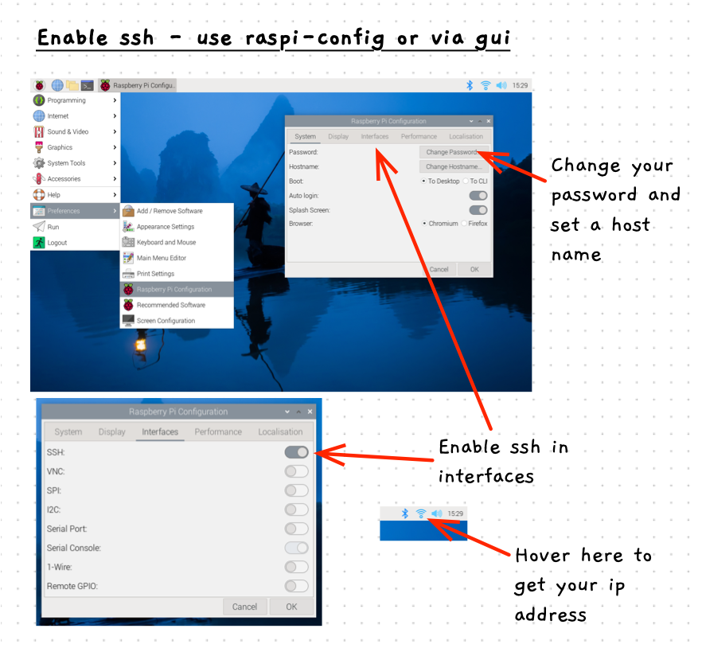
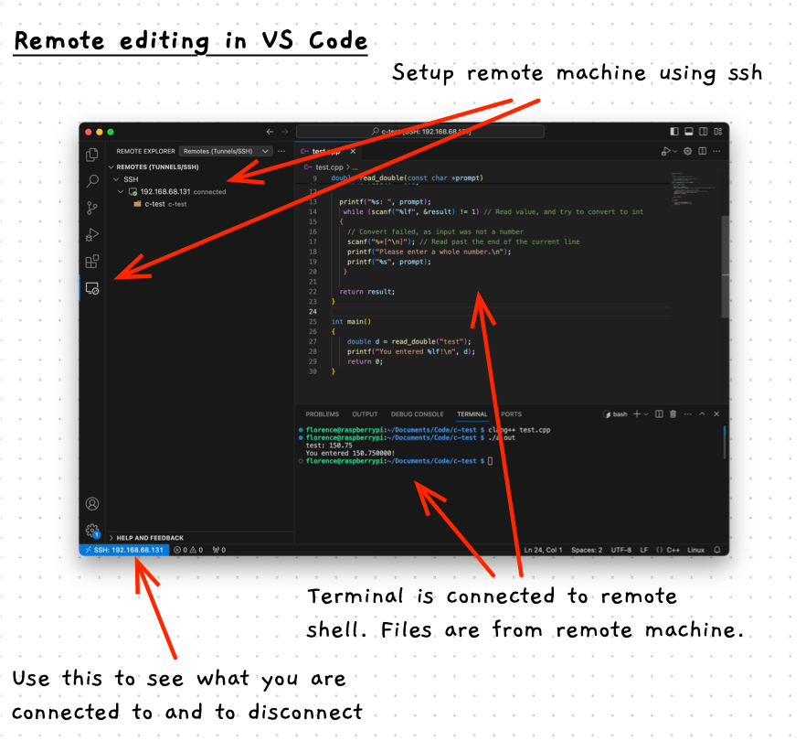

At times, you may want to copy files between your Raspberry Pi and another computer. There are several ways you can do this. The simplest is to use a USB drive. You can plug the drive in and copy files onto it, then eject it and plug it into your computer. However, it can also be very convenient to connect to your Raspberry Pi over the network. You can then copy files and interact with your Pi from your computer.

All the details you need, and more, are in the Raspberry Pi documentation on [Remote Access](https://www.raspberrypi.com/documentation/computers/remote-access.html#setting-up-an-ssh-server). However, we will go over the basics here.

## Enable SSH

The best way to connect to your Raspberry Pi is via a **secure shell** (ssh). This is the same [shell](../../1-concepts/02-shell) we introduced earlier, but accessed over the network.

The Raspberry Pi comes with an ssh server built it, but it is switched off by default. In the [Remote Access](https://www.raspberrypi.com/documentation/computers/remote-access.html) documentation, the instruction are in the [Enabling the Server](https://www.raspberrypi.com/documentation/computers/remote-access.html#enabling-the-server) section. Basically you need to:

1. Open the Raspberry Pi Configuration tool (`sudo raspi-config` from the command line for the terminal version)
2. Make sure you set your hostname and have a reasonable password on your account.
3. Go into the **interfaces** section, and turn **ssh** on.
4. Accept the changes, and close the configuration tool.


<div class="caption">Image not subject to The Programmer's Field Guide <a href="https://creativecommons.org/licenses/by-nc-nd/4.0/">CC BY-NC-ND 4.0 License</a></div>

## Access your Pi via SSH

Make sure both your computer and your Pi are connected to the same network. Before you connect you will need the IP address of the Pi. You can find this by hovering over the network icon at the top right of your Pi's desktop or by running `hostname -I` at the Terminal. You are looking for an address like `192.168.68.131`.

Now, to access your Pi from your computer, open the Terminal and use the `ssh` command to connect. This command needs you to pass it an argument that has the username and IP address of the Pi you are connecting to. For example, if your username is `florence` and my pi is at `192.168.68.131`, then you connect with this:

```sh
ssh florence@192.168.68.131
```

You should also be able to use your Pi's hostname with the `.local` address. For example, if the hostname for the Pi is `multitool` then you can also access it using:

```sh
ssh florence@multitool.local
```

Whichever way you access it, this will prompt you to accept the connection if your computer has not accessed the Pi before and then it will ask for the user's password. Type the password and press enter. 

:::tip[Password not showing? That is good!]

You won't see your password echoed to the Terminal as you type it. So you don't have to worry about others seeing your password on your screen, but you do have to remember what you have typed.

:::


<div class="caption">Image not subject to The Programmer's Field Guide <a href="https://creativecommons.org/licenses/by-nc-nd/4.0/">CC BY-NC-ND 4.0 License</a></div>

If this succeeds, your Terminal will now have access to the shell on your Pi! You can use any of your Unix commands to access things on the Pi.

To close the terminal use the `ctrl-d` signal, or type the `exit` command. This will close the secure shell, and return you to your local shell.

## Copying files with sftp

Once you have ssh working, you can sue the **secure file transfer protocol** (**sftp**) to easily transfer files between your computer and your Pi, and visa versa.

At the terminal, with a local shell, you can connect to your Pi using sftp much like you access it for ssh. For example:

```sh
sftp florence@multitool.local
```

When this connects, you can use the following commands to quickly and easily transfer files between your computer and the Pi:

- `ls` will give you a director listing from the remote machine (your Pi)
- `cd` will change the directory on the remote machine
- `get` will copy a file from the remote machine to your local machine (Pi to computer)
- `lls` will give you a directory listing of your local machine (your computer)
- `lcd` will change the current directory on your local machine
- `put` will copy a file from the local machine to the remote machine (computer to Pi)


<div class="caption">Image not subject to The Programmer's Field Guide <a href="https://creativecommons.org/licenses/by-nc-nd/4.0/">CC BY-NC-ND 4.0 License</a></div>

The above image shows connecting to a Pi using `sftp` and getting all the files from the `Pictures` folder on the remote machine.

## Accessing your Pi from VS Code

VS Code includes the ability to do [remote development using ssh](https://code.visualstudio.com/docs/remote/ssh). To do this you need to install the [Remote - SSH](https://marketplace.visualstudio.com/items?itemName=ms-vscode-remote.remote-ssh) extension. If you have ssh working, you can play around with editing your code from your computer, while the files and terminal commands are actually run on the Raspberry Pi!


<div class="caption">Image not subject to The Programmer's Field Guide <a href="https://creativecommons.org/licenses/by-nc-nd/4.0/">CC BY-NC-ND 4.0 License</a></div>

To get this working, follow the steps in the [remote development using ssh](https://code.visualstudio.com/docs/remote/ssh) guide.
