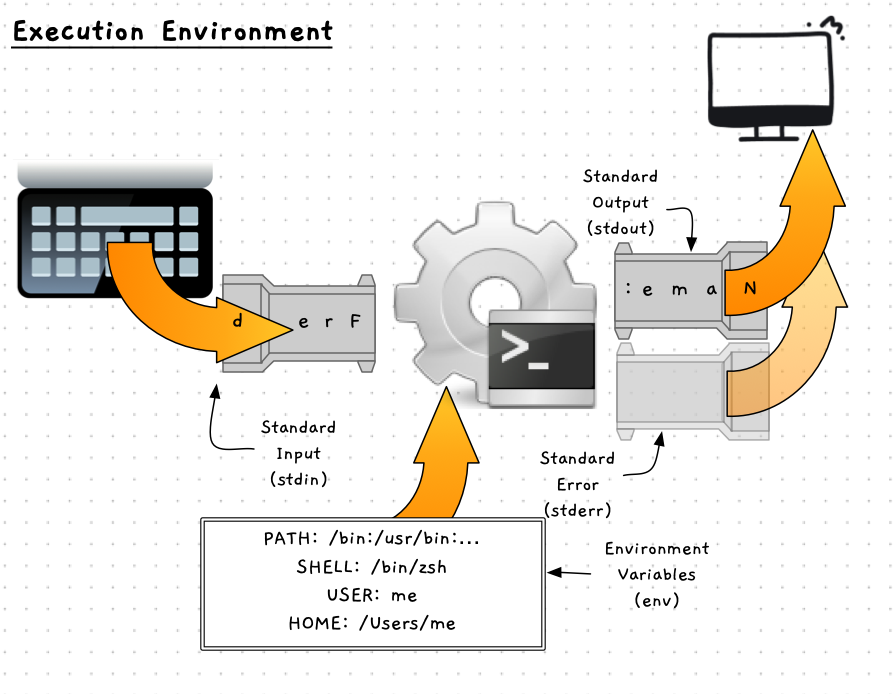

Operating systems, like all programs, need to create digital realities for us to work with. We have seen how this is applied to data, which we can store and organise in files and folders.
To understand how programs are executed within operating systems there is another concept we need to understand: **data streams**.

Data streams, often just referred to as **streams**, come from a river or water-flow metaphor. A stream is a flow of data either into or out of a program. You can picture this as the data *flowing* through a stream from a data source to a consumer. For example, data flows from the keyboard into a program which can respond to it. Similarly, data can flow out of the program and onto the terminal's display for the user to see.

:::note
Data flows through a stream in order. So, the first piece of data added to the stream is the first piece of data which comes out the other end.
:::

In Unix, streams are used as the metaphor for all data flows.

- **File streams** allow data to flow into or out of a file.
- **Network streams** allow data to flow between computers across a network.
- **Text streams** allow text to flow from things like the keyboard, and to things like the shell's output.

:::note
Having one common abstraction for all of these different sources of data is great for us. It means that once you know how to work with a stream, you can apply the same knowledge to work with other data sources.
:::

## Input, Output, and Errors

When you run a program, the operating system gives it **three** different data **streams** - one for input to be read, and two for outputs.

- **Standard input (stdin)** is a text input stream that your program can read.
- **Standard output (stdout)** is a text output stream that your program can write to.
- **Standard error (stderr)** is a second text output steam that your program can write error messages to.



:::tip
When picturing the stream, remember the first thing put on the stream will be the first thing read at the other end.
:::

### Standard Input (stdin)

The **standard input** stream provides your program with text input that it can read. By default, the shell will stream data from the keyboard to your program while it is running.

**Picture of data from the keyboard going into a program**

#### Standard Output (stdout)

A program can write text output to its **standard output** stream. By default, the shell will stream this to the terminal for the user to see.

**Picture of data from program going to the terminal**

### Standard Error (stderr)

A program can write text output to its **standard error** stream. By default, the shell will stream this to the terminal for the user to see.

:::note
When you run a program normally there is no difference between standard output and standard error. 
However, there are ways of redirecting these streams, so it is useful to have them separated.
For example, some programs redirect standard error to a log file.
:::

## Redirection

One of the great features of streams is the ability the operating system provides to **redirect** them. 
Using this feature, you can change where the data for standard input comes from, and where standard output and standard error go.

When running a program from the terminal, you can use different shell commands to redirect a program's streams.
The table below shows some of these commands.

| **Action**                     | **Command**  | **Description**                                    |
|--------------------------------|--------------|----------------------------------------------------|
| Redirect stdout to new file    | `>`          | Send output to a new file                          |
| Append stdout to existing file | `>>`         | Send output to the end of an existing file         |
| Redirect stderr to new file    | `2>`         | Send output to a new file                          |
| Append stderr to existing file | `2>>`        | Send output to the end of an existing file         |
| Use a file to source stdin     | `<`          | Read the contents of a file as the program's input |

:::note
Each stream has a unique number -- 0 for stdin, 1 for stdout, and 2 for stderr. This is what the `2` represents in `2>>`.
You can redirect one stream to another using these identifiers. For example, `2>&1` will redirect stderr to stdout.
The `&` indicates that `1` should be interpreted as a stream, not a file name.
:::

To test out these commands, we need another cool utility called [wc](https://man.cx/Wc).

| **Action**  | **Command** | **Description**                                              |
|-------------|-------------|--------------------------------------------------------------|
| Count words |`wc`         | Outputs the number of words, lines, or characters from stdin |

Use the following shell instructions to try out redirection.

```sh
echo "Here is a new file" > lines.txt
ls >> lines.txt
cat lines.txt
# the file will contain the message "Here is a new file"
# and a list of the files in the current directory

ls . NO_FILE > lines.txt 2>&1
cat lines.txt
# the file will contain an error indicating that NO_FILE does not exist
# and a list of files in the current directory

wc -l < lines.txt
# outputs the number of lines in lines.txt
```

## Pipes

Pipes offer another option for redirecting streams. In this case you can connect the output from one program to the input of another. This is a super powerful feature, allowing you to combine together multiple programs.

To explore this let's look at one more tool: [grep](https://man.cx/Grep). Grep is an incredibly useful tool when combined with pipes. With grep you can filter standard input to only return lines that match patterns you define. For now, the patterns can just be exact text matches, but grep provides much more powerful pattern-matching capabilities which you can explore later.

| **Action**       | **Command** | **Description**                                                 |
|------------------|-------------|-----------------------------------------------------------------|
| Filter stdin     | `grep`      | Filter stdin and output only lines that match the given pattern |
| Connect programs | `\|`         | Send stdout from program to stdin of another                    |

Let's try these out.

```sh
cat /etc/shells | grep sh | wc -l 

# outputs the number of lines in /etc/shells that contain the text "sh"
```

This command is three commands in one.
First, `cat` reads the file /etc/shells.
Normally `cat` would output the file contents to the terminal, but in this case the output is piped to be the input to `grep`.
`grep` filters this input to output only lines with "sh" in them, and that output is piped to `wc`.
`wc` then counts the number of lines it reads in its input.

Try the whole command, then try running the parts (e.g., just `cat /etc/shells`, then just `cat /etc/shells | grep sh`) to see how it is working.
