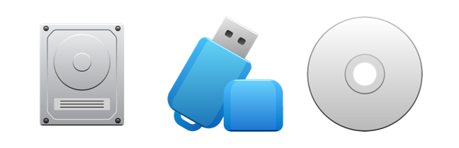

Computers come in all shapes and sizes including desktop, laptops, phones and tablets. Less obvious computers include cars, robots, and electronic appliances. You will understand the basic components of a computer and the role that programs perform. 

A computer is made up of several components: 

## CPU (Central Processing Unit)

The CPU performs  simple instructions such as mathematical operations and comparing values. It can perform millions of these very small instructions each second.

## Memory

Instructions and data are stored in _memory_ as binary values (combinations of 1s and 0s). Instruction data provides lists of actions for the CPU to perform. All of the data associated with these instructions is located in memory. One challenge with memory is that it is not persistent, so when the computer is turned off these values are lost.

## Storage device

To store data more permanently you need to use a  _storage device_  such as a solid-state drive or  hard disk. Data on storage devices are organised into files and folders (directories). You can save data from memory into a file and then read it back into memory at a later stage.

## Input devices

_Input devices_ are used to convert user actions into digital (binary) data within the computer. These include  keyboards, mice, touch screens, track pads, and others.  User interactions with these devices result in data that can be used by the instructions running within the CPU. 

## Output devices

_Output devices_ take digital information and turn it into something the user can perceive. This can include displays, speakers, and haptic devices. The CPU sends data to these devices to output information to the users of the computer. 

## Where does this intelligence come from?

CPUs perform actions, memory and storage devices store data, input devices collect data from users, and output devices provide information to users. There is nothing inherently intelligent within any of these components, yet we think computers do intelligent things all the time.

So, where does the intelligence come from? The answer is **software**, the programs that drive computing machines. Each program is a **sequence** of instructions for the CPU to perform. A large part of learning to program involves learning to give instructions to an unintelligent computer. This means your instructions need to be detailed and precise. 

To provide instructions for the computer you need to be able to communicate in its language. The computer's CPUs execute instructions that are provided in **machine code**, which consists of instructions made up from unique binary codes. These codes relate to very simple actions, so even a small program is likely to need thousands or millions of these instructions.

To avoid the nightmare of having to code programs in the instructions the computer needs, software developers have created tools to write programs in more _human friendly_ ways. These are the **compilers** and **interpreters** associated with each programming language, and these are the tools we will use to build programs.

In order to use these tools we need to learn the grammar (rules) that describe how programs written in these languages must be structured. These rules define the **syntax** of the language, which describes the code structure that can be understood by the compiler or interpreter.

At first the rules of these languages may seem very restrictive, as they must be followed exactly. The key is to remember that **the computer is unintelligent**, so it is just following the rules exactly as they are written. It cannot do anything else!

Learning to program can be challenging. The computer is unintelligence, which means **you** have to provide detailed instructions to achieve any task. These instructions will be followed precisely, so you need to get them right. As a result, it is common to make mistakes. This is normal! The key is to not stress about this, and to learn to work with the messages from the software tools to help you identify and correct the problems.

In the next step, you will be guided through what you need to do to create your own programs. 

## Your Task

Reflect on the software you interacted with today. Focus on one of its features. Think about the instructions the developer needed to have programmed to achieve that feature.

Let us know what you think in the comments.  