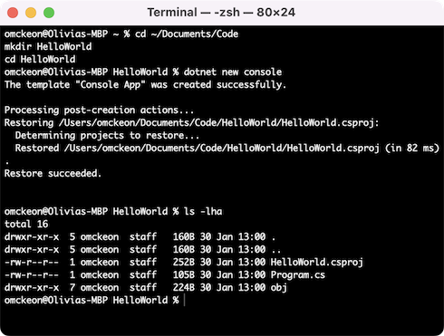
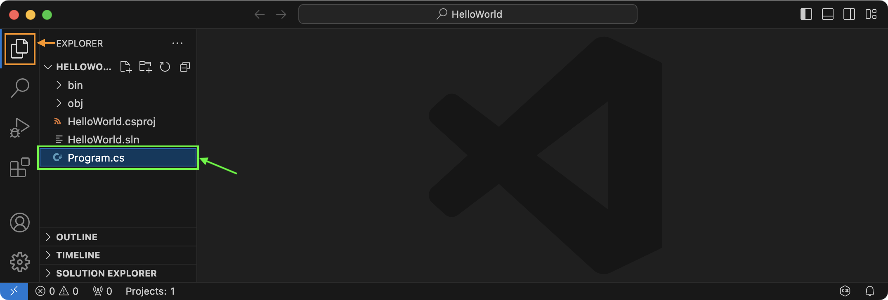
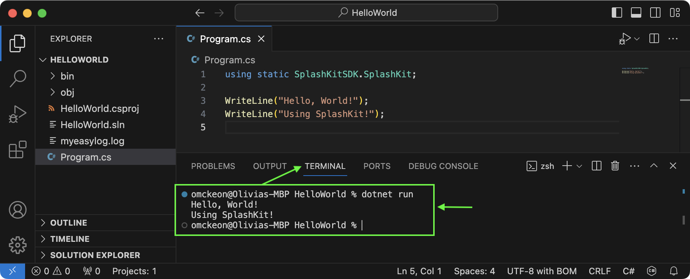

import { Tabs, TabItem } from "@astrojs/starlight/components";

Here are the steps needed to build your own program:

1. Create a new folder for the project, and move into this in the terminal
2. Use `dotnet new console` to create the initial project files
3. Add the SplashKit package we will be using `dotnet add package splashkit`
4. Write the code in **Program.cs**
5. Build and run using `dotnet run`

Let's go through these steps to build a simple terminal-based program to output the text: "Hello, World".

:::note[Why "Hello World"?]
Whenever you start learning a new programming language, you will likely write code to output **"Hello, World"** for your first program - just like we are going to do here!

You can read more about the origin of "Hello, World" [here](https://en.wikipedia.org/wiki/%22Hello,_World!%22_program) if you're curious, but the short version is that it is a simple way of checking that your computer is set up correctly to code in a particular language.
:::

## Make sure you are set up

We need somewhere to put our project's code. For this, we will create a folder in our **Documents/Code** folder. You should have created this folder as part of the tour in the [Computer Use](/book/part-0-getting-started/2-computer-use/1-tour/3-1-terminal) chapter, but we will repeat it here just in case you missed that step.

You can choose anywhere to store your code, if you want to save your code elsewhere then make sure to adjust paths as needed. Open a terminal, and use the following commands to create the *Documents/Code* folder:

<Tabs syncKey="terminal-type">
<TabItem label="macOS">

```zsh
# Create a Documents/Code folder
mkdir ~/Documents/Code

# Move to the Documents/Code folder
cd ~/Documents/Code
```

</TabItem>
<TabItem label="Windows (WSL) & Linux">

```zsh
# Create a Documents/Code folder
# WSL users might also need to create the Documents folder, using:
#   mkdir ~/Documents
mkdir ~/Documents/Code

# Move to the Documents/Code folder
cd ~/Documents/Code
```

</TabItem>
<TabItem label="Windows (MSYS2)">

```zsh
# Create a Documents/Code folder
mkdir /c/Users/`whoami`/Documents/Code

# Move to the Documents/Code folder
cd /c/Users/`whoami`/Documents/Code
```

</TabItem>
</Tabs>

:::tip
You can also type `cd` ("cd", then space), then drag a folder from File Explorer or Finder into your terminal window. This will add the path to the folder/file that you drag in.
:::

## Create the project folder

Now you can create a folder for your project. Make sure you are in your *Documents/Code* folder, and run the following commands:

```zsh
# Make a folder for the project
mkdir HelloWorld

# Move into that folder
cd HelloWorld
```

:::caution[Project Folders]

Remember to avoid adding *Spaces* in your folder names!

:::

## Create *dotnet* project files

We will be using C# initially, for these programs we need to setup project files that the language uses to know how to build your program.

To create the initial project files for this C# program, copy and paste the following commands into your Terminal window:

```bash
dotnet new console
dotnet add package splashkit
```

This creates the project, and add the splashkit library we will be using.

If you run `ls -lha` in the terminal after the commands above, it should look similar to this:


<div class="caption">Image not subject to The Programmer's Field Guide <a href="https://creativecommons.org/licenses/by-nc-nd/4.0/">CC BY-NC-ND 4.0 License</a></div>

Now you are ready to start coding your first program!

## Write your code

From the terminal window, we can open the current folder in Visual Studio Code using the following command:

```bash
code .
```

:::note
If the `code .` command does not work on your computer, you can open Visual Studio Code, and then click *File > Open Folder*, and then navigate to the HelloWorld folder you created in the steps above. Make sure to open the folder itself.
:::

You will notice that shortly after opening the project, a **bin** folder and a **.sln** file will be added automatically:


<div class="caption">Image not subject to The Programmer's Field Guide <a href="https://creativecommons.org/licenses/by-nc-nd/4.0/">CC BY-NC-ND 4.0 License</a></div>

Open `Program.cs` file (shown above in Green box) by double-clicking the file in the Explorer tab (shown above in Orange box):

Copy the following code into your Program.cs file (replacing the existing code):

```cs
using static SplashKitSDK.SplashKit;

WriteLine("Hello, World!");
```

After the last line, you can add another `WriteLine("...")` bit of code with your own custom message!

:::caution

We will be using SplashKit for terminal input and output initially. Avoid using the `System.Console` version for now, but we will come back to this once we have moved beyond the basics.

:::

## Build and run your code

Let's turn your code into a program! Like magic!

Use the following command to build and run the program:

```bash
dotnet run
```

:::tip[Use the Terminal inside VS Code!]
To avoid having to switch back and forth between your apps, you can open a Terminal shell inside Visual Studio Code by clicking "Terminal" (one of the tabs across the top of the window/screen), and then click on "New Terminal".
:::

Here is what the result will look like:


<div class="caption">Image not subject to The Programmer's Field Guide <a href="https://creativecommons.org/licenses/by-nc-nd/4.0/">CC BY-NC-ND 4.0 License</a></div>

Next, we are going to create a **Graphical** *Hello World* program!
