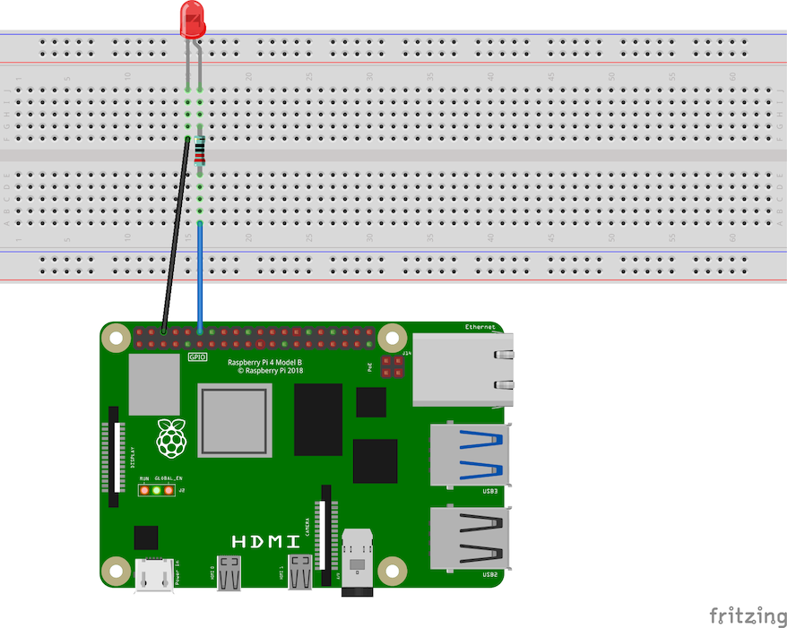

import { Accordion, AccordionItem } from 'accessible-astro-components'
import { Steps } from "@astrojs/starlight/components";

Welcome to our fun, step-by-step guide on how to blink a physical LED using SplashKit on your Raspberry Pi! In this tutorial, you'll learn how to set up your hardware, write simple code to turn your LED on and off multiple times, as well as how to run your project. Get ready to see your LED come to life!

## Hardware Setup

### Components

To build the simple LED circuit shown below (in real life), here's what you need:

- **LED:** Can be any color.  
  *Remember: the longer leg is the anode (+), the shorter is the cathode (-).*
- **220 Ω Resistor:** This protects the LED by limiting the current.
- **Breadboard and Jumper Wires:** For making temporary connections.
- **Raspberry Pi:** With a GPIO pin (we'll use GPIO Pin 11) and a Ground (GND) pin.

:::note[Just getting started with circuits?]

These sections include links with more information about the circuit components:

<details>
<summary>LEDs and Resistors:</summary>

- [LEDs (Introduction to Raspberry Pi Pico guide)](https://projects.raspberrypi.org/en/projects/introduction-to-the-pico/7)
- [Resistors (Introduction to Raspberry Pi Pico guide)](https://projects.raspberrypi.org/en/projects/introduction-to-the-pico/6)
- [Resistors for LED Circuits](https://eepower.com/resistor-guide/resistor-applications/resistor-for-led/)

</details>
<details>
<summary>Breadboards and Jumper Wires:</summary>

- [How to Use a Breadboard for Electronics and Circuits](https://www.sciencebuddies.org/science-fair-projects/references/how-to-use-a-breadboard)
  - [What is inside a breadboard?](https://www.sciencebuddies.org/science-fair-projects/references/how-to-use-a-breadboard#inside-breadboard)
  - [How are the holes connected?](https://www.sciencebuddies.org/science-fair-projects/references/how-to-use-a-breadboard#holes)
  - [What is a breadboard diagram?](https://www.sciencebuddies.org/science-fair-projects/references/how-to-use-a-breadboard#breadboard-diagram)
- [What are jumper wires and what kind should I use?](https://www.sciencebuddies.org/science-fair-projects/references/how-to-use-a-breadboard#jumper-wires)

</details>
:::

### Wiring Instructions


<div class="caption">Image created with <a href="https://fritzing.org/">Fritzing</a></div>

<Steps>

1. **Put the LED and resistor onto the breadboard:**

    Place the resistor across the center channel of the breadboard, or across any two separate rows.

    Then place the LED across two rows (as shown in the breadboard diagram above), with the cathode (short leg) on the same row as one end of the resistor.

2. **Attach the ground wire:**

    Attach a jumper wire from the other end of the resistor to a GND pin.  
    *(This is the black wire connected to pin 6 in the diagram above.)*

3. **Connect the LED to the GPIO Pin:**

    Attach a jumper wire from the LED’s anode (long leg) to GPIO Pin 11.
    *(This is the blue wire connected to pin 11 in the diagram above.)*

</Steps>

:::caution[Safety Note:]
Always double-check your connections and ground yourself before handling the circuit to avoid static discharge or accidental damage.
:::

## Software Setup

To set up the software side of this project, you can follow the steps below:

<Steps>

1. ### Create a new C# project

    Open your terminal and create a new C# console project:

    ```shell
    mkdir LedBlink
    cd LedBlink
    dotnet new console
    dotnet add package SplashKit
    code .
    ```

2. ### Write the code

    Copy the code below, then replace the contents of your `Program.cs` file with this code:

    ```csharp
    using SplashKitSDK;
    using static SplashKitSDK.SplashKit;

    // Initialise the GPIO system
    RaspiInit();

    // Define the LED pin (using physical Pin 11)
    GpioPin ledPin = GpioPin.Pin11;

    // Set the LED pin to output mode
    RaspiSetMode(ledPin, GpioPinMode.GpioOutput);

    // Blink 1: Turn LED ON, wait, then OFF
    RaspiWrite(ledPin, GpioPinValue.GpioHigh);
    Delay(500);  // LED ON for 500 ms
    RaspiWrite(ledPin, GpioPinValue.GpioLow);
    Delay(500);  // LED OFF for 500 ms

    // Blink 2: Turn LED ON, wait, then OFF
    RaspiWrite(ledPin, GpioPinValue.GpioHigh);
    Delay(500);
    RaspiWrite(ledPin, GpioPinValue.GpioLow);
    Delay(500);

    // Blink 3: Turn LED ON, wait, then OFF
    RaspiWrite(ledPin, GpioPinValue.GpioHigh);
    Delay(500);
    RaspiWrite(ledPin, GpioPinValue.GpioLow);
    Delay(500);

    // Clean up the GPIO system
    RaspiCleanup();
    ```

    :::note
    You will learn more about SplashKit's Raspberry Pi code in Part 1, but for now you can just copy/paste this code without needing to know the details just yet.
    :::

3. ### Build and run the project

    Use the following command to build and run the program:

    ```shell
    dotnet run
    ```

</Steps>

## Expected Outcome

When you run the program, your physical LED connected to GPIO Pin 11 should blink on and off three times. Each "on" state lasts for 500 milliseconds followed by an "off" state for 500 milliseconds. Once the sequence is complete, the program cleans up the GPIO settings and exits.


Enjoy watching your LED blink and have fun tinkering with your Raspberry Pi projects!
