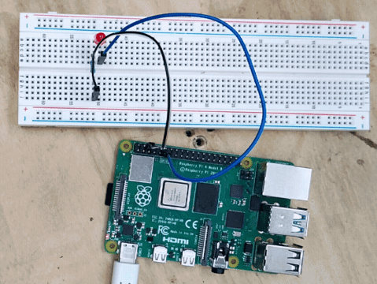

import { Accordion, AccordionItem, Steps } from 'accessible-astro-components'

## Overview

Welcome to our fun, step-by-step guide on how to blink a physical LED using SplashKit on your Raspberry Pi! In this tutorial, you'll learn how to set up your hardware, write simple code (without loops) to turn your LED on and off with delays, and run your project. Get ready to see your LED come to life!

## Hardware Setup

Imagine a simple LED circuit that you'd build in real life. Here's what you need:

- **LED:** (any color; remember: the longer leg is the anode, the shorter is the cathode)
- **220 Ω Resistor:** This protects the LED by limiting the current.
- **Breadboard and Jumper Wires:** For making temporary connections.
- **Raspberry Pi:** With a GPIO pin (we'll use GPIO Pin 11) and a Ground (GND) pin.

**Wiring Instructions:**


1. **Resistor Connection:** Attach one end of the resistor to GPIO Pin 11.
2. **LED Connection:** Connect the LED’s anode (long leg) to the other end of the resistor.
3. **Ground Connection:** Connect the LED’s cathode (short leg) to a GND pin on the Raspberry Pi.

:::caution
**Safety Note:** Always double-check your connections and ground yourself before handling the circuit to avoid static discharge or accidental damage!
:::


## 1. Initialization

First, we'll initialize the GPIO system on your Raspberry Pi using SplashKit and set up our chosen pin as an output.

```csharp
using SplashKitSDK;
using static SplashKitSDK.SplashKit;

// Initialize the GPIO system
RaspiInit();

// Define the LED pin (using physical Pin 11)
Pins ledPin = Pins.Pin11;

// Set the LED pin to output mode (GPIO_OUTPUT mode is represented by 1)
RaspiSetMode(ledPin, PinModes.GpioOutput);
```

## 2. Blinking the LED

Now, we’ll blink the LED by turning it on and off with delays. We’re keeping it simple—no loops here! Each command is written in sequence:

```csharp
// Turn the LED ON
RaspiWrite(ledPin, PinValues.GpioHigh);
Delay(500);  // Wait for 500 milliseconds

// Turn the LED OFF
RaspiWrite(ledPin, PinValues.GpioLow);
Delay(500);  // Wait for 500 milliseconds

// Blink the LED again (ON)
RaspiWrite(ledPin, PinValues.GpioHigh);
Delay(500);  // Wait for 500 milliseconds

// Turn the LED OFF again
RaspiWrite(ledPin, PinValues.GpioLow);
Delay(500);  // Wait for 500 milliseconds

// One more blink (ON)
RaspiWrite(ledPin, PinValues.GpioHigh);
Delay(500);  // Wait for 500 milliseconds

// Finally, turn the LED OFF
RaspiWrite(ledPin, PinValues.GpioLow);
Delay(500);  // Wait for 500 milliseconds
```

## Full Code Example

Below is the complete code, combining the initialization and blinking sequence. All commands are executed one after the other—no loops!

<Accordion>
  <AccordionItem header="Full LED Blink Code (C#)">
  
  ```csharp
  using SplashKitSDK;
  
  // Initialize the GPIO system
  RaspiInit();
  
  // Define the LED pin (using physical Pin 11)
  Pins ledPin = Pins.Pin11;
  
  // Set the LED pin to output mode
  RaspiSetMode(ledPin, PinModes.GpioOutput);
  
  // Blink 1: Turn LED ON, wait, then OFF
  RaspiWrite(ledPin, PinValues.GpioHigh);
  Delay(500);  // LED ON for 500 ms
  RaspiWrite(ledPin, PinValues.GpioLow);
  Delay(500);  // LED OFF for 500 ms
  
  // Blink 2: Turn LED ON, wait, then OFF
  RaspiWrite(ledPin, PinValues.GpioHigh);
  Delay(500);
  RaspiWrite(ledPin, PinValues.GpioLow);
  Delay(500);
  
  // Blink 3: Turn LED ON, wait, then OFF
  RaspiWrite(ledPin, PinValues.GpioHigh);
  Delay(500);
  RaspiWrite(ledPin, PinValues.GpioLow);
  Delay(500);
  
  // Clean up the GPIO system
  RaspiCleanup();
  ```
  
  </AccordionItem>
</Accordion>

## Build and Run

1. **Set Up Your Project:**
   Open your terminal and create a new C## console project:
   
   ```bash
   mkdir LedBlink  
   cd LedBlink  
   dotnet new console  
   dotnet add package SplashKit  
   code .
   ```
   
2. **Paste the Code:**
   Replace the contents of your `Program.cs` (or equivalent) with the full code example above.

3. **Build the Project:**
   
   ```bash
   dotnet build
   ```

4. **Run the Program:**
   
   ```bash
   dotnet run
   ```

## Expected Outcome

When you run the program, your physical LED connected to GPIO Pin 11 should blink on and off three times. Each "on" state lasts for 500 milliseconds followed by an "off" state for 500 milliseconds. Once the sequence is complete, the program cleans up the GPIO settings and exits.

Enjoy watching your LED blink and have fun tinkering with your Raspberry Pi projects!