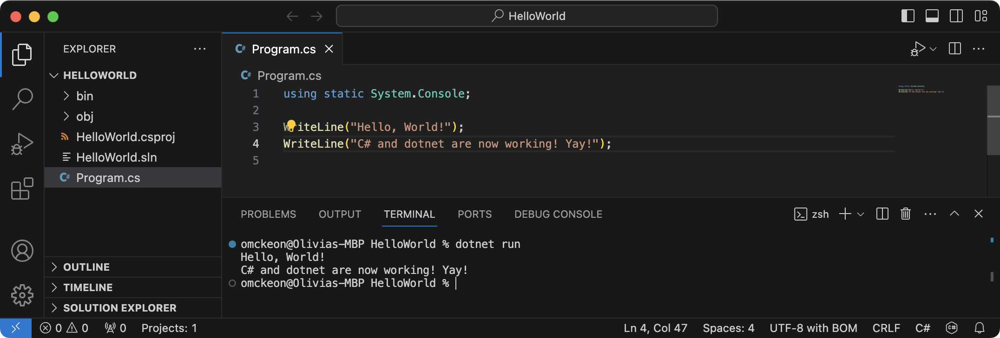

In this guide, we will go through the steps of building a basic terminal-based C# program to output the text: "Hello, World".

:::note[Why "Hello World"?]
Whenever you start learning a new programming language, you will likely write code to output **"Hello, World"** for your first program - just like we are going to do here!

You can read more about the origin of "Hello, World" [here](https://en.wikipedia.org/wiki/%22Hello,_World!%22_program) if you're curious, but the short version is that it is a simple way of checking that your computer is set up correctly to code in a particular language.
:::

## Create your Project

Firstly, we need to create a new C# project folder and the initial project files within this folder:

### 1. Create Project Folder

As mentioned earlier, in the Concepts page: [Create a Project](../../1-concepts/01-create-project), we will be using the **~/Documents/Code** folder as the base. If you are saving your code elsewhere then make sure to adjust paths as needed.

To set up your HelloWorld folder from the terminal, copy and paste the following command into your Terminal window:

```zsh
cd ~/Documents/Code
mkdir HelloWorld
cd HelloWorld
```

:::caution[Project Folders]

- For all new programs, you will need to create a new project folder.  
  (1 folder per project)
- Make sure to name your project folder in a way that allows you to easily identify what it is doing.
- Avoid using *Spaces* in your folder names if possible, as this can sometimes cause issues later on.

:::

### 2. Create *dotnet* project files

To create the initial project files for this C# program, copy and paste the following commands into your Terminal window:

```bash
dotnet new console
```

If you run `ls -lha` in the terminal after the commands above, it should look similar to this:


Now you are ready to start coding your first program!

## Write your Code

From the terminal window, we can open the current folder in Visual Studio Code using the following command:

```bash
code .
```

:::note
If the `code .` command does not work on your computer, you can open Visual Studio Code, and then click *File > Open Folder*, and then navigate to the HelloWorld folder you created in the steps above.
:::

You will notice that shortly after opening the project, a **bin** folder and a **.sln** file will be added automatically:


Open `Program.cs` file (shown above in Green box) by double-clicking the file in the Explorer tab (shown above in Orange box):

Copy the following code into your Program.cs file (replacing the existing code):

```cs
using static System.Console;

WriteLine("Hello, World!");
```

After the last line, you can add another `WriteLine("...")` bit of code with your own custom message!

## Build and Run your Code

Let's turn your code into a program! Like magic!

To run the program (and build it at the same time), use the following command in your terminal:

```bash
dotnet run
```

:::tip[Use the Terminal inside VS Code!]
To avoid having to switch back and forth between your apps, you can open a Terminal shell inside Visual Studio Code by clicking "Terminal" (one of the tabs across the top of the window/screen), and then click on "New Terminal".
:::

Here is what the result will look like:



Next, we are going to create a **Graphical** *Hello World* program!
