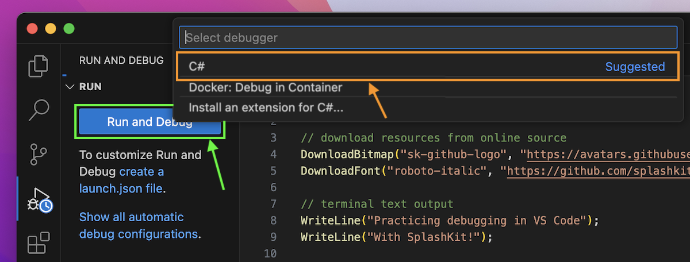
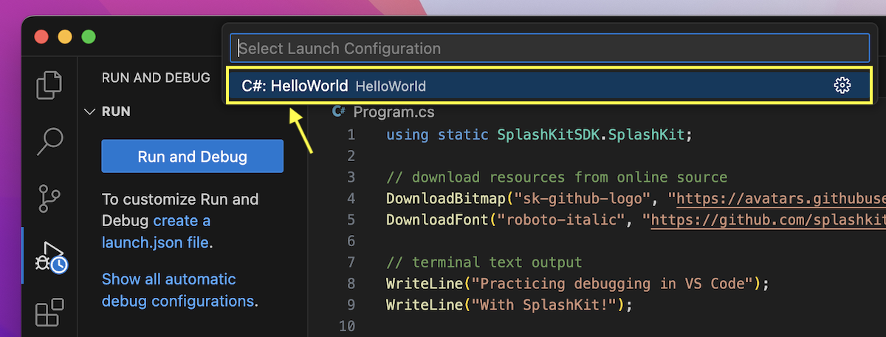
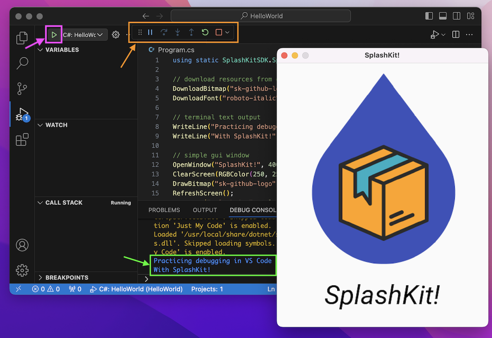

As you continue learning new coding concepts, you will inevitably come across errors (bugs) in your code. Don't be discouraged though! Even the most skilled programmers run into bugs in their programs. You will get better and faster at debugging the more you practice.

## Setting up your C# project

In this guide, we will be using the **HelloWorld** project you created in the [previous page](../1-hello-world-gui), but with some simpler code, so that we can focus on the VS Code debugger more easily.

Copy the following example code and paste it into your Program.cs file (replacing existing code) and then run your program using `dotnet run`:

```cs
using static SplashKitSDK.SplashKit;

// download resources from online source
DownloadBitmap("sk-github-logo", "https://avatars.githubusercontent.com/u/16730454?s=400&u=1c5ea7f86f40253bd5883ab2380257f614b44187&v=4", 443);
DownloadFont("roboto-italic", "https://github.com/splashkit/the-programmers-field-guide/raw/main/public/resources/code-examples/part-0/Roboto-Italic.ttf", 443);

// terminal text output
WriteLine("Practicing debugging in VS Code");
WriteLine("With SplashKit!");

// simple gui window
OpenWindow("SplashKit!", 400, 500);
ClearScreen(RGBColor(250, 250, 250));
DrawBitmap("sk-github-logo", 0, 0);
RefreshScreen();
DrawText("SplashKit!", ColorBlack(), "roboto-italic", 50, 90, 410);
RefreshScreen();
Delay(5000);
```

This code will create a window that looks like this:

It will also write the text below in your terminal:

```text
Practicing debugging in VS Code
With SplashKit!
```

## Debugging in VS Code

In this section you will use the VS Code debugger, that you learnt about in the Concepts [Debugging](../../1-concepts/04-debug) page, to have a *look* at what is happening in the code above.

:::note
You don't have to understand what is happening in the code at this point, or how it works. The steps below are just an example to help you practice using the VS Code debugger.
:::

### Run and Debug

Start with running the program using the VS Code debugger without breakpoints first to get it started. You can follow the steps below:

Click on the Run and Debug tab in the left sidebar (shown in the green box in the image below), then select the C# debugger (shown in the orange box):



Next, select the **C#: HelloWorld** launch configuration(shown in the yellow box in the image below):



This will run the program in mostly the same way as it would by using `dotnet run` in the terminal.

Here is an example of what this would look like:



In the image above, you can see:

- The debugging **control panel** (shown in the orange box), which we will use in the next section with breakpoints.
- The **play button** (shown in the pink box) is now visible, and can be used the next time you want to **Debug and Run** your program.
- The **terminal output** (shown in the green box) from lines 8 and 9 of the code, which is now outputted to the *Debug Console* panel rather than the *Terminal* panel.

### Using Breakpoints

**TODO - Olivia:** Update rough draft steps below and add images

Add a breakpoint on line 8 of your code (the first WriteLine) and another breakpoint on line 12 (OpenWindow line)

Run the debugger using the play button.

Take note of the Debug Console text.

Click on the step-over button in the control panel (second button)

(You will see that the first WriteLine text is now showing)

Click on the continue button in the control panel (first button)

(You will see that the both WriteLines are now showing)

Click on the step-over button in the control panel

(Now the Window is showing.)
(Note: You might want to move the SplashKit window an area next to your VS Code window to see the updates more easily)

Explore using the step-over button with the next lines.

Try using the other buttons too, except the step-into and step-out of buttons, which you won't be able to use properly till part 2.
