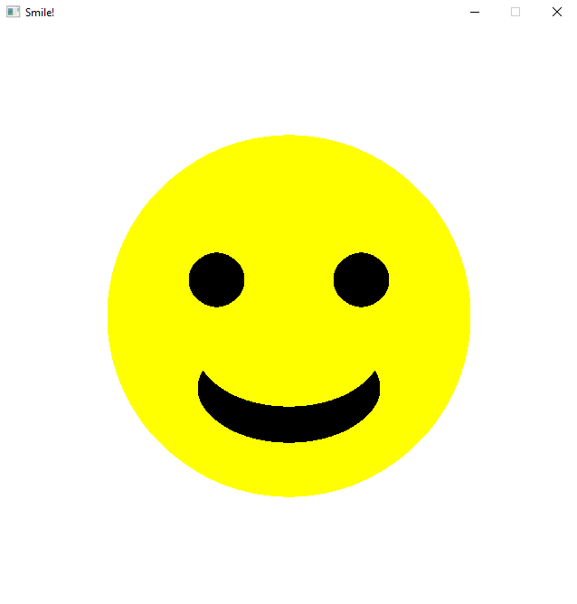

Write/modify a Splashkit application that draws a simple picture

Follow the [Graphical Hello world](/book/part-0-getting-started/3-building-programs/1-tour/2-hello-world-gui) guide
and play around with adding or removing the shapes, to see if you can make something truly original.

:::tip
Don't worry if it seems like magic for now, with time we will decipher what all of those "magic numbers" are...
Just have a play, and enjoy being able to create shapes
:::