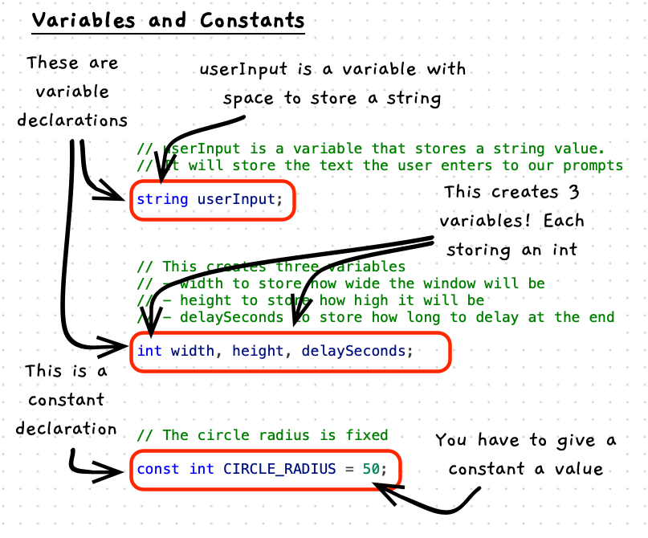

We need to be able to work with data in our programs. You can create **variables** as placeholders for values that will change as the program runs, and you can create **constants** to name values that will be fixed throughout the code.

When you create a variable or constant, you have to indicate the **type** of data that it will store as well as give it a unique name within the code where it is declared.

To get started, there are three built-in types you can use:

- `string` - when you want to store text data like "Hello" or "7".
- `int` - to store whole numbers like 7 or -25.
- `double` - to store real numbers like 3.1415, or -0.0017.



:::note[A variable...]

- is somewhere you can store a value.
- has a name that is used to access it.
- has a value of a certain type.
- can be read - giving you its current value.
- can be changed - giving it a new value.
- should be named using `camelCase`.

:::

:::tip

You will create variables for any value you want to change as the program runs. Data will be a big part of every program, and your variables are where this data will exist.

:::

:::note[A constant...]

- is like a variable, except you cannot change its value.
- should be named using `UPPER_CASE`.

:::

:::tip

Any fixed value should be coded as a constant with a meaningful name. This helps make the code easier to understand, and ensures these values are consistent throughout the code.

:::

## Example

This code contains a number of variables: `userInput`, `width`, `height`, and `delaySeconds`. The code also contains a single constant `CIRCLE_RADIUS`.

```cs
using static SplashKitSDK.SplashKit;
using static System.Convert;

// userInput is a variable that stores a string value.
// It will store the text the user enters to our prompts
string userInput;

// This creates three variables
// - width to store how wide the window will be
// - height to store how high it will be
// - delaySeconds to store how long to delay at the end
int width, height, delaySeconds;

// The circle radius is fixed - so we have a constant for this.
const int CIRCLE_RADIUS = 50;

// Prompt the user read text into userInput
Write("How wide do you want the window? Enter width: ");
userInput = ReadLine();

// Convert user input to a number
width = ToInt32(userInput);

// Repeat for the height
Write("How high do you want the window? Enter height: ");
userInput = ReadLine();
height = ToInt32(userInput);

// And for delay seconds
Write("How many seconds do you want it to show for? Enter seconds: ");
userInput = ReadLine();
delaySeconds = ToInt32(userInput);

// Open a window and draw a circle
// Use the width and height for the window size
OpenWindow("Test Window", width, height);

// Draw a circle in the center of the screen, using a random color
// and the set circle radius
ClearScreen(ColorWhite());
FillCircle(RandomColor(), width / 2, height / 2, CIRCLE_RADIUS);
RefreshScreen();

// Delay for the number of seconds - we have to multiply delaySeconds
// by 1000 to get the milliseconds
Delay(delaySeconds * 1000);

CloseAllWindows();
```

## Activities

How would you declare each of these?

1. A variable to store the user's name.
2. A constant for PI with the value 3.1415.
3. An integer variable for a cost per unit.
4. A variable to store a phone number.
5. A constant to store the maximum number of lines, with the value 100.

<details>
  <summary role="button">Answers</summary>
  <ul>
    <li><strong>1: </strong><code>string name;</code></li>
    <li><strong>2: </strong><code>const double PI = 3.1415;</code></li>
    <li><strong>3: </strong><code>int costPerUnit;</code></li>
    <li><strong>4: </strong><code>string phoneNumber;</code> While this is a "number" it is actually best handed as text. Consider area code etc. Do you ever need to multiply a phone number?</li>
    <li><strong>5: </strong><code>const int MAX_LINES = 100;</code></li>
  </ul>
</details>
