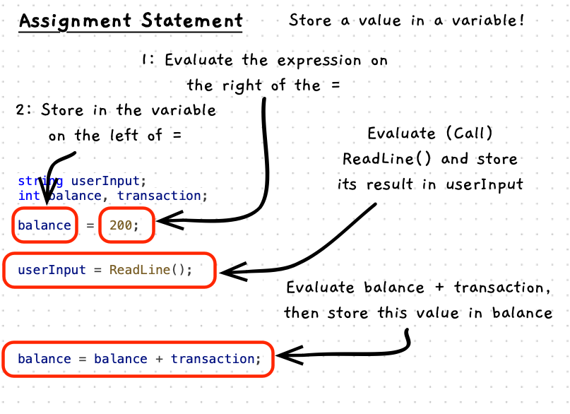

Once you have a variable, you can use it to store a value and then change that value over time. Use an **assignment statement** to store a value in the variable. The variable will retain that value until you use another assignment statement to change it.

The basic form of the assignment statement has the name of the variable to change, an `=` and then the value to store. There are also several shorthand methods for changing the value:

- `a = b;` will store the value `b` in the variable `a`.
- `a += b;` will store the value `a + b` in the variable `a`. With similar options for `-=`, `*=`, and `/=`.
- `a++;` will store the value `a + 1` in the variable `a`. Can also be written as `++a;`.



:::note[An assignment statement...]

- stores a value in a variable.
- first calculates the value on the right of the `=`, then stores the result in the variable on the left-hand side of the `=`.

:::

:::tip

Use assignment statements to update the values in your variables as your program runs. Remember you are defining a set of instructions that run in order, so you must store the value before you use it.

:::

## Example

This code includes some assignment statements that store values in the `name`, `userInput`, `balance`, and `transaction` variables.

```cs
using static SplashKitSDK.SplashKit;
using static System.Convert;

string name, userInput;
int balance;
int transaction;

Write("Please enter your name: ");
name = ReadLine();

Write("Enter initial balance: ");
userInput = ReadLine();
balance = ToInt32(userInput);

Write("Enter transaction amount: ");
userInput = ReadLine();
transaction = ToInt32(userInput);

balance += transaction;

WriteLine($"{name}, the new balance is now: {balance}");
```

## Activities

What will the following do?

1. `age = 21;`
2. `name = ReadLine();`
3. `interestPayment = balance * rate;`
4. `age = age + 1;`
5. `age += 1;`
6. `age++;`

<details>
  <summary role="button">Answers</summary>
  <ul>
    <li><strong>1: </strong>Stores 21 in the <code>age</code> variable.</li>
    <li><strong>2: </strong>Calls <code>ReadLine</code> and stores the result in the <code>name</code> variable.</li>
    <li><strong>3: </strong>Calculates <code>balance * rate</code> and stores the result in <code>interestPayment</code>.</li>
    <li><strong>4: </strong>Reads the current value of <code>age</code>, adds one to it, and stores the result back into <code>age</code>.</li>
    <li><strong>5: </strong>This is the same as 4.</li>
    <li><strong>6: </strong>This is the same as 4.</li>
  </ul>
</details>
