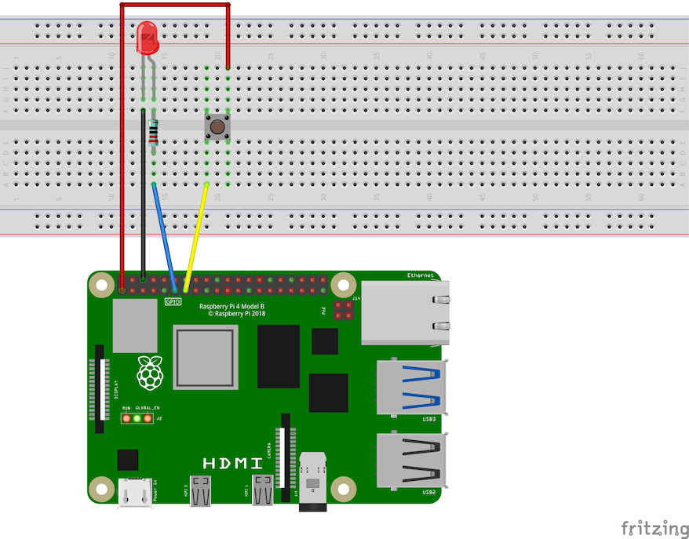

TODO: Overview of Raspberry Pi GPIO Pins:

- Refer back to [Use Your Raspberry Pi](/book/part-0-getting-started/2-computer-use/1-tour/3-2-setup-raspberry) - give summary of content on that page maybe?
- Refer back to [Machine Code](/book/part-0-getting-started/1-digital-realities/2-trailside/4-machine-code) - discuss binary values
- Include tables for relevant Pin Modes and Pin Values? (Or just links to splashkit for easier maintainability?)
- Links to GPIO SplashKit types: [Gpio Pin](https://splashkit.io/api/types/#gpio-pin), [Gpio Pin Mode](https://splashkit.io/api/types/#gpio-pin-mode), [Gpio Pin Value](https://splashkit.io/api/types/#gpio-pin-value), and maybe [Pull Up Down](https://splashkit.io/api/types/#pull-up-down)?
- Maybe add diagrams similar to method call, but for RaspiWrite and RaspiRead - not sure if needed.

## Example

To get started with using the Raspberry functions to write and read GPIO pin values, you can use the following wiring diagram to connect an LED to Pin 11 and connect a button to Pin 13.

:::note
You can check out [Step 2 - Initialise GPIO Pin](/book/part-1-instructions/1-sequence-and-data/1-tour/03-01-prepare-gpio-pins) from the guided activity for more information about setting up the button.
:::


<div class="caption">Image created with <a href="https://fritzing.org/">Fritzing</a></div>

The following program uses methods in the [Raspberry](https://splashkit.io/api/raspberry/) category of the SplashKit library to "write" data to Pin 11 (GPIO 17), and "read" data from Pin 13 (GPIO 27) on the Raspberry Pi (as shown in the wiring diagram above).

```cs
using SplashKitSDK;
using static SplashKitSDK.SplashKit;

// Initialise the GPIO system
RaspiInit();

// Define the LED pin (using physical Pin 11)
GpioPin ledPin = GpioPin.Pin11;
// Define the button pin (using physical Pin 13)
GpioPin buttonPin = GpioPin.Pin13;

// Set the button pin to input mode
RaspiSetMode(buttonPin, GpioPinMode.GpioInput);
// Set the led pin to output mode
RaspiSetMode(ledPin, GpioPinMode.GpioOutput);

// Set the button pin to use an internal pull-down resistor
RaspiSetPullUpDown(buttonPin, PullUpDown.PudDown);

// Reading 1 with button pressed
WriteLine("Press and hold your button down, then hit Enter to record the reading:");
ReadLine();  // Wait for user to press Enter
GpioPinValue reading1 = RaspiRead(buttonPin);

// Output of button being pressed
WriteLine("Button Gpio value: " + reading1);
RaspiWrite(ledPin, reading1);

// Reading 2 with button released
WriteLine("Now release your button now so it is not pressed, then hit Enter:");
ReadLine();  // Wait for another press
GpioPinValue reading2 = RaspiRead(buttonPin);

// Output of button not being pressed
WriteLine("Button Gpio value: " + reading2);
RaspiWrite(ledPin, reading2);

// Clean up the GPIO system
RaspiCleanup();
```

## Activities

Here are some lines from the code above. What do you think these lines of code do?

1. `GpioPin ledPin = GpioPin.Pin11;`
2. `RaspiSetMode(ledPin, GpioPinMode.GpioOutput);`
3. `GpioPinValue reading1 = RaspiRead(buttonPin);`
4. `RaspiWrite(ledPin, reading1);`

<details>
  <summary role="button">Answers</summary>
  <ul>
    <li><strong>1: </strong><code>GpioPin ledPin = GpioPin.Pin11;</code> creates a GpioPin variable named ledPin, and assigns it the value of pin 11.</li>
    <li><strong>2: </strong><code>RaspiSetMode(ledPin, GpioPinMode.GpioOutput);</code> sets the LED pin to output mode to allow data to be written to pin 11.</li>
    <li><strong>3: </strong><code>GpioPinValue reading1 = RaspiRead(buttonPin);</code> reads the value of the pin 13, while the button is pushed, and assigns it to a GpioPinValue variable named "reading1".</li>
    <li><strong>4: </strong><code>RaspiWrite(ledPin, reading1);</code> turns the LED "on" by writing the value stored in the "reading1" variable (GpioHigh) to pin 11, which is connected to the LED.</li>
  </ul>
</details>
