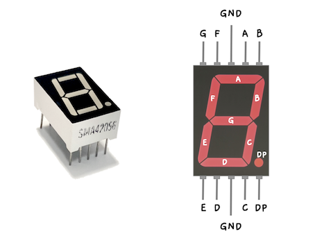
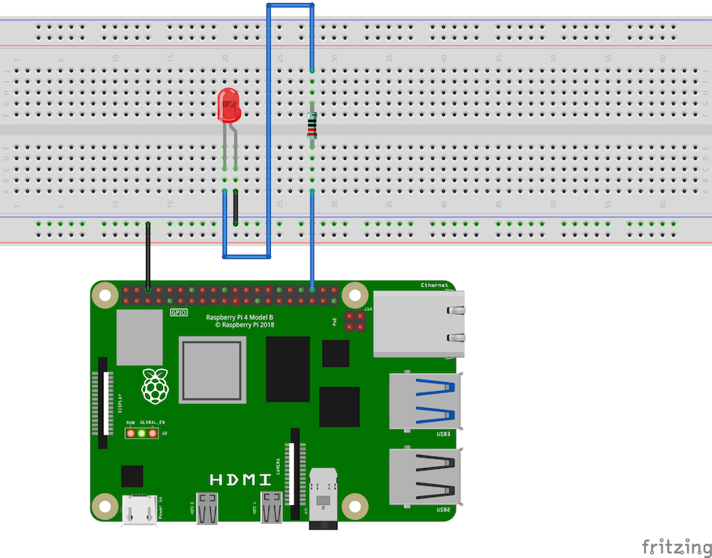

import { Tabs, TabItem } from "@astrojs/starlight/components";

TODO: Overview of Raspberry Pi GPIO Pins:

- Refer back to [Use Your Raspberry Pi](/book/part-0-getting-started/2-computer-use/1-tour/3-2-setup-raspberry) - give summary of content on that page maybe?
- Refer back to [Machine Code](/book/part-0-getting-started/1-digital-realities/2-trailside/4-machine-code) - discuss binary values
- Include tables for relevant Pin Modes and Pin Values
- Explain 7-segment display



## Example

To get started using the 7-segment display, you can use the following wiring diagram to connect to the "Decimal Point" segment LED for the LED blinking program below.

If you don't have a 7-segment display yet, you can click on the "Alternative: Simple LED" tab below. This wiring diagram will also work with the example code below.

<Tabs>
<TabItem label="7-Segment Display Decimal Point">


</TabItem>
<TabItem label="Alternative: Simple LED">



</TabItem>
</Tabs>

The following program uses methods in the [Raspberry](https://splashkit.io/api/raspberry/) category of the SplashKit library to "write" data to Pin 36 (GPIO16) on the Raspberry Pi, which will be connected to the 7-Segment Display pin for the "Decimal Point" segment LED, or a simple LED (as shown in the wiring diagram options above).

```cs
using SplashKitSDK;
using static SplashKitSDK.SplashKit;

// 
// Setting up the GPIO pins:
// 

// Initialise the GPIO system
RaspiInit();

// Define the GPIO pin being used for the simple LED or 'Decimal Point' segment LED
GpioPin ledPin = GpioPin.Pin36;

// Set the "mode" for the pin being used to "output" mode
RaspiSetMode(ledPin, GpioPinMode.GpioOutput);

// 
// Blinking the LED:
// 

// Turn 'ON' the the LED
RaspiWrite(ledPin, GpioPinValue.GpioHigh);
Delay(500);  // Hold for 500 milliseconds

// Turn 'OFF' the LED
RaspiWrite(ledPin, GpioPinValue.GpioLow);
Delay(500);  // Hold for 500 milliseconds

// Turn 'ON' the the LED
RaspiWrite(ledPin, GpioPinValue.GpioHigh);
Delay(500);  // Hold for 500 milliseconds

// Turn 'OFF' the LED
RaspiWrite(ledPin, GpioPinValue.GpioLow);
Delay(500);  // Hold for 500 milliseconds

// Turn 'ON' the the LED
RaspiWrite(ledPin, GpioPinValue.GpioHigh);
Delay(500);  // Hold for 500 milliseconds

// Turn 'OFF' the LED
RaspiWrite(ledPin, GpioPinValue.GpioLow);
Delay(500);  // Hold for 500 milliseconds

// 
// Turning off the GPIO pins:
// 

// Clean up the GPIO system
RaspiCleanup();
```

## Activities

Here are some lines from the code above. What do you think these lines of code do?

1. `GpioPin ledPin = GpioPin.Pin36;`
2. `RaspiSetMode(ledPin, GpioPinMode.GpioOutput);`
3. `RaspiWrite(ledPin, GpioPinValue.GpioHigh);`
4. `RaspiWrite(ledPin, GpioPinValue.GpioLow);`

<details>
  <summary role="button">Answers</summary>
  <ul>
    <li><strong>1: </strong><code>GpioPin ledPin = GpioPin.Pin36;</code> creates a GpioPin variable named ledPin, and assigns it the value of pin 36.</li>
    <li><strong>2: </strong><code>RaspiSetMode(ledPin, GpioPinMode.GpioOutput);</code> sets the LED pin to output mode to allow data to be written to pin 36.</li>
    <li><strong>3: </strong><code>RaspiWrite(ledPin, GpioPinValue.GpioHigh);</code> turns the LED "on" by writing a digital high (1) value to pin 36.</li>
    <li><strong>4: </strong><code>RaspiWrite(ledPin, GpioPinValue.GpioLow);</code> turns the LED "off" by writing a digital low (0) value to pin 36.</li>
  </ul>
</details>
