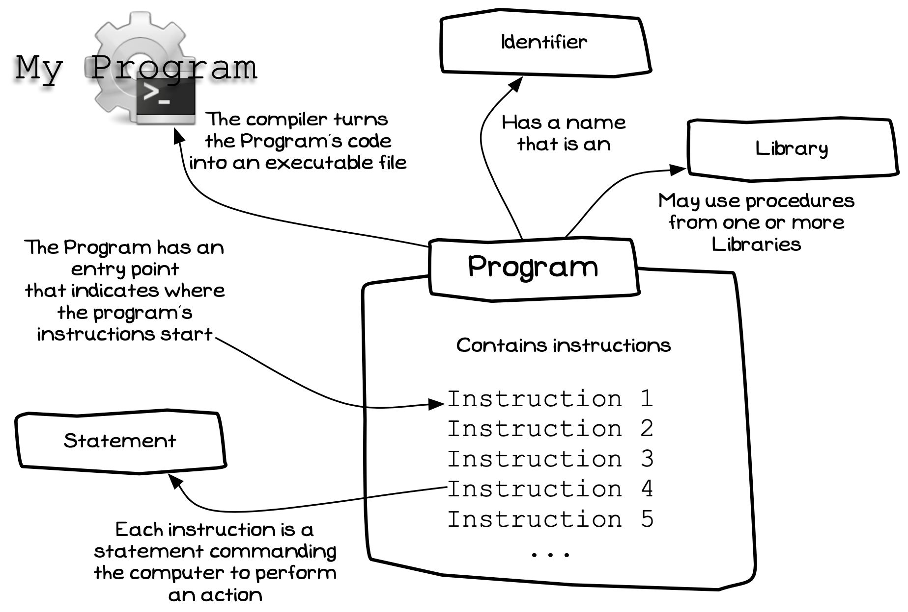

## Concept

In most software projects the top level *artefact* you are aiming to create is a **program**. A program is something you can create by writing **source code** in a language like c#, and getting another piece of software, called the **compiler**, to convert your source code into **executable code** (1s and 0s). Executable code is the code that can be run by your computer. The name of the program determines the name of the executable code. For e.g.:

myprogram.cs (your source code) -> compiler -> myprogram.exe (executable code).

Your program consists of a **list of instructions** the computer will perform when that program is run on the computer. When you create a program, you should be thinking about the tasks you want the program to achieve, and the steps you must get the computer to perform when the program is run. These then become the instruction within the source code of program, with each instruction being a [Statement](../01-statement) of what you want performed.

[Figure 5.1](#FigureProgram) below shows a **software program** consisting of instructions (the **source code**) that gets compiled into an **executable program** that is run.

<a id="FigureProgram" class="linkPoint"></a>


<div class="caption"><span class="caption-figure-nbr">Figure 5.1: </span> A program contains instructions that command the computer to perform </div><br/>

## In C#


:::tip[Syntax]
C++ does not have an explicit Program artefact. Rather, you create a program by having a function called `main` in your code. [Figure 5.x](#FigureProgramSyntax) shows the structure of the syntax used to create a program using the C++ language.

<a id="FigureProgramSyntax"></a>


<div class="caption"><span class="caption-figure-nbr">Figure 5.2: </span>The syntax for a C# program</div><br/>

:::


## Example


[Listing 5.x](#ListingProgramWithMethods) shows a small C++ Program. You should be able to match this up with the syntax defined in [Figure 5.x](#FigureProgramSyntax). This program does not include any custom procedures, but does use a header include to include the splashkit.h header file. Following this is the `main` function that includes the instructions that are run when the program is executed.

<a id="ListingProgramWithMethods"></a>

```csharp
include "splashkit.h"

int main() {
  write_line("Hello World!");
  return 0;
}
```
<div class="caption"><span class="caption-figure-nbr">Listing 5.x: </span>C# Hello World Program</div>


## Activities
### Compiling and running your Hello World program in C#

<div class="review">
These instructions can be coded into a C# source code file, compiled and run in "Visual Studio Code" (VSC). To do this follow the instructions here:

- [Tutorial: Create a .NET console application using Visual Studio Code](https://learn.microsoft.com/en-us/dotnet/core/tutorials/with-visual-studio-code?pivots=dotnet-7-0)
  - The tutorial also contains an extension exercise which you can try, to modify the program to ask the user to input their name and then output their name along with the date and time

Your "HelloWorld" output should look something like this:

```bash
localhost:HelloWorld vsc-user$ dotnet run
Hello, World!
localhost:HelloWorld vsc-user$
```
<div class="caption"><span class="caption-figure-nbr">Listing 5.2: </span>Output from the "HellowWorldProgram" C# program</div>

:::note[Summary]

- You use a compiler to convert the program’s **source code** into an **executable** file that the user can run (execute).
- The program has an **entry point** that indicates where the program’s instructions start (the Main() method in C#).
- Your program can use code from a [Library](#library) or number of libraries.
- In programming terminology, an instruction is called a [Statement](#statement).

:::

</div>