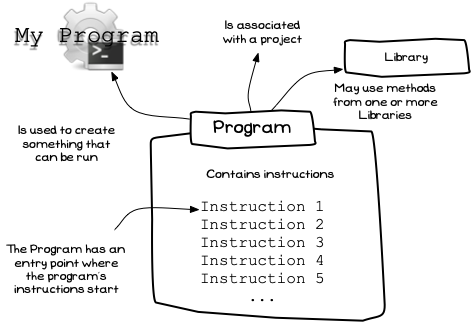
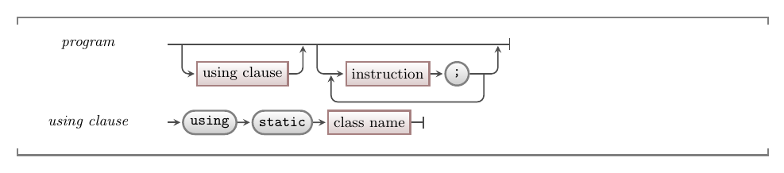

In most software projects the top-level building block you are aiming to create is a **program**. A program is something the user can **run** to get the computer to do something.

Each program consists of a **list of instructions** ([statements](../../../2-communicating-syntax/1-concepts/02-statement) in programming terminology) that the computer will perform when the program is run. When you create a program, think about the goal of that program and the steps you need the computer to perform to achieve that goal.

The image below shows a sketch of the program concept. It shows a program consisting of instructions (written in **source code**). Some key aspects of the program are the starting instruction and the libraries that it uses.



## Program -- when, why, and how

You will need to create a program to be able to run and share each digital reality/piece of software you create. A large software system may have several programs, but each program will create its own digital reality when it is executed.

When you think about a program, you are thinking **big picture**.
What do you want this program to do, and what are the steps to achieve this?
Each program will contain other building blocks to achieve its goals.
As you continue your journey, you will pick up more tools to expand what you can create in your programs.
For now, a program is simply a list of instructions that are followed when the program runs.

## In C#

:::tip[Syntax]
In a C# project, you have one source code file that will contain the program's main code. The following illustration shows the structure of the syntax for this.


:::

Each program starts with an optional list of **using directives**.
These allow you to tell the compiler where you want it to look for the [methods](./02-method) you call in your program.
Following this list, you provide a list of instructions that each end with a semicolon (`;`).

In C#, the library identifiers in using directives will refer to classes, either written by the C# language developers or distributed by other programmers.
Classes are a concept we will cover in [Part 3](../../../part-3-programs-as-concepts/00-part-3-programs-as-concepts) -- for now, just think of them abstractly as a collection of code you can use.

:::tip[Directive?]
A directive is an instruction for the compiler, rather than an instruction that gets added to the program created by the compiler. You use these to let the compiler know something about the code you are writing.

For example, the using directive tells the compiler which parts of a code library you want to access.
This allows you to use the [methods](./02-method) from this part of the library in your code.
:::

## Examples

The following code shows a basic Hello World C# Program. You should be able to match this up with the syntax defined above. This program uses code from the `System.Console` part of the C# library to access the `WriteLine` method, which can be called to output a message to [stdout](../../../../part-0-getting-started/2-computer-use/1-concepts/07-streams#input-output-and-errors). The important thing to see here is that **all** of this code is the program -- each line is a part of the program.

```csharp
using static System.Console;

WriteLine("Hello World!");
```

The following program uses SplashKit to open a window and draw some shapes to it. Once again, the important thing to think about for now is that the program is **all** of these instructions. They all come together to create the program.

```csharp
using static SplashKitSDK.SplashKit;

OpenWindow("A House", 800, 600);
ClearScreen(ColorWhite());

// Draw a house shape
FillEllipse(ColorBrightGreen(), 0, 400, 800, 400);
FillRectangle(ColorGray(), 300, 300, 200, 200);
FillTriangle(ColorRed(), 250, 300, 400, 150, 550, 300);

RefreshScreen();
Delay(5000);
```

:::tip[Code Comments]
C# source code is [abstracted](../../../part-0-getting-started/1-digital-realities/1-concepts/6-source-code/#programming-with-a-third-generation-language) to make it more understandable for humans, but ultimately it is still written for computers.
Because of this, C# and virtually all programming languages include syntax for writing [**code comments**](../09-comments).

In the code above the line starting with `//` is a code comment and will be ignored by the compiler.
:::

Data is also key within every program. Can you spot data in the examples above?

We use data to capture information we need a program to work with. The data in the above examples are all **fixed** or [literal](./05-literal) values. That means these values can not change when the program runs. They are fixed, being literally the value that appears in the code.

:::note[Summary]
- You can create something the user can run from a program's **source code**.
- Most importantly, you can't really *see* the program in the code. The program is **all** of the code together.
- The program has an **entry point** that indicates where the program’s instructions start -- in this case that is the first instruction in the source code.
- Your program can use code from [libraries](./10-library), giving it access to building blocks others have created.
- Data is central to a program.
:::
