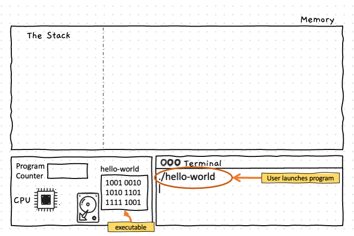
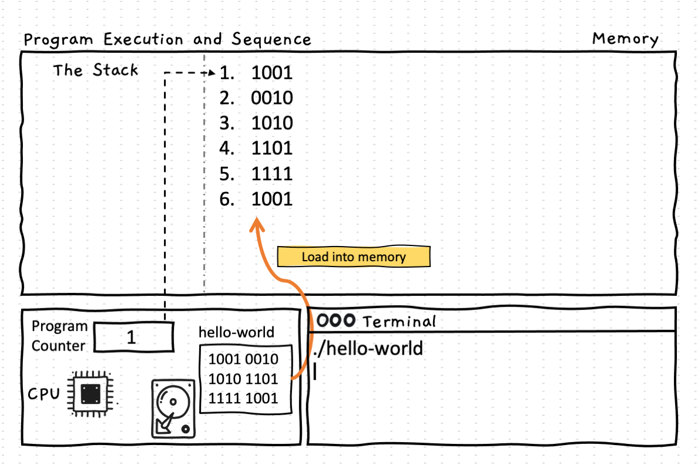
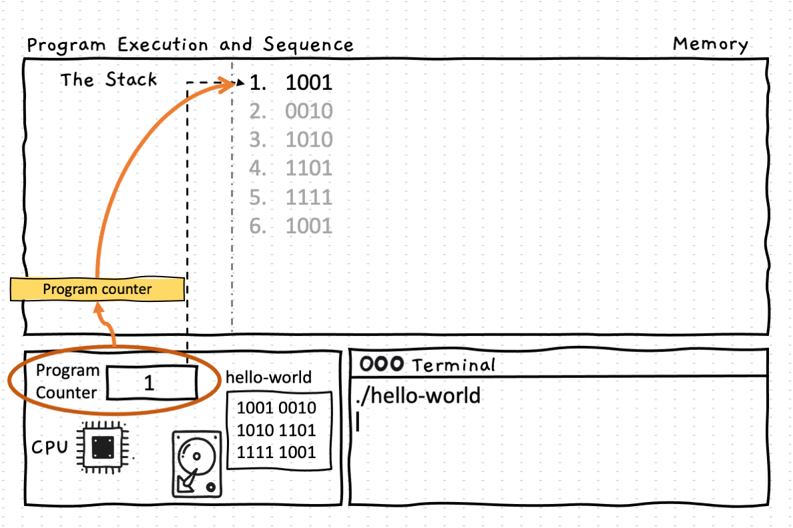
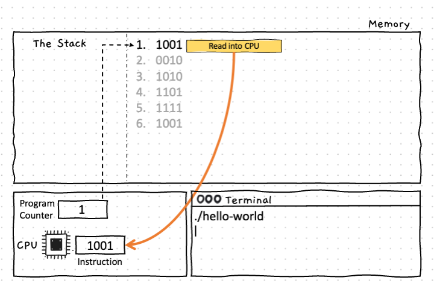
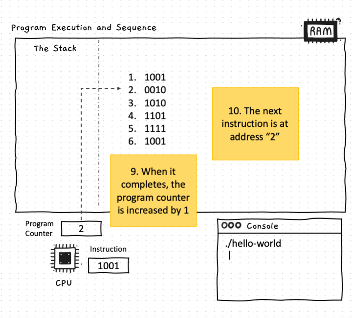
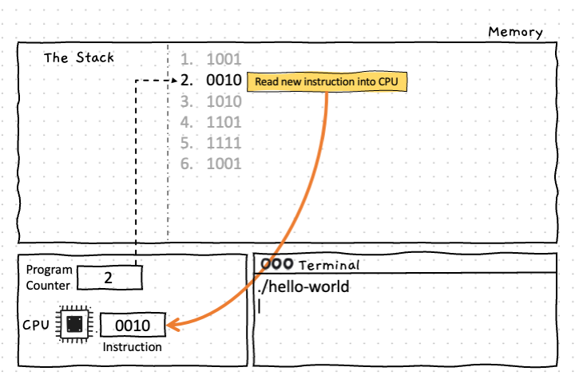
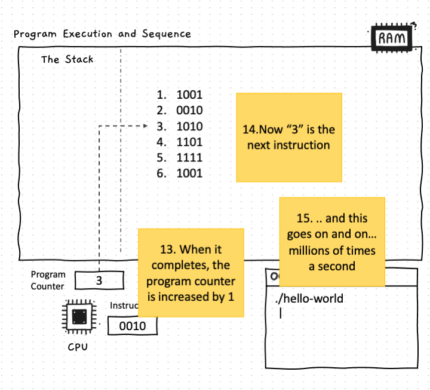

Within a program, one of the main things you need to see is that everything runs in **sequence**.

At a low level, the computer executes each of its machine code instructions one at a time. This is central to the way the computer works and is therefore central to the way we need to think about its operation (**computational thinking**).

The computer's processor maintains a **program counter** that is used to record the instruction the computer is currently performing. Once it finishes the current instruction, the computer adds one to the program counter, moving it to the **next instruction** in the program. Some instructions will let you control which instruction is next, but this just lets you adjust the sequence, at its core, it is performing one step and then the next. We will see one such instruction in this chapter, and the next chapter will focus on the different instructions you can use to control this sequence.

Keeping this simple idea in mind will be important throughout your programming journey, and beyond. The computer is unintelligent and will follow the **sequence** of actions that you define. It will not interpret, adapt, or otherwise deviate from what you tell it to do.

## Sequence - why, when, and how

Designing a program will require you to be able to identify a **sequence** of instructions that will allow you to get the computer to achieve the result you want. This is the process of creating an **algorithm** - a finite sequence of instructions that a computer can use to perform a required task or calculate a required output. In this, you have to work within the constraints of the computer. The instructions within the program/algorithm will be unambiguous, and require no intelligence to perform. After all, we want this to run in the computer and the computer is unintelligent.

This design process is known as **computational thinking**. You need to think about the available instructions and building blocks, and creatively come up with the code to create the building blocks and **sequence** instructions to use this abstract machinery you have created to achieve an outcome.

In this chapter, you will be able to create the following **building blocks**

- [Programs](../00-program) the user can run
- [Variables](../07-variable) to store values

You will be able to use the following **building blocks** that others have created:

- [Methods](../02-method) that can be called to perform an action or fetch/calculate a value.
- [Libraries](../10-library) that provide you with building blocks others have created.

You will be able to instruct the computer to:

- [Call methods](../03-method-call) to run their instructions.
- [Assign variables](../08-assignment-statement) a value

By putting these together you will be able to build some small programs that show visualisations and calculate values. The next chapter in your journey explore how we can make these more dynamic by controlling the sequence of actions.

## Sequence Up Close

:::tip[How does this work?]

1. This all starts when the user runs the program.
2. In this example, we are showing a compiled executable running. Its instructions are in the file on the disk.
3. The instructions can be loaded from disk into memory. This gives the CPU easier access to the instructions as memory is much faster to access than the disk.
4. Every value (based on the CPU architecture) in memory is uniquely addressable. For example, in a 64-bit machine, each address refers to a 64-bit value. So address 0 is the first 64 bits, address 1 is the second 64 bits, and so on. Each instruction in a 64-bit machine will be 64 bits.
5. In the CPU, the **program counter** is used to track the address of the current instruction.
6. Now that we know where the first instruction is, and the CPU has this in the program counter, the next thing it will do is run that instruction. Thereby starting the program.
7. To run the instruction, the computer reads the memory into the CPU.
8. The instruction is then executed within the CPU.
9. The last part of running the instruction will be to add one to the program counter.
10. As the instructions are the same size as a single memory address, this means that the CPU is now at the next instruction.
11. The process to run the instruction remains the same - load it into the CPU.
12. Run the instruction.
13. Add one to the program counter.
14. The next instruction will be the instruction at address 3.
15. This same process runs on and on, with millions of these instructions running each second.

:::

There is no magic or intelligence here. **Sequence** is simply the computer adding one to a list that is tracking where the instructions are.

*How small are these instructions?*

One line of code will generally have several instructions. That is a large part of the focus of this part. When you read the code, you need to be able to think through how the instructions will run. You don't usually need to draw these out as we have here, but you need to be able to read the code and see these individual steps.

In general, this shouldn't be too hard. Remember the following:

- Instructions will run in sequence. So read through the code line by line.
- Calculated values (expressions) are evaluated before they are used. This will be a sequence of mathematical operations, which obey standard mathematical rules (e.g. BOMDAS).
- Study each different kind of instruction to know the steps involved in its sequence. The one kind of instruction will always have the same sequence.

With these in mind, you will be able to get started working with code which is all built upon this core concept of **sequence**.

:::tip[Slow and carefully]
Go slowly and carefully, with attention to each piece of code. Most problems come from overthinking things or imagining powers the computer does not have. When you have an issue, slow down. Look at what the code *actually* does. Sketch it out on paper - tracking the changes as things run. Most of the issues will be small things you will miss if you quickly skim over the code.
:::
